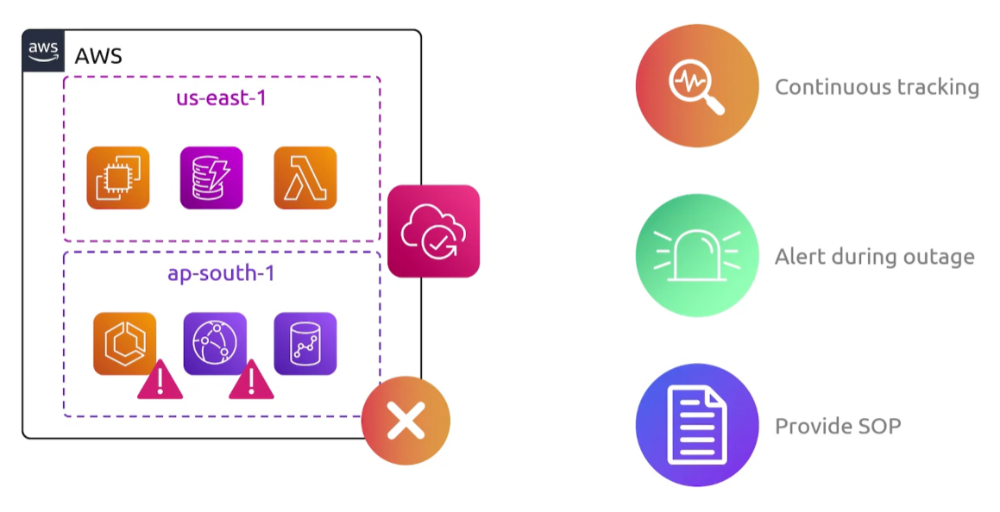

## Resilience Hub
- [Overview](#overview)
- [Components](#components)

### Overview

* AWS `Resilience Hub` is a managed service that lets you define, validate, and track the resilience of your applications
    - it evaluates your cloud setup against recovery goals, uncovers weaknesses, and provides tips to fix issues before disruptions happen

### Components

* `Recovery Goals`: set targets for `rto` (how fast you recover) and `rpo` (how much data you can lose)
* `Dependency Mapping`: discover how your app connects to aws services and tools
* `Testing`: run checks using `aws fault injection` to see how your app handles real failures