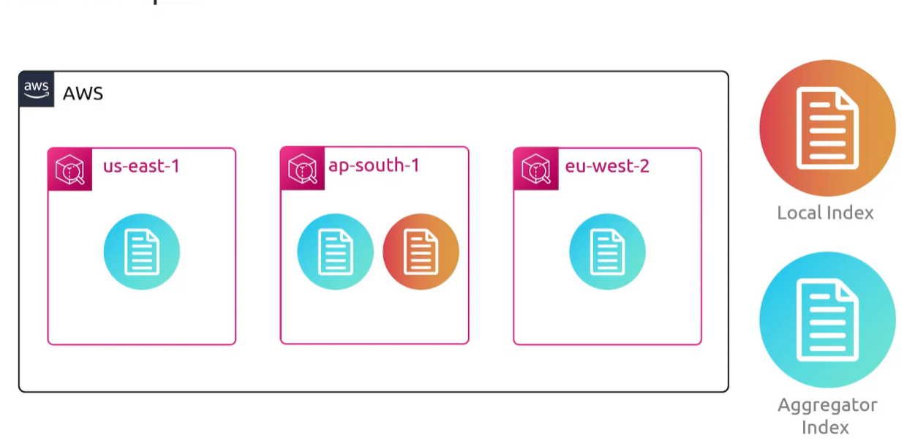
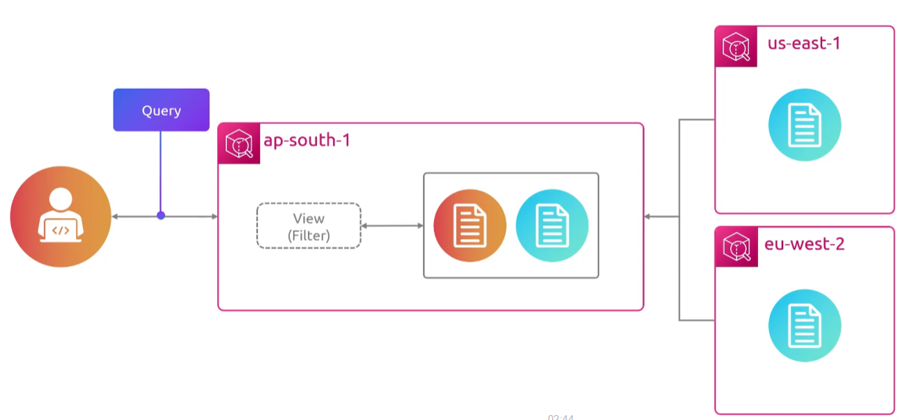

## Resource Explorer
- [Overview](#overview)

### Overview

* AWS `Resource Explorer` is a free resource search and discovery service that lets you explore infra components like `ec2`, `s3`, and `dynamodb` tables across multiple regions using internet search engine-like experience
    - you must turn it on and configure it for it to work
* How it works
    - indexes are per region, and must be turned on in each region you want searchable
        * one region gets promoted to aggregator index, which replicates the others into itself, this is what makes cross region search possible
    - views define what slice of an index is searchable and are the iam boundary
    - search is a keyword plus filters

* Once an aggregator index exists, the unified search bar at the top of the console starts returning your actual resources alongside services and docs
* For multi account, you set a delegated admin throug aws organizations and create a view that spans member account, so one search covers the whole org