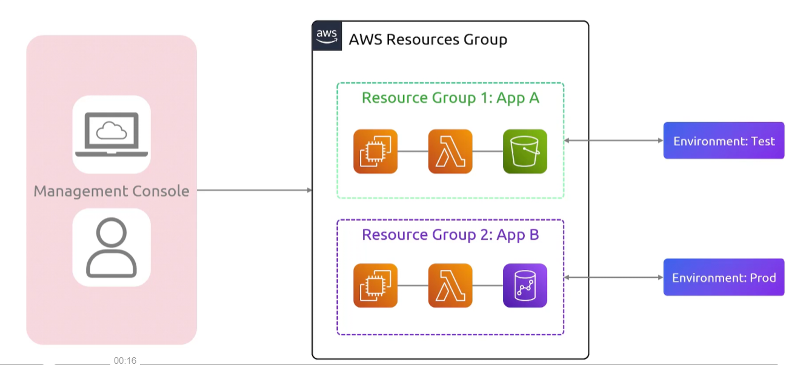

## Resource Group
- [Overview](#overview)

### Overview

* AWS `Resource Groups` allow oyu to organize and manage cloud assets using tag-based queries, cloudformation stacks, and automated grouping
    - you can create your own console for view resources with a specific tag
    - this allows for bulk actions where you run automated management and operations via `ssm` against entire groups  