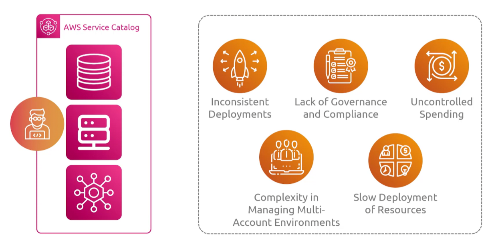
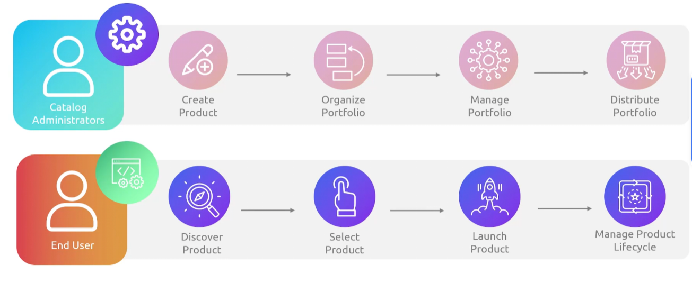

## Service Catalog
- [Overview](#overview)
- [Components](#components)

### Overview

* AWS `Service Catalog` lets organizations create, manage, and distribute curated lists of approved IT services (vms, dbs, and multi-tier apps) using IaC templates
    * Why we need a catalog:
        - 
    - you build out templates for how you want resources to be deployed in aws and anyone who has access to those templates can deploy them in aws

### Components

* `Products`: individual IT services or achitectures built using AWS `Cloudformation` or Terraform templates
    - collection of aws resources that can be deployed together
* `Portfolio`: group of products organized together
    - manages who can use the services and how they can use them using iam policies
    - can be shared to other aws accounts
* `Constraints`: rules set by admins to control how products are deployed 
    - such as limiting instance types or assigning specific iam roles
* `Service Actions`: pre-approved operational tasks that end users can run on an already deployed product
    - lets users perform routine job like rebooting an `ec2` or taking a db `snapshot` without neding full admin permissions
        * powered by `aws ssm`
