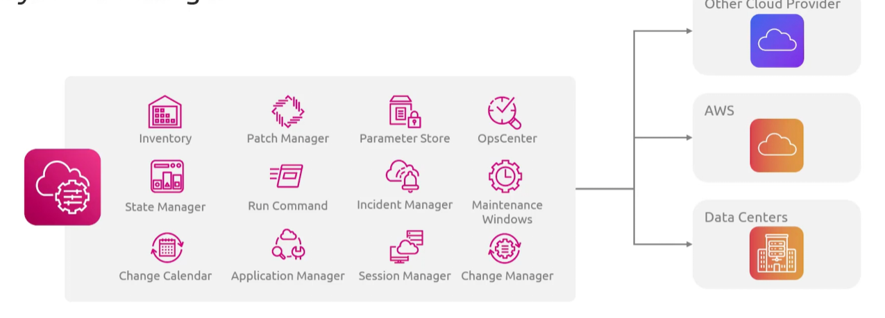

## Systems Manager
- [Overview](#overview)
- [Components](#components)

### Overview

* AWS `Systems Manager(ssm)` is an operations management service that lets you safely control, track, and manage cloud servers or vms using key features like `session manager`, `run command`, and `parameter store`
    - it requires a lightweight software agent to be installed on your target machine to communicate with the cloud
        * `ssm agent` runs in the backgroun on your `ec2`, `on-prem` or `vm` to process cloud instructions

## Components

* `Session Manager`: allows you to open a secure shell in your browser without managing BH or opening inbound ports
* `Run Command`: run configuration changes and scripts remotely across large groups of servers at once
* `Parameter Store`: save configuratoin data, db strings, and passwords safely as secure values
    - its like a secrets manager for `ec2`
* `Patch Manager`: auto scans and installs security updates for both windows and linux os
* `Application Manager`: allows you investigate and remediate issues in the context of applications