## Datasync
- [Overview](#overview)
- [Components](#components)
- [Demo](#demo)

### Overview

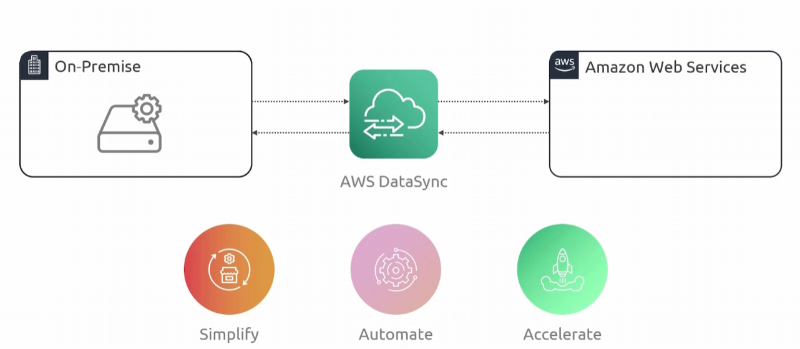
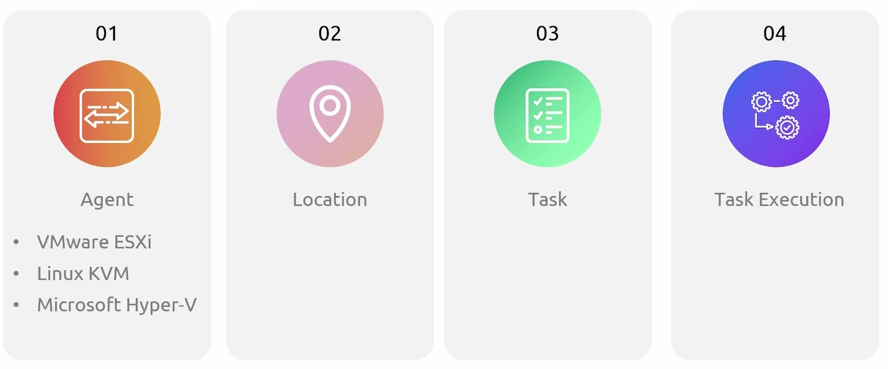
* AWS `Datasync` is a manged data transfer service that automates and speeds up moving large amounts of file and objectdata into, out of, or between storage systems
    - for on premise, you deploy a `datasync agent` that connects to your existing storage using standard protocols and talks back to the managed service
        * can pass information on source to `datasync discovery` which will give recommedations on your setup
        * 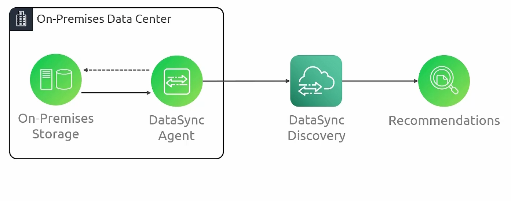
    - cloud to cloud migrations are possible as well as aws-to-aws cross region migrations
        - 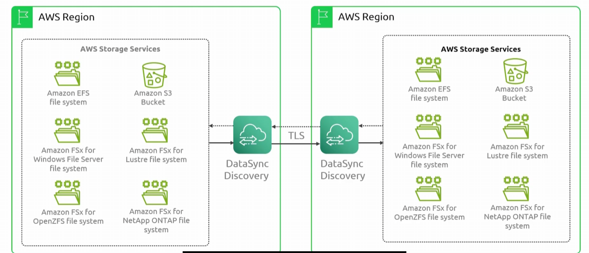
        - 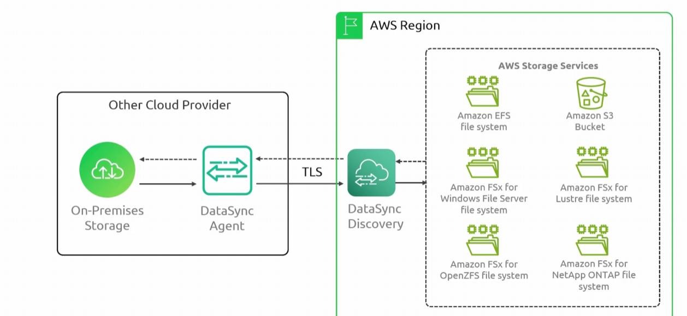
    - you define a `task` and the service facilitates the transfer
    - after initial transfer, it automates incremental transfers to only move changed files or objects
* `Datasync` supports `nfs`, `smb`, `hadoop fs`, and object storage options as source or destination types
* `Datasync` supports `s3`, `efs`, or `FSx` as aws destinations
* `Datasync` also supports encryption at reat and in transit

### Components

* `Agent`: vm application that `datasync` uses to read from and write to storage during transfer
    - transfer within aws or between csp do not require an `agent`
* `Location`: describes where you are copying data from or to
    - source and destination
* `Tasks`: defintion of a transfer
    - reusable config that ties 2 locations together with rules
    - defines how to copy data, how to handle metadata, deleted files, and permissions
* `Task execution`: a single run of a task
    - there are several phases involved
        * launching
        * preparing
        * transferring
        * verifying
        * sucess

### Demo

1. Create bucket where `nfs` data will be replicated to

2. Deploy `datasync agent`
    - in this example we will deploy as an `ec2`
    - more information on deploying agent can be found [here](https://docs.aws.amazon.com/datasync/latest/userguide/deploy-agents.html)

3. Register agent in `datasync` console
    - 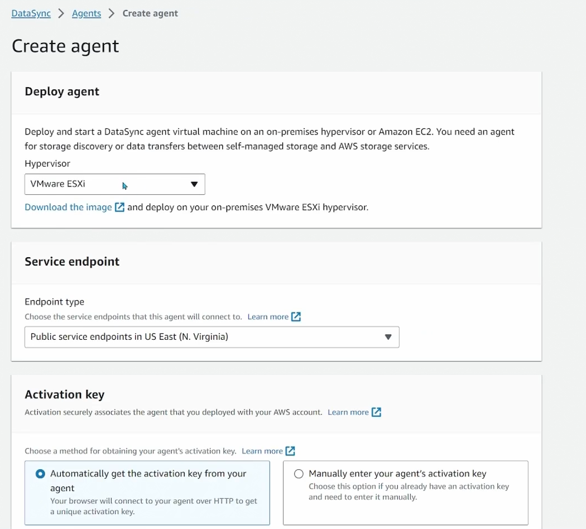
    - Add registration key through ip
        * 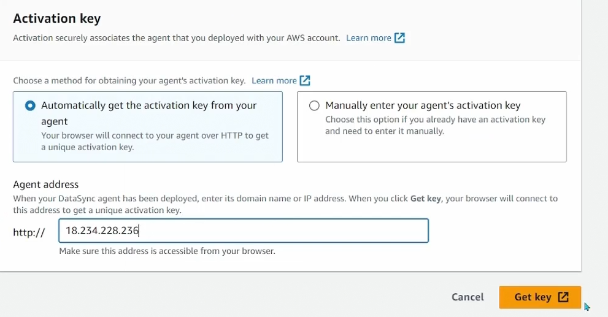
        * 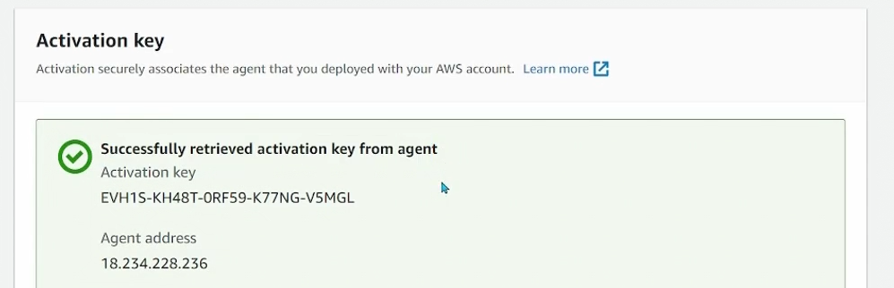
    - 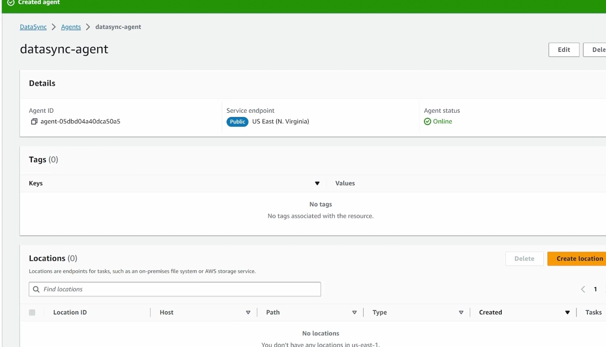

4. Set up locations for source and destination
    - define source nfs
        * 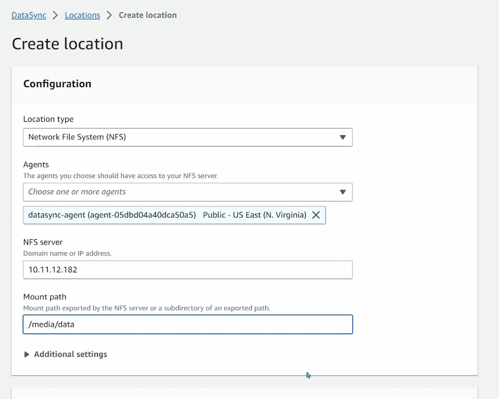
    - define destination `s3`
        * 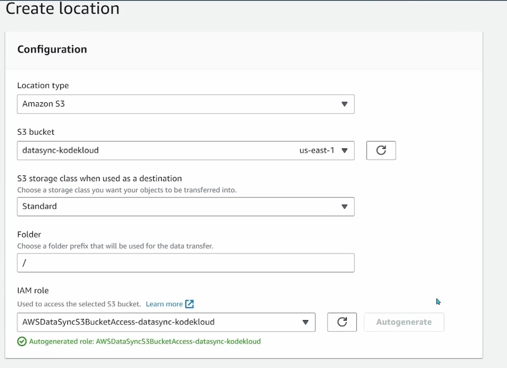

5. Create a task
    - define source location
        * 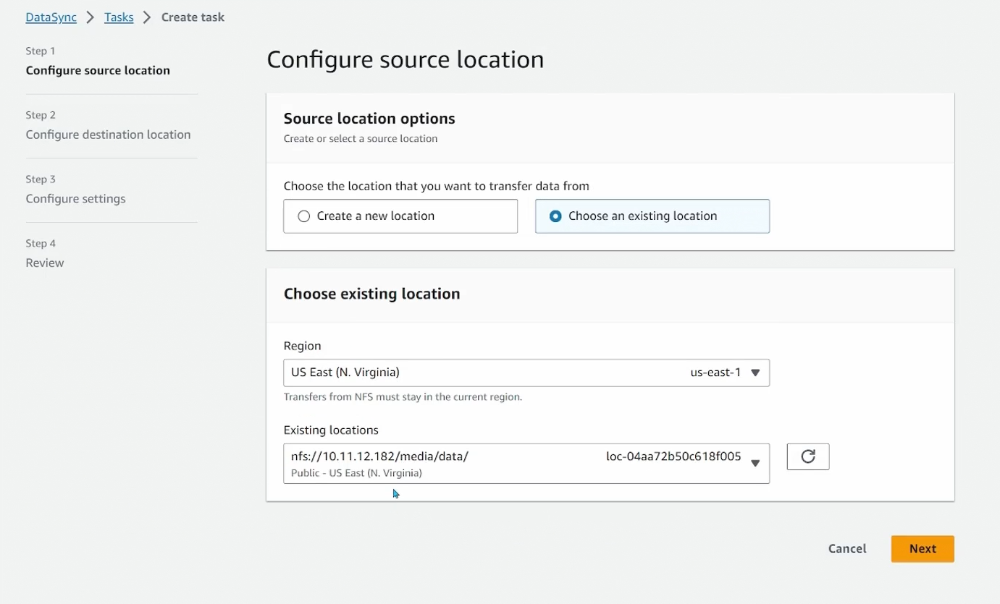
    - define destination location
        * 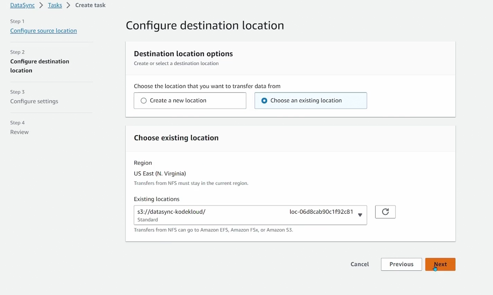
    - define settings
        * 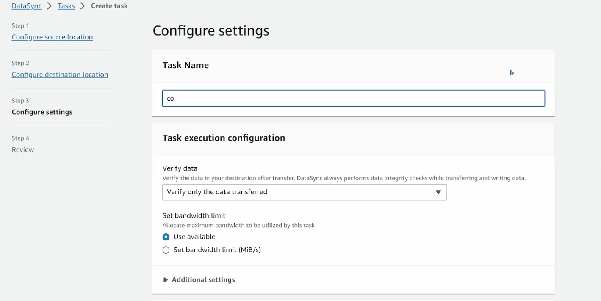
        * 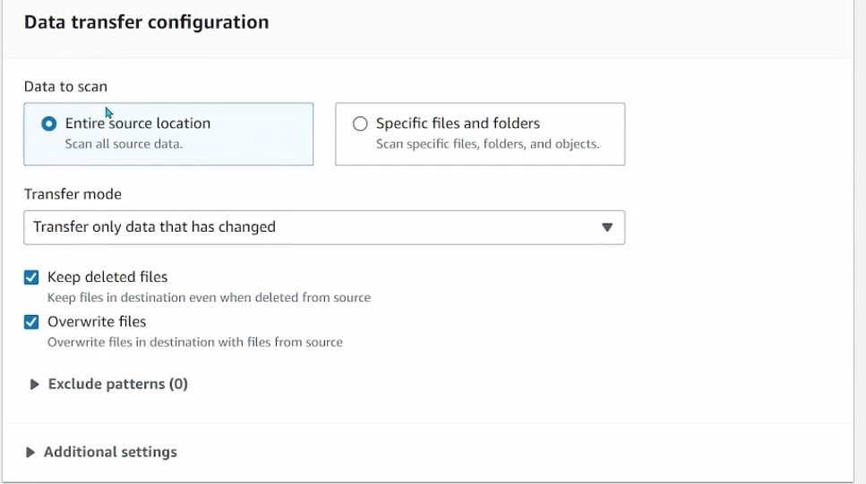
        * 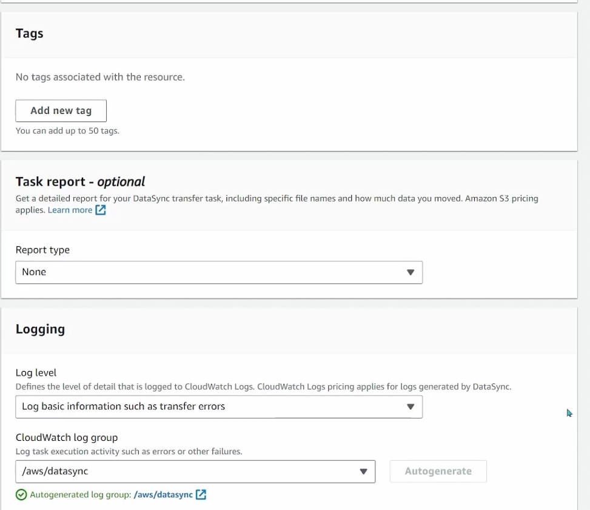

6. Start the task
    - 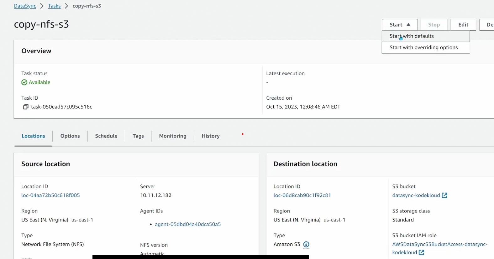
    * view execution details
        - 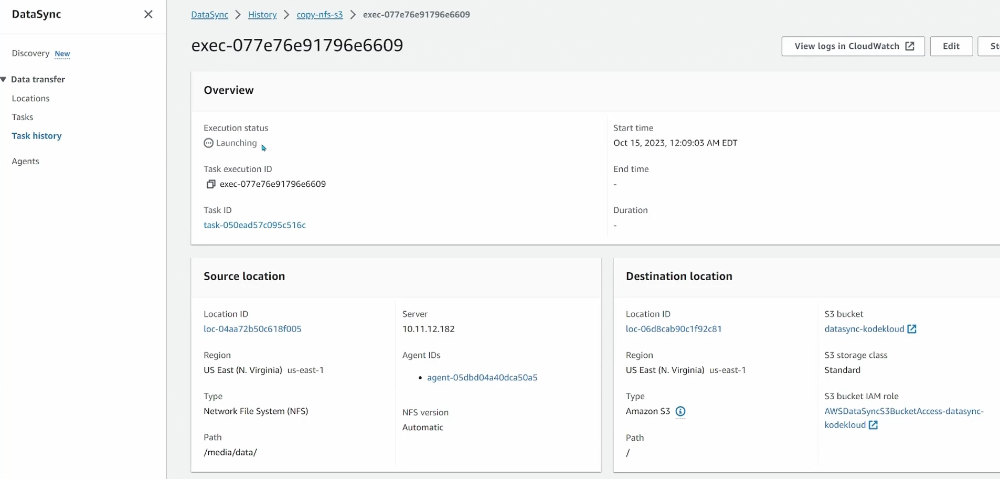
