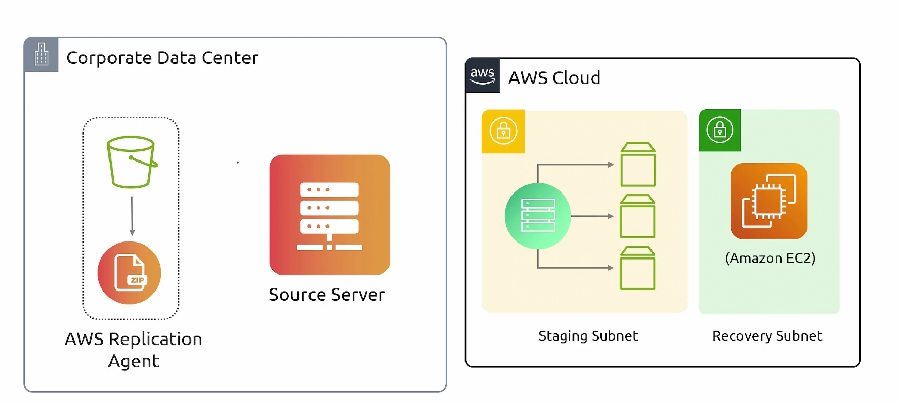
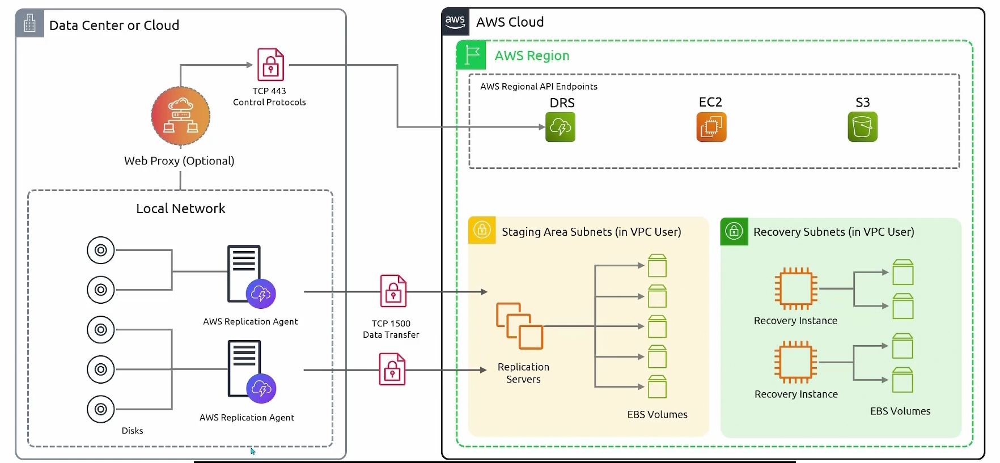

## Elastic Disaster Recovery
- [Overview](#overview)

### Overview

* AWS `Elastic Disaster Recovery (drs)` is a managed service for replicating servers into aws so you can failover to them quickly if primary environment goes down
    - it works almost the same way `mgn` works
        - you install a lightweight replication agent on each source server
        - the agent does continous, block level replication on the server's disk into a staging area in your aws account
        - on failover, the `drs` launches `ec2 instances` from replicated data, converting boot volumes so they run on `ec2`
            * you can launch from latest state or from an earlier point-in-time snapshot
        - you can run non-disruptive drills at anytime without touching production
        - failback is supported too, so you can return workloads to the original site once its healthy
        - using this continous replication to `ebs volumes` you can save costs because you're not having to create `ec2 instances` just sitting there waiting for a disaster event
    - more information on `mgn` can be found [here](2026-07-25-transform-mgn.md)
* NOTE: data inbound for `drs` is free
    - data outbound is charged but is cheaper if you're going through direct connect