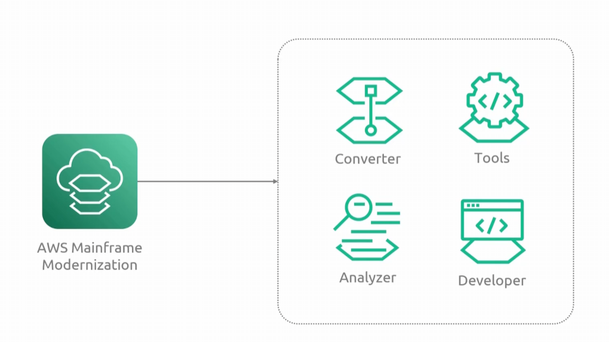
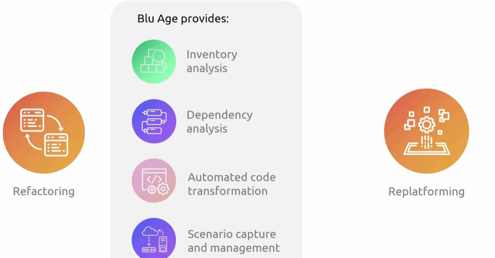

## Mainframe Modernization
- [Overview](#overview)

### Overview

* AWS `Mainframe Modernization` is a tool that helps organizations migrate and modernize legacy mainframe workloads onto aws instead of on physical mainframe hardware
    - it lets you migrate legacy mainframe applications to a cloud-native environment
    - it supports 2 modernization options
        - 
        1. `Replatforming`: lets you recompile and run your existing COBOL and PL/I applications on aws without significant code changes
        2. `Refactoring`: using aws blu age to automatically refactor mainframe applications into `java-based` cloud native application