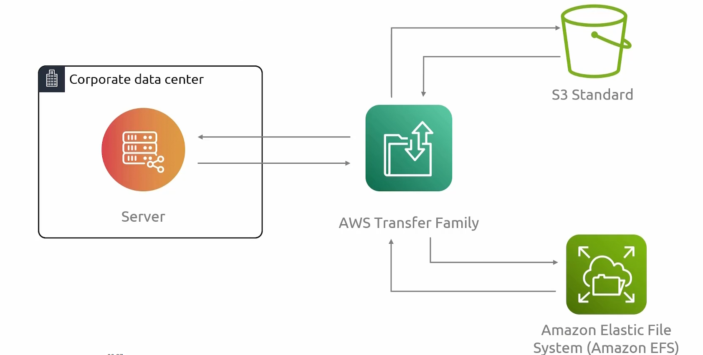

## Transfer Family
- [Overview](#overview)

### Overview

* AWS `Transfer Family` is a fully managed service for running standard file-transfer protocols on top of aws storage
    - it is a secure transfer service that stores your data in `s3` or `efs` and simplifies migrating `sftp`, `ftps`, `ftp`, or `as2` workflows to aws
    - its similar to `datasync` but with `datasync` you control both locations
        * with `transfer family` you do not control the other end
        * clients may need to retrieve or drop data from you and they aren't going to install a `datasync agent` to facilitate the process