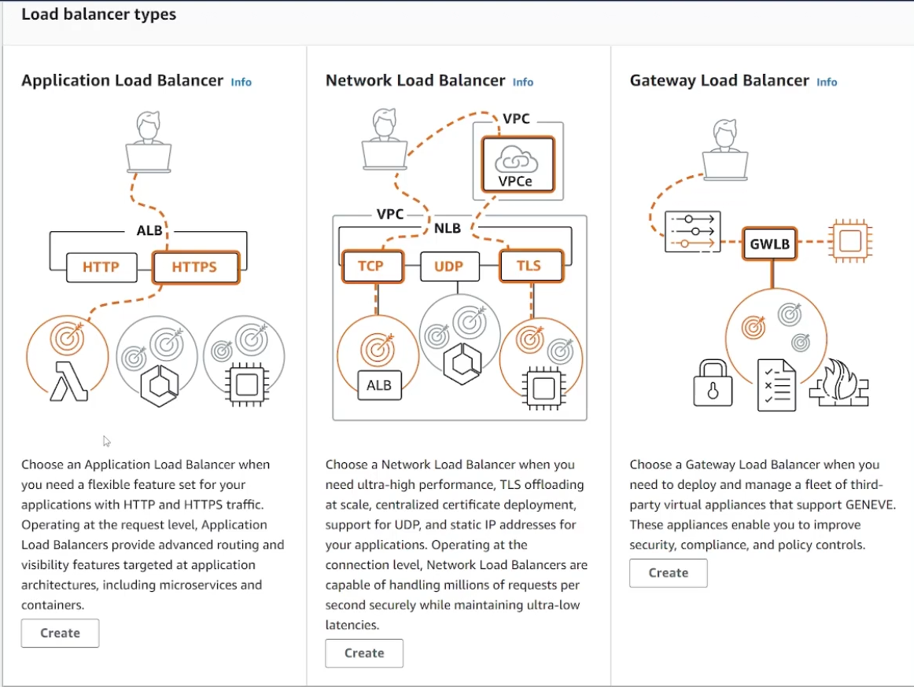
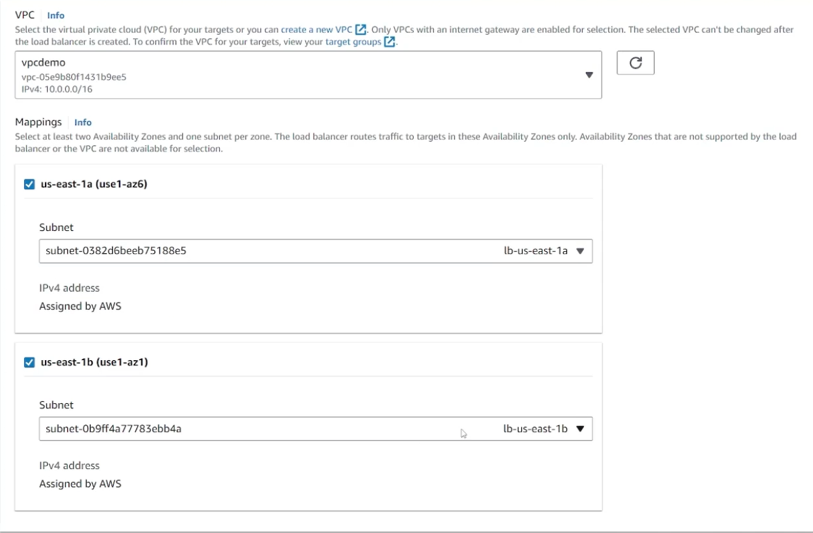
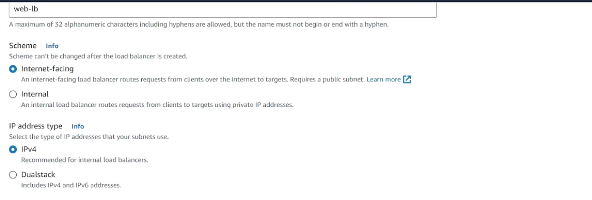
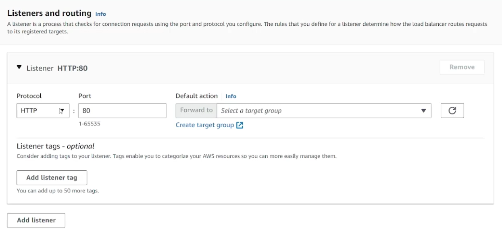
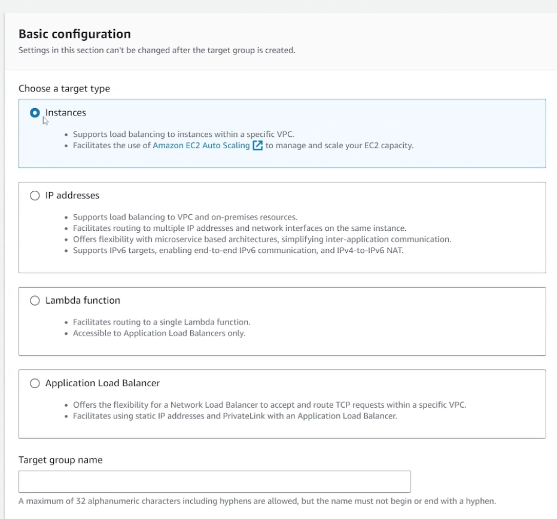
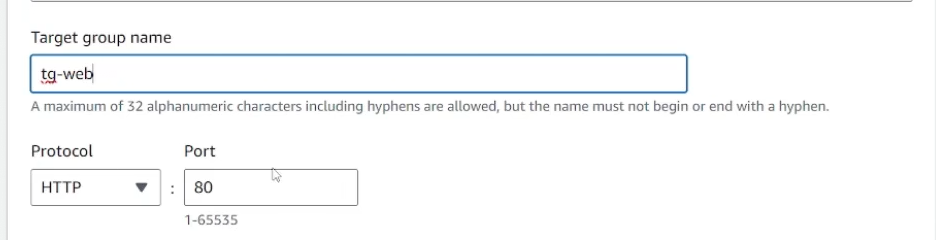
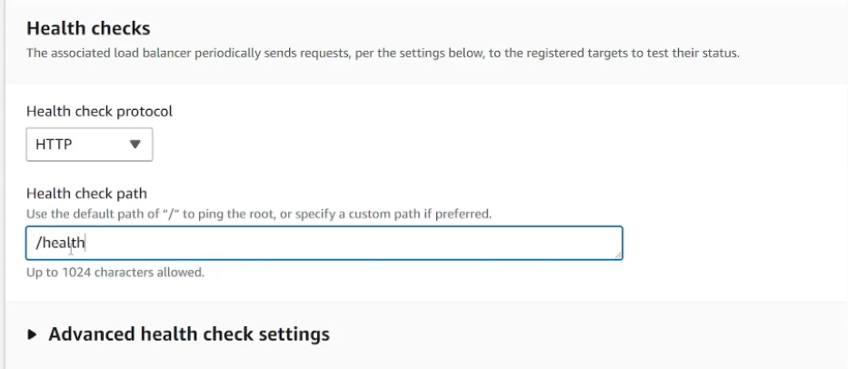

## LoadBalancers
- [Overview](#overview)
- [Loadbalancer Types](#loadbalancers-types)
    - [Classic Loadbalancer](#classic-loadbalancer)
    - [Application Loadbalancer](#application-loadbalancer)
    - [Network Loadbalancer](#network-loadbalancer)
- [Deployment](#deployment)
- [Listeners & Target Groups](#listeners-and-target-groups)
- [Reference](#references)

### Overview

* There are 3 different type of loadbalancers that AWS has:
    1. `Classic Loadbalancer`
    2. `Application Loadbalancer`
    3. `Network Loadbalancer`

### Loadbalancers Types

#### Classic Loadbalancer

* The `classic loadbalancer` is the first introduced loadbalancer by aws
    - Its super old and its not recommended because of its legacy failing points
        * One example being that it can only support one ssl certificate, so you're unable to use one loadbalancer to balance 2 different apps that may need different certificates

#### Application Loadbalancer

* The `application loadbalancer` is used to balance traffic for web-based applications, hence it manages traffic at L7(`http, https, websockets`)
    - It has the ability to forward traffic based on:
        1. Url path conditions
        2. Host domain
        3. HTTP fields -- headers, method, query, and ip
        4. Support HTTP redirect and custom HTTP responses
    - It also has the ability to perform applicatoin-specific health checks to ensure application is running on target and if its not it will stop routing traffic to that application

* TLS termintion happens at the ALB always, at which point the LB will forwards traffic via HTTP to the backend service (unencrypted)
    - You can encrypt the traffic between the LB and the backend service by passing a cert to the service that you would need to manage yourself 

* This loadbalancer is unique in that it works with `AWS Web Application Firewall` and `AWS Global Accelerator` (to produce static ips for end users who may potentially need to whitelist your service in their infrastructure)
    - There are no ips associated with `albs` nor can you associate `eips`. This is because of the scaling that aws does in the backend to manage traffic, multiple lbs are created to balance traffic based on demand so an A record is produced that maps to these lbs. Hence why if you're looking for a static ip, you'll either need to place a `nlb` in front of your `alb` or use global accelerator

    

#### Network Loadbalancer

* The `network loadbalancer` operates at L4(`TCP/UDP`) and it is not meant for applications that use `http/https`
    - `nlbs` balance traffic faster than `albs`, so there's reduced latency
    - Health checks are only basic ICMP/TCP connections
    - `nlbs` forward tcp connection to instances, since there it cannot understand L7 components, TLS termination does not happen at the `nlb`
        * It essentially acts like a proxy

### Deployment

* When you deploy an `lb` it asks you which `AZ` you'd like to balance traffic in. This is because when an `lb` is created a physical `lb node` is deployed in these `AZ` to balance traffic
    - Because of this you may want a dedicated `subnet` for loadbalancers
    - If you do decide to do this, then your entire application itself does not need to exist in a `public subnet`, you can make it all private
* `Cross AZ lb` was created to fix ineffiencies in proper loadbalancing. Say you have 2 `AZs`, one is balancing traffic to 2 instances while the other only has 1 instance. `Cross AZ lb` allows `lb nodes` to balance traffic across `AZs` for more efficient loadbalancing

* There are 2 types of deployment modes for loadbalancers:
    1. `Public Loadbalancers`: deployed in `public subnets`
    2. `Private Loadbalancers`: deployed in `private subnets`
        * Example: you have a frontend app living in your `public subnet` that the end user accesses through a public lb that sits in front of it, with 2 backend databases that your frontend app interacts with through a `private lb`. That way your databases are not accessible over the internet.

    

### Listeners and Target Groups

* `Listeners` is a process that checks for connection request using the protocol and port that you configure
    - This can be `listeners` that watch for specific HTTP requests or specific hostnames for `albs` 
    - This can be `listeners` that watch for requests destined for a specific port for `nlbs`
        * At which point the `listeners` will forward all matching requests to a `target group`

* Above is an example of configuring a `listener` for an `alb`
    - You can define the port that the `alb` will listen on

* A `target group` route requests to registered targets, like ec2 instances. Just a list of resources we're looking to balance traffic 

### References 

* For a target group there are a variety of different options for target types

* For the targets themselves you can define what port the application itself listens on

*  Here we see we can configure health checks for our application in a  `target group`
