## Virtual Private Network
- [Overview](#overview)
- [Architecture](#architecture)
    - [Routing](#routing)
    - [Pricing](#pricing)
    - [Limitations](#vpn-gateway-limitations)
- [Hands On](#hands-on)
    - [Static Routing](#static-routing)
    - [Dynamic Routing](#dynamic-routing)
- [References](#references)

### Overview

* A `Virtual Private Network (vpn)` is a way to allow private secure access to resources within the cloud. Such as trying to configure access between you're on prem networking and your `vpc` in aws.
* This traffic is passed through an `IPSec` tunnel that runs through the internet. This data is encrypted as it goes through the internet

### Architecture:

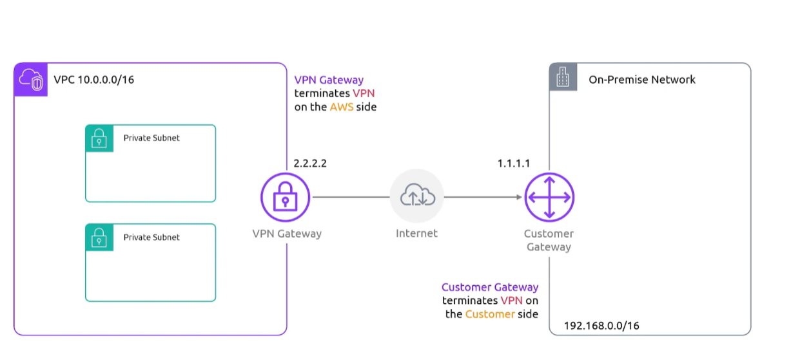

* The `vpn gw` is going to be on the aws side and the `customer gateway is going to be on the on premise side

#### Routing 

* Works 1 of 2 ways:
    1. Static method where you modifu your `route table` to tell the `gateway` how to handle traffic
    2. Dynamic method using `BGP` to exchange routes for you

#### Pricing:

- You'll be charged for each available `vpn` connection hour
- You'll be charged for data transfers out from ec2 to the internet

#### VPN Gateway Limitations

1. 1.25Gbps max bandwidtch per VPN tunnel
    - stack to increase bandwidth
2. 140,000 max packets per second
3. 1,466 `maximum tansmission unit (MTU)`

### Hands On

#### Static Routing

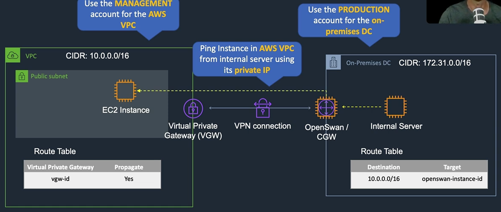

1. In your on-premise network, you'll need to create a customer gateway
    - If you're doing this in AWS, you're essentially just creating an ec2 instance (this instance should allow `icmp` (in `sg`) so we can do a ping test after the `vpn` is created)
    - Disabled source/destination check, since this instance of `OpenSwan(customer gateway)` is going to be forwarding traffic
        * 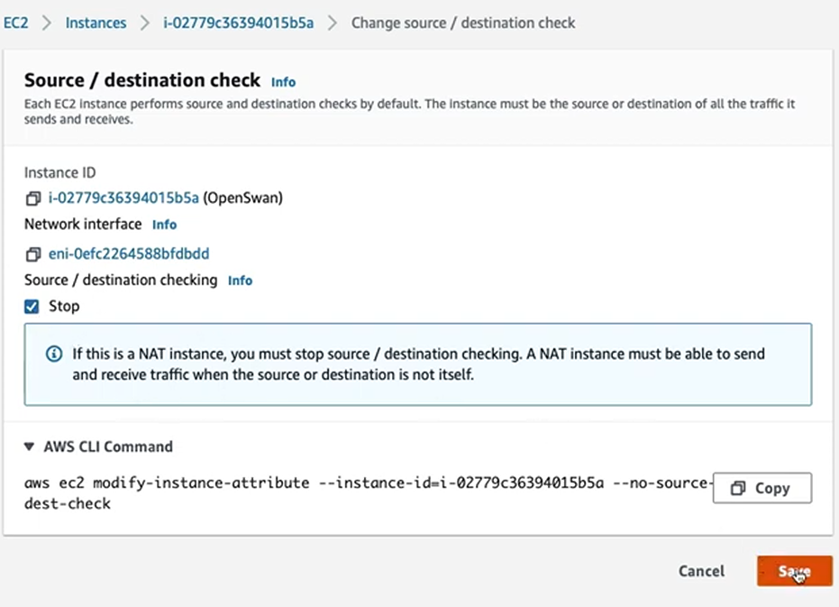
    * Create another instance that you'll use for testing (do not disable source/dest check on this one)

2. In the cloud side of your `vpn` connection, create an ec2 instance that we'll use to validate the connection  

3. In the AWS `VPN` console (cloud side of the tunnel), create a `customer gateway`
    - For the IP Address, make sure it matches the IP of the `OpenSwan` instance we created on prem
        * 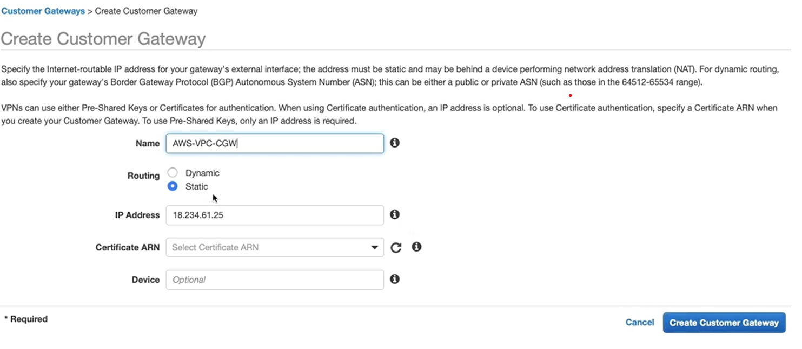

4. Create the `Virtual Private Gateway (vpgw)` on the cloud side of the tunnel
    - 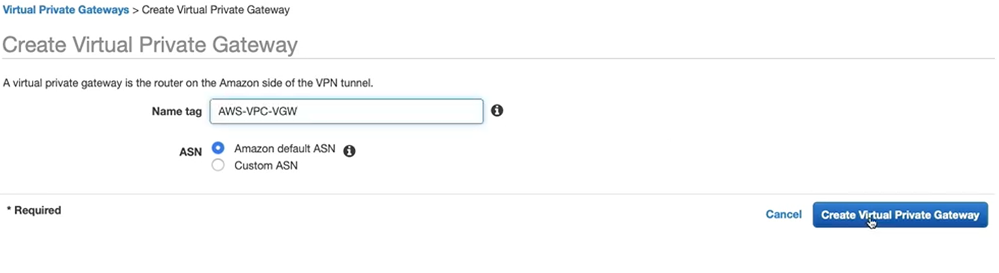

5. Attach the `vpgw` to the vpc you're looking to attach the tunnel to

6. Create the `Site-to-Site VPN Connection`
    - Select both the `vpgw` and `cgw`
    - Set routing options to static
        * Add the static IP Prefixes; 1 for the cidr ranges of each network
    - 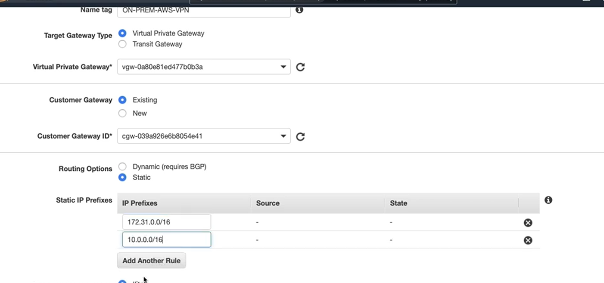

7. Add Local IPv4 and Remote IPv4 Cidr
    - Local is the cidr range of the on prem
    - Remote is the cidr range of the aws side
    * Create Connection
    - 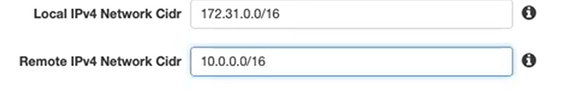

8. In the `route table` attached to the AWS VPC enable `route propagation` for the `vpgw`
    - 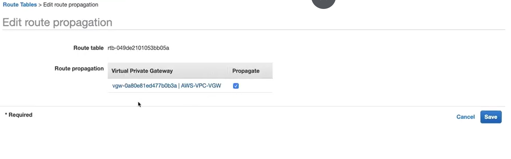

9. Go back to the `Site-to-Site VPN Connection` and download configuration meant for `OpenSwan`
    - This will produce a file with configurations meant to be applied to the `OpenSwam` server in on premises 
    - 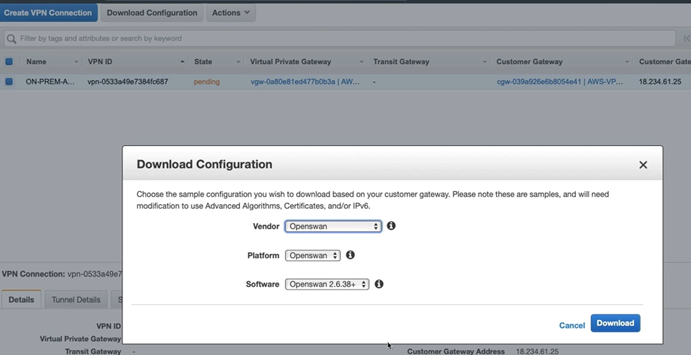

10. Install `OpenSwan` on your `cgw` instance

    ```bash
    sudo yum install openswan -y
    ```
11. Within the downloaded configurations, there will be instructions for each `IPsec Tunnel`. Follow those instructions in your `OpenSwan` instance
    - 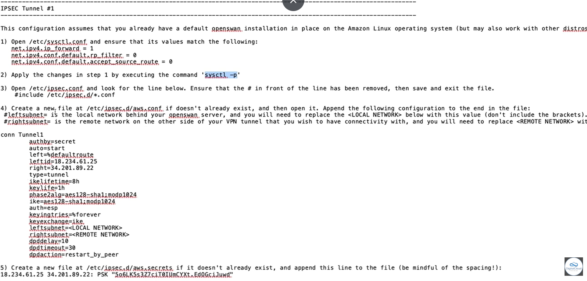
    * remove `auth=esp`: new kernels do not support it and it causes the tunnel to fail silently
    * change `leftsubnet=<LOCAL NETWORK>` to network cidr of on prem network
    * change `rightsubnet=<REMOTE NETWORK>` to network cidr of cloud `vpc`

12. Run `IPSec`

    ```bash
    sudo ipsec verify # verify service before starting it
    sudo systemctl start ipsec
    sudo systemctl status ipsec
    ```

13. On the `Site-to-Site VPN Connection` click on tunnel details and you should see that the tunnel is showing up for the `IPSec` Tunnel you created
    - 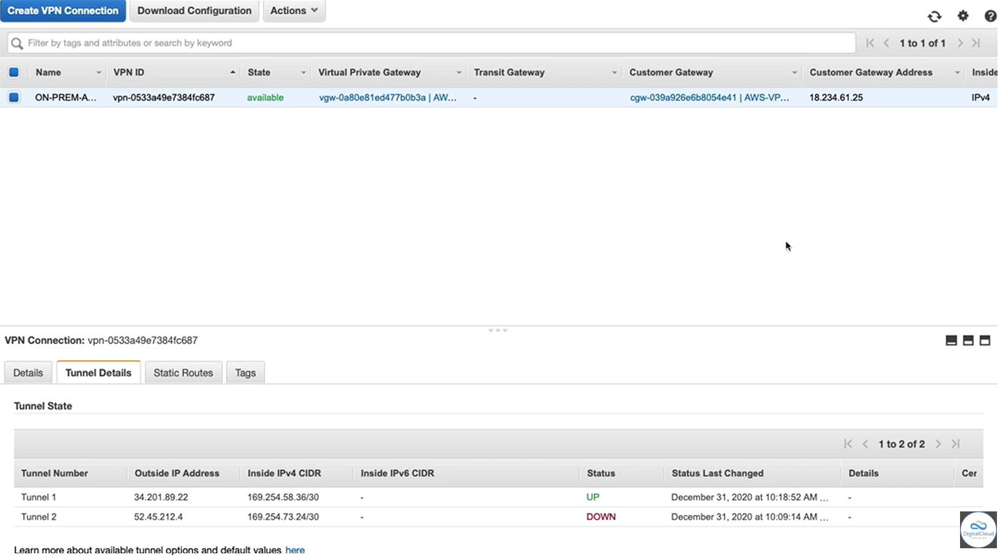

14. Now from the `cgw` instance, you should now be able to ping the instance on the cloud

15. Now for the on premise router, make sure to configure it to route traffic through the `cgw` for all traffic destined for the aws `vpc` network
    - Example below is using an ec2 instance as the `cgw`
    - 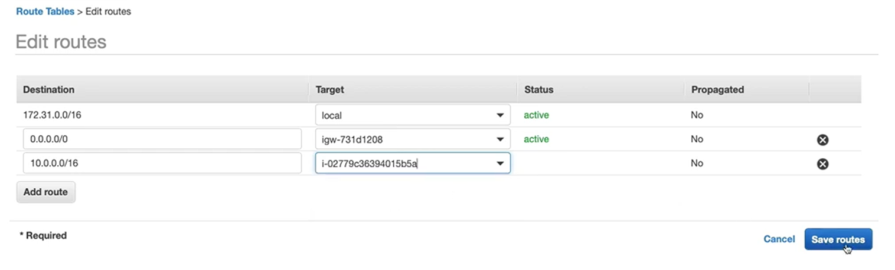

16. You should now be able to ping the instance in the cloud network from the instance you created on prem (the second instance from step 1)

#### Dynamic Routing

* Using `BGP` we can configure dynamic routing, which is important when you have redundancy set up for your `vpn` tunnels. If a tunnel goes down you need your routing to be intuitive enough to redirect routing from that stale `IPsec` tunnel

### References

* `Source/Destination Check`: by default aws drops traffic where the instance isn't the origin or the destination, which is why for our `customer gw` we want to disable it (the same would be done for a `ngw`)

* Cidr Block Ranges: The 2 networks at the edge of each side of the `vpn` tunnel must have different `cidr block` ranges. Overlapping ranges will fail because the `aws vpc router` will prioritize the `local route`, meaning packets meant for the other side of the tunnel will never leave the origin network