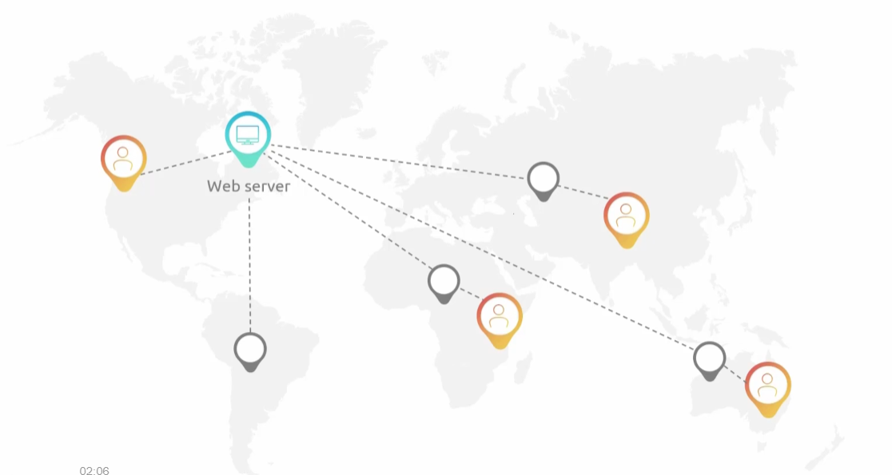
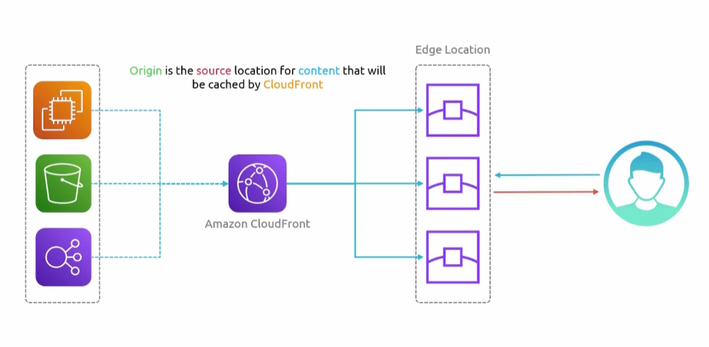
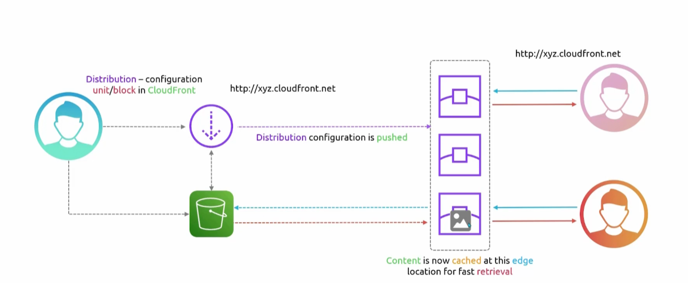
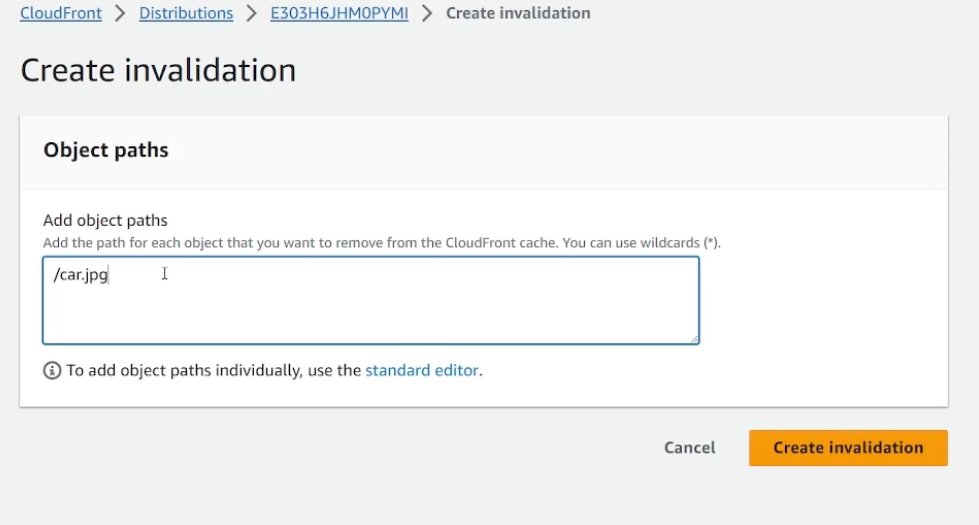
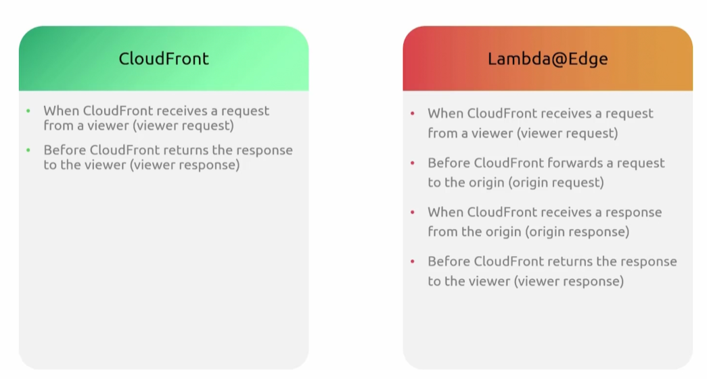
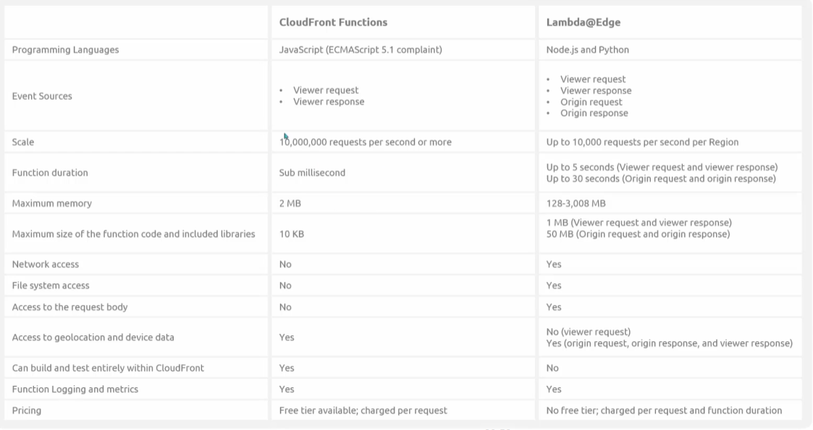

## CloudFront
- [Overview](#overview)
- [Architecture](#architecture)
- [TTL](#time-to-live-ttl)
    - [Cache Invalidation](#cache-invalidation)
- [AWS Services Integration](#aws-services-integration)
- [Lambda@Edge](#lambdaedge)
- [CloudFront Functions](#cloudfront-functions)

## Overview

* In order to understand what `cloudfront` does, we first need to understand that a `content delivery network (cdd)` is. 

* A `cdn` is a globally distributed network of servers called `edge locations` that cache and serve content to users from whichever service is closest to them
    - How it works
        1. User requests a pdf from a site
        2. DNS routes to nearest edge location
        3. Edge checks its cache
            - If present it responds immediately
            - If not present, server fetches from origin and caches it
            - Next User requesting same pdf from nearby location gets it from cache instantly
    - Things that usually get cache
        1. Static assets
            - Images
            - Videos
            - HTML pages
            - Static Websites (e.g. `s3` hosted sites)
        2. Dynamic assets
            - Amazon Lightsail
            - ALB
                * Cloudfrot enables your application's `Cache-Control` headers to cache content like `html, css/js, and images` close to the viewer
                * Additionally you can attach a `sg` configured to allow traffic from `cloudfront ip addresses`, so that it is possible to ensure all requests are processed and inspected by `cloudfront and waf`
* AWS's `cdn` is `cloudfront`. its edge locations sit in front of origins like `s3`, `alb`, `ec2`, or `api gateway`. 

### Architecture

* A `distribution` is a configuration entity that defines how a `cdn` routes and delivers content. It maps request from a user to and `origin` and caches response globally

### Time to Live (TTL)

* Cached content in an `edge location` remains for a set time known as a `ttl`
    - This `ttl` value decides content validity before `edge location` requests the origin
    - Default `ttl` is 24hrs
    - You can have objects expire at a specific time

#### Cache invalidation

* `Cache invalidation` allows you to invalidate content cache at an `edge location`. Its a manual process where you clear the clear the cache from all the old locations
    - You invalidate the cache of a specific `distribution`
    - You can invalidate all objects in a `distribution`, a specific folder, or a specific object
        - `/*` - invalidates entire `distribution`
        - `/file.txt` - invalidates specific file
        - `/images/*` - invalidates all objects in a specific folder

        

### AWS Services Integration

* `Cloudfront` also integrates with a couple other aws services
    1. ACM
        - A default domain will be created for each distribution, and it will have an ssl cer `*.cloudfront.net`
        - You can use your own custom domain by integrating with `aws certificate manager (acm)`
    2. CloudWatch
        - Auto pulished operational metrics for `distributions`
        - Can enable extra metrics for added cost

### Lambda@Edge

* `Lambda@Edge` is a way to run `lambda` functions at `cloudfront edge locations`, so that your code executes as close to the user as possible rather than at origin.
    - Greate for functions that take several ms to run, functions that require adjustable resources (mem, cpu), functions that depend on 3rd party libs (aws sdk), functions that require network access to use external services for processing, and functions that require file system access or access to body of HTTP request
    - You'd use these over `cloudfront functions` if is a heavier long running function
    - `lambda@edge` is also alot more versatile with when you the functions actually run
    - See differences below
        * 

### CloudFront Functions

* `Cloudfront functions` are ideal for lightweight short runing functions
    - Great for header manipuation, url rewrites, validating jwt for request auth, url redirects

