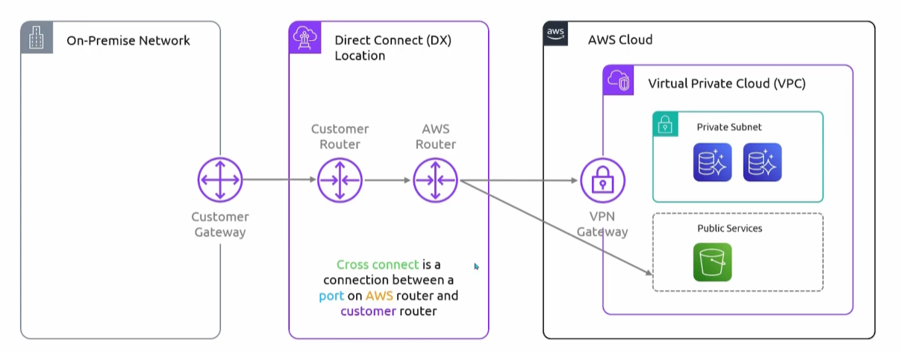

## Direct Connect
- [Overview](#overview)
- [Pricing](#pricing)

### Overview

* `Direct Connect` is literally what it means, it is a direct physical connection from your on premises to aws resources.
* There ae 3 components:
    - On premise network with firewall cgw
    - Direct Connect (DX) location
        * Not always owned by aws
        * A data center with aws routers that you can connect to
        * Your router will exist at this location
        * Your router will have a cross connection to the aws router which will send that traffic to aws services
    - AWS Cloud
        * Depending on whether or not your connection to private or public aws services, the aws router will have to go through a `vpn` gateway
* The whole idea of this is to bypass the internet entirely, and you'll be going through AWS backbone. For faster speeds and increased security

### Pricing

* You'll be charged for port hours and outbound data transfers