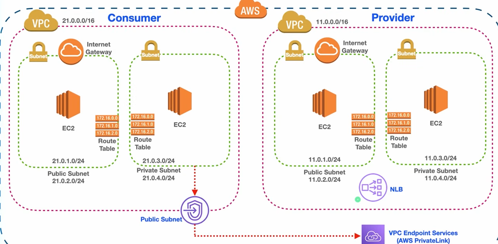
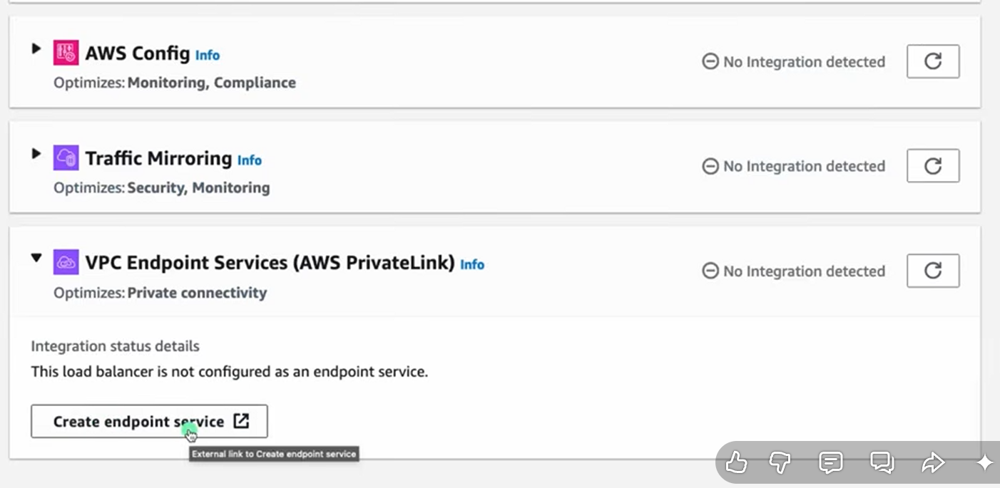
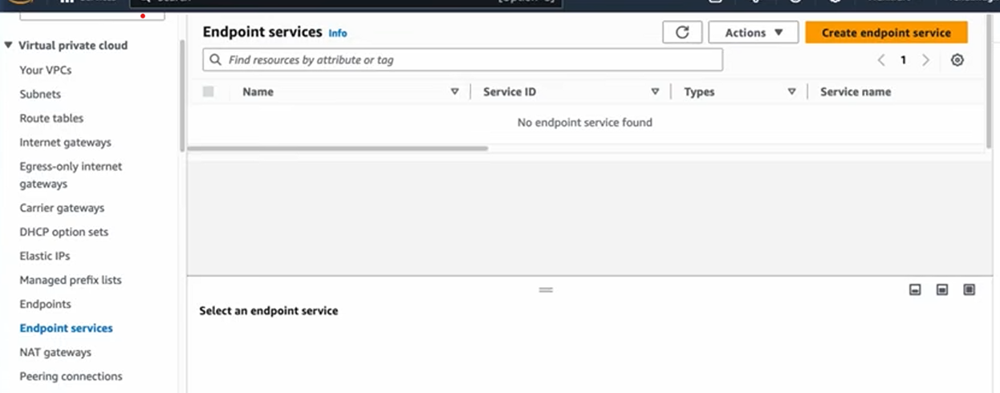
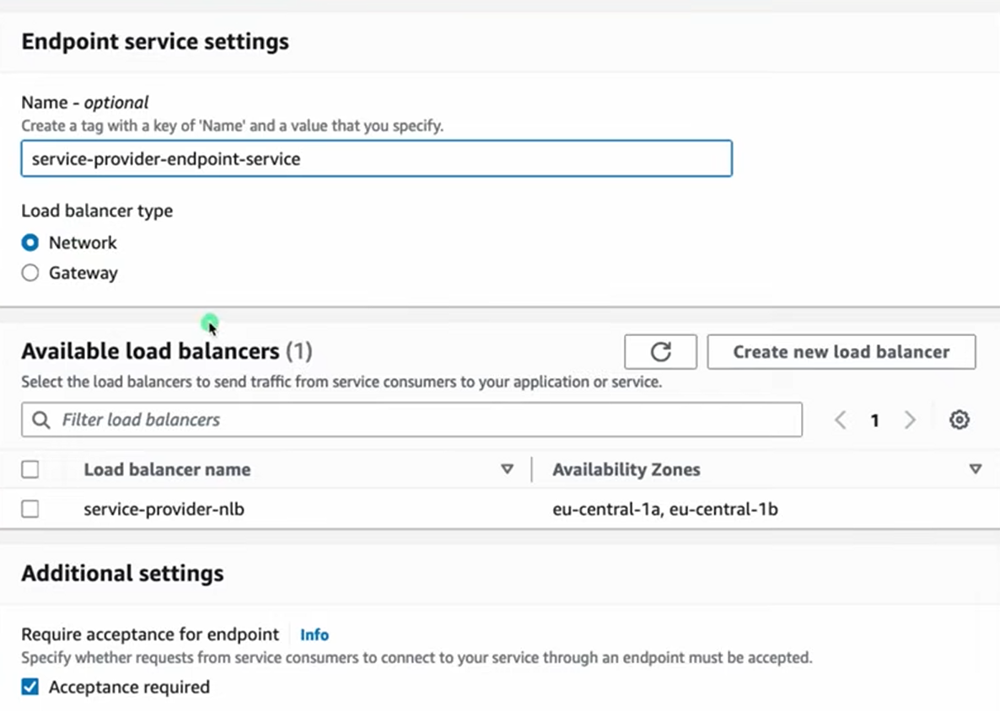
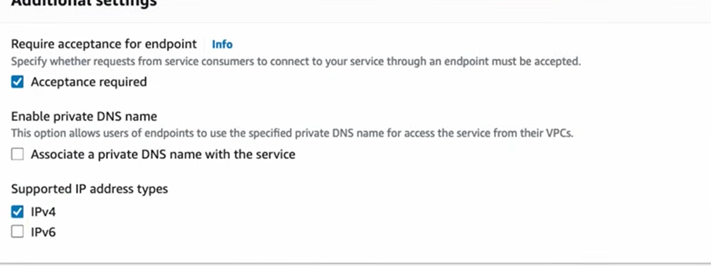
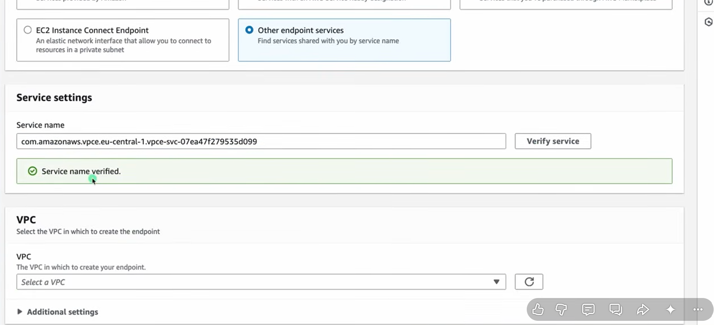
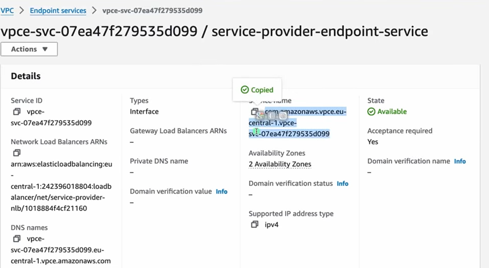
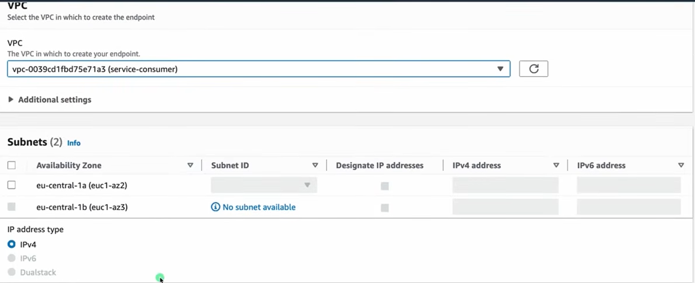
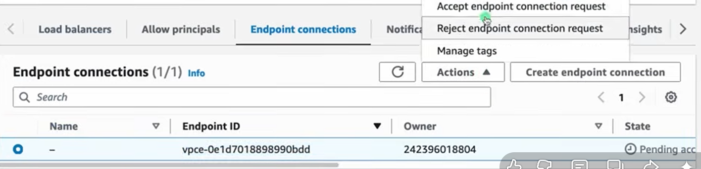

## PrivateLink
- [Overview](#overview)
- [Hands On](#hands-on)

### Overview

* AWS `privatelink` gives access to public aws services without having to route through the internet. It also allows connections to other services in `vpcs` through private ip adddresses.
    - If a 3rd party service hosted a service on their `vpc`, you could create a `privatelink` connection to that service through private ips
    - For you're perspective, the services you're accessing appear to reside directly in your vpc
    - Connections will not traverse the internet, you will not require a `ngw` or an `igw`

### Hands On

1. In this example, we're looking to expose our internal service running behind a private `loadbalancer` to our enduser in a separate account. We have a SaaS product hosted that they want to connect to privately.

2. We'll first need to create an `endpoint service` from our loadbalancer. Which can be done at the lb itself or in the `vpc console`
    - 
        * directly at lb
    - 
        * vpc console
    * NOTE: only `gateway` or `network loadbalancers` can be directly creatde as `endpoint services`
    - Create the `endpoint service`
        * Associated a `Private DNS Name`
        * 
        * 
    - As a service provider, you must create dns records in the public domain that you use it for DNS validation
    - As said by [this doc](https://aws.amazon.com/about-aws/whats-new/2020/01/aws-privatelink-supports-private-dns-names-internal-3rd-party-services/) you simply specify what DNS Name the consumer uses
    - More documentation [here](https://docs.aws.amazon.com/vpc/latest/privatelink/manage-dns-names.html)

3. Next we'll just need to create our `consumer vpc`, where we'll be attempting to connect to our `nlb` though `privatelink`. Ensure its fully private

4. After our consumer ec2 instance is setup (private), we need to create a `vpc endpoint` which we will use to access our `endpoint service`
    - 
    - The service name will the in the details of the `endpoint service` that you created in step 2
        * 
    - Choose the `vpc` where the endpoint will be created (in your consumer `vpc`)
    - Select the `subnets` where the `endpoint network interface (eni)` will be created
        * 
        * Pick `sg` you want to attach to `eni`
    - When an `endpoint` is created
        * you have the option to hook that up to a `private DNS name`
        * with istio as the producer you might also tell consumers what DNS Name to connect to their `endpoint`

5. After creation the `endpoint` will request acceptance of connection from `endpoint service`, which we'll need to accept
    - 
        * Once accepted the service consumer can modify private DNS Names on their `service endpoint` and enable it to use a custom private DNS Name

* You can even do this from different accounts, service names are unique in aws, so you'd simply need to submite the request when you create the `endpoint` and then wait for approval