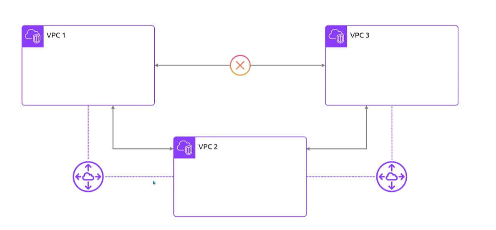
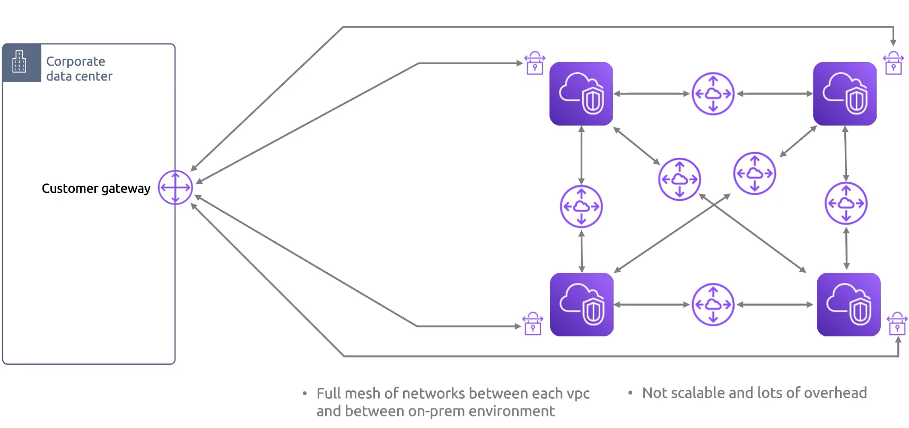
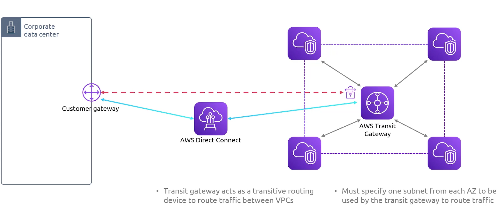
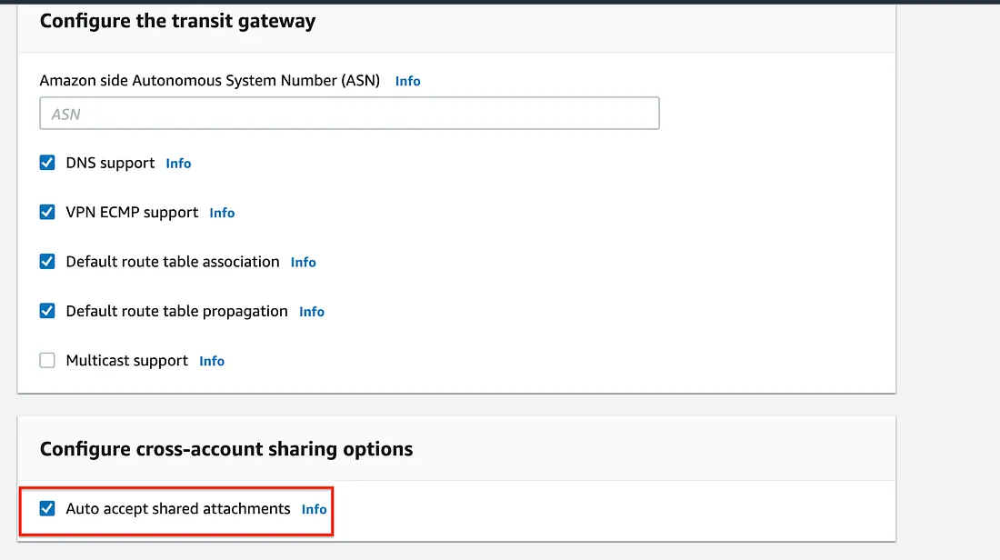
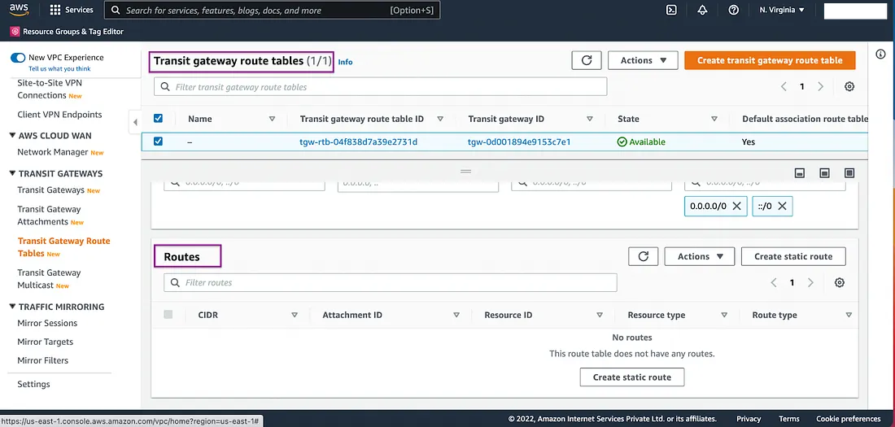
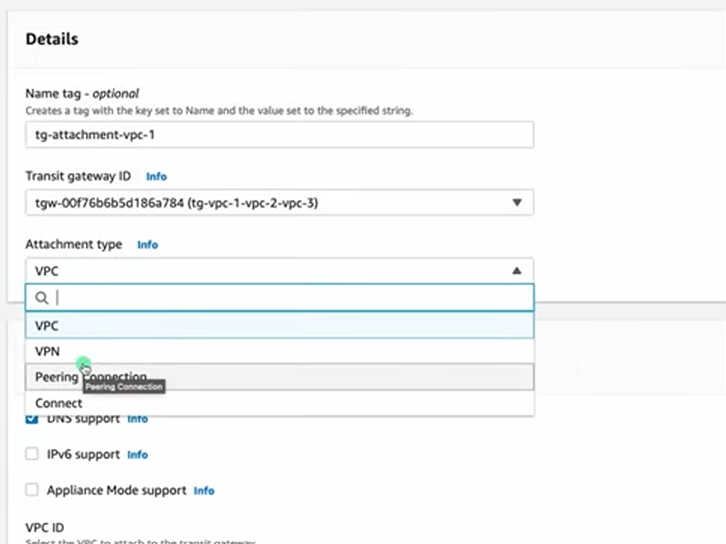
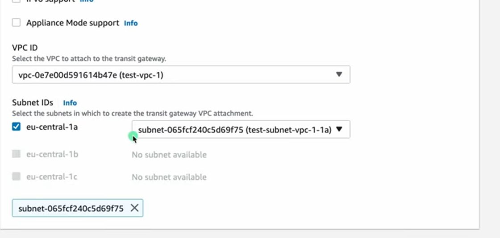
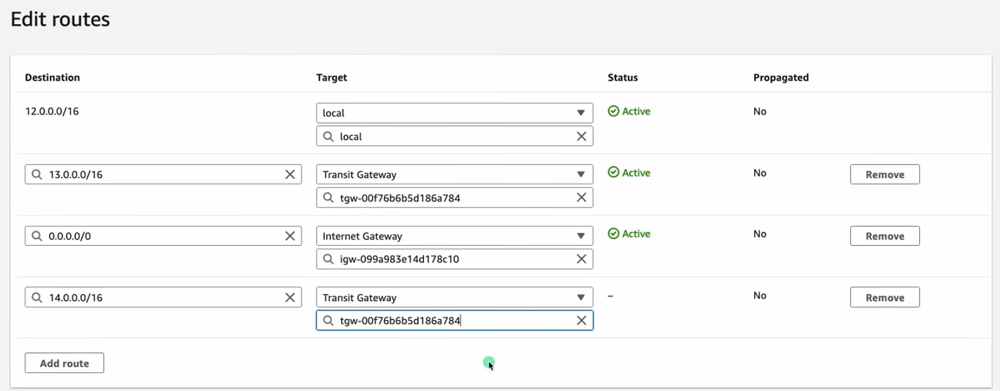

## Transit Gateway
- [Overview](#overview)
- [Hands On](#hands-on)

### Overview

* We learned in our notes on [vpc peering](2026-06-19-vpc-peering.md) that we cannot perform transitive peering from one `vpc` to another `vpc` through a separate `vpc`
    - 

* If we wanted to peer multiple vpcs to one another, it will become increasingly difficult to manage the `vpc peering connections` as well as managing the `routes` that facilitate the connection. Scaling would be difficult if you wanted to add a new `vpc` to this mesh of connections

* It gets even more complicated when you an an on premise data center into the mix that needs to be able to communicate with the aggregate of `vpc`. You'd need to create a `vpn` per `vpc`
    - 

* A `transit gateway(tgw)` is meant to solve this issue. The `vpcs` that need to be able to communicate with one another, need only connect to the `transit gateway` and the `tgw` will act as a router to forward traffic to the destionation `vpc`
    - You must specify one `subnet` for each `AZ` to be used by the `tgw` to route traffic
    - Even for an on premise data center that needs to communicate with the aggregate of `vpcs` you need only create `vpn` connection directly to the `tgw`
        * You can even use `direct connect` to form a connection directly to a `tgw`
    - 

* You can even peer `tgws` to one another. That way you can peer `vpc` between one another. You can even peer `tgws` between aws accounts

### Hands On

1. Under the assumption that you already have `vpc`, `subnets`, and `route tables` created; we'll jump right into creating the `tgw`
    - 
        * We selected auto accept shared attachments
        * When sharing between aws accounts that you own with an org, you can use aws `resource access manager (ram)`. Example doc with `RAM` can be found [here](https://blog.searce.com/sharing-transit-gateway-across-aws-accounts-using-resource-access-manager-ram-9831a22b2a84)
        * `sg` referencing now support across `vpcs` where you can reference the `sg` from another `vpc` in the `sg` of the current `vpc` through the `tgw`

    - You'll notice that a `tgw route table` was automatically created
        * 

2. Create a `tgw attachment`
    - 
        * you can attach to another `vpc`, `vpn` (for on prem connections), `peering connection` (connecing a `tgw` to another `tgw`), or to `direct connect`
    
    - For attaching to a `vpc`, you'll be required to specify at least 1 `subnet` to create the `tgw attachment`
        * 

3. Update the `route tables` per `vpc`
    - You'll use the attachments (created for the `vpc` the `rt` is attached to) as the target for the `route` pointing to the `vpc` you're connecting to through the `tgw`
        * 
        * You'd repeat this process for all `vpcs` that need to connect with one another

