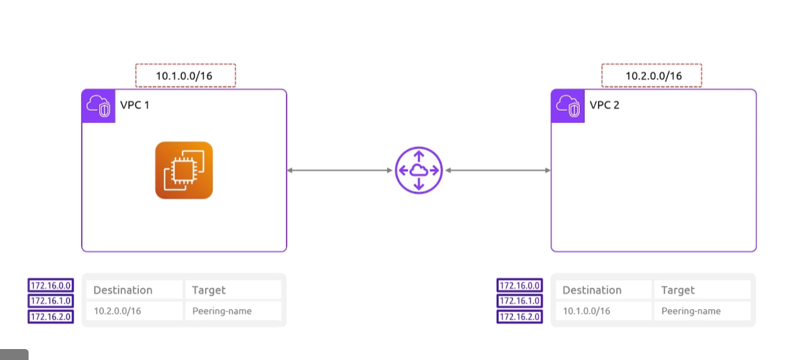
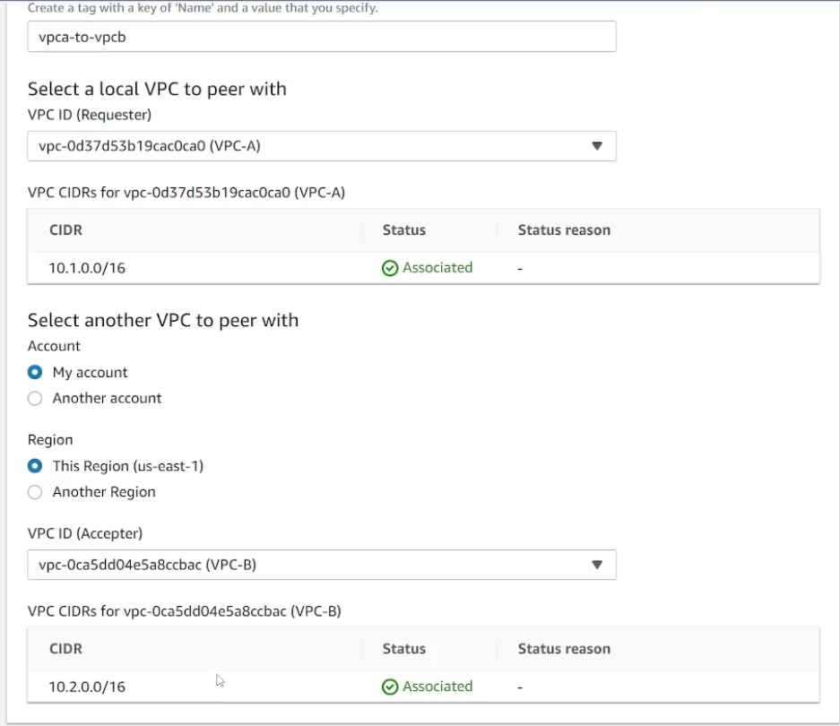
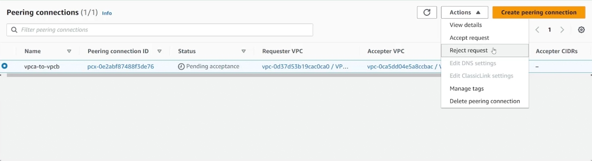
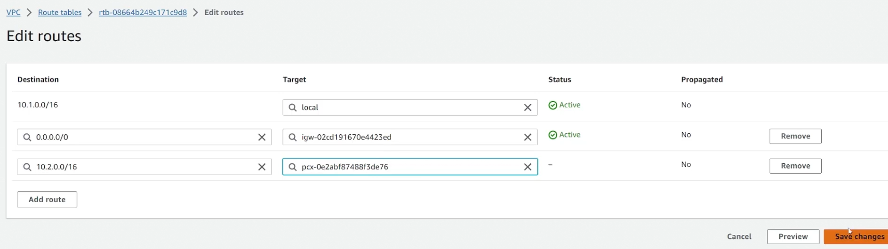
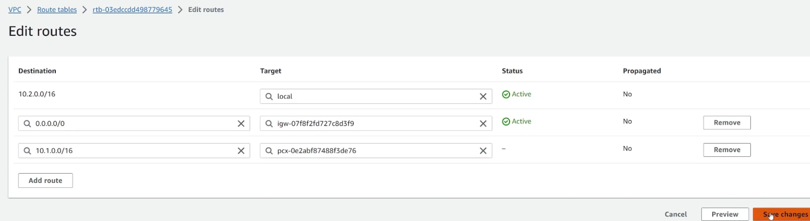

## VPC Peering
- [Overview](#overview)
- [Pricing](#pricing)
- [How it Works](#how-it-works)
- [Hands On](#hands-on)

### Overview

* By default resources in separate `vpcs` are unable to communicate with one another. The whole idea behind `vpc peering` is to setup a connection between 2 `vpcs` allowing resources between these `vpcs` to communicate through one another
    - Its is possible to peer `vpcs` between aws accounts

### Pricing

* For the peering connection creation, there are no costs
* Data transfers within the same `AZ` via peering is also at no cost
* Data transfers across `AZs` via peering will incur a charge

### How it works

* The owner of one of the two `vpc` will need to send a peering request to the owner of the other `vpc` (which they will need to accept)
    - If it's within the same account, you'd be sending the request to yourself
* After the peering is created, you'll need to handle the routing
* You'll need to modify the `route table` in both `vpc` to set a `route` with destination for the `cidr block` of the corresponding `vpc` and the target being the `vpc peering` name (which will have a unique identifier).
    - 

* NOTE: you cannot set up transient `vpc` connections
    - If `vpc 1` has a peering to `vpc 2` which has a peering with `vpc 3`, you cannot have `vpc 1` use `vpc 2` as a means to connect to `vpc 3`.

* NOTE: `cidr blocks` of each `vpc` must be different

### Hands On

1. Create a `peering connection` in aws vpc console
    - 

2. Accept peering request
    - 

3. Modify main `route table` of each `vpc` to configuring routing to one another throguh peering 
    - 
    - 