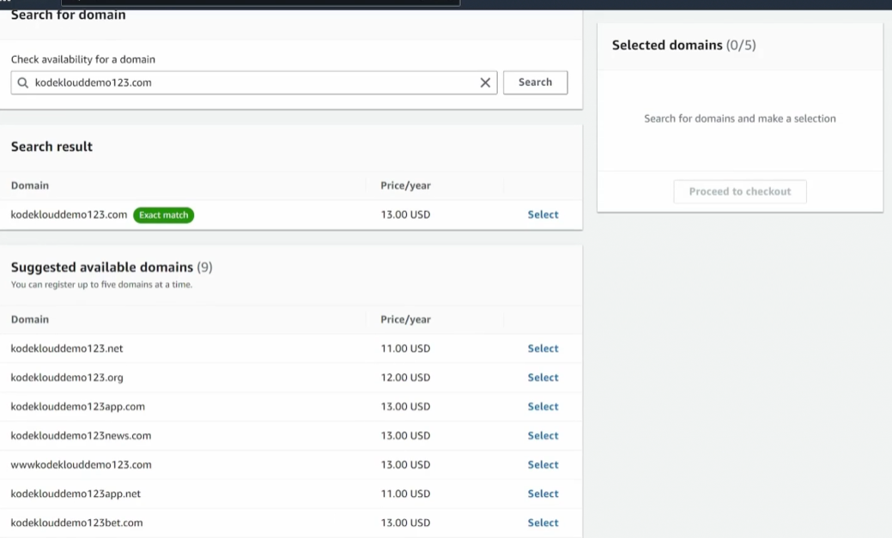
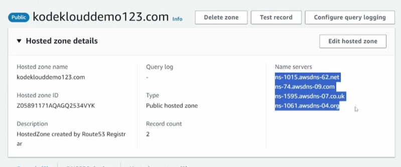
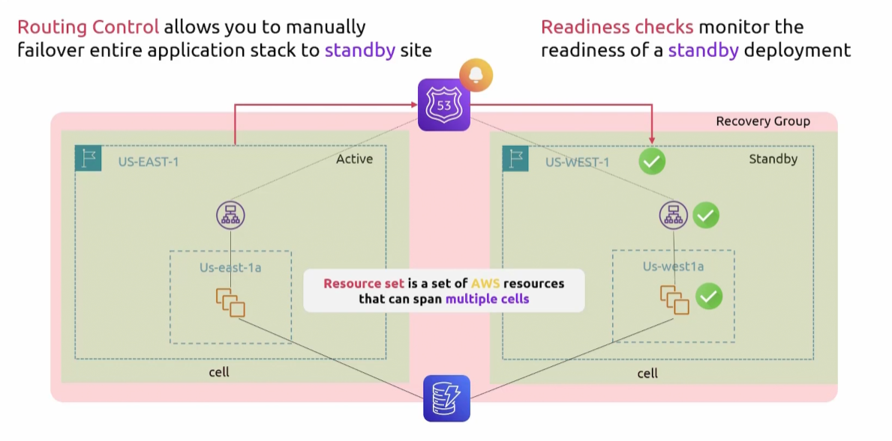

## Route53
- [Overview](#overview)
- [Application Recover Controller](#application-recovery-controller)
- [Routing Policies](#routing-policies)

### Overview

* `Route 53` is aws's managed domain name service that acts as a domain registrar where you can purchase domains (similar to sites like godaddy and namecheap) and manage the records for those domains within aws
    - You can even transfer in domains that you've purchased elsewhere
    - 
    - 
* NOTE: it is a global service, not a regional service

* Within `route 53` we have `hosted zones`, which are just a collection of `dns rules` and `records`
    - When you create a `hosted zone`, aws will allocation 4 nameservers to that zone

### Application Recovery Controller

* `Route 53 application recovery controller` is a service for managing and automating failover of applications across regions or `AZs`
    - Terms to know
        1. `Routing Control`: allows you to manually failover entire application stack to standby site
        2. `Readiness Checks`: monitors the readiness of a standby deployment by comparing to primary
        3. `Resource Set`: set of aws resources that can span multiple cells
        4. `Cell`: contain an applications independent unit of failure, group of aws resources required for your app to operate 
        5. `Recovery Group`: a collection of `cells` that represent an application of group of applications that you want to check for failover readiness (i.e. primary and standby `cell`)
    - It has 3 main components
        1. Readines Check: monitors resources across regions or `AZs` and tells you whether your DR env is ready to take traffic by checking things like
            - If standby auto scaling group is size like primary
            - Does stnadby DB have replication lag under a threshold
            - Are all the right resource provisioned
        2. Routing Controls: a switch that sits in front of `route 53` health checks
            - You flip it and `route 53` stops or starts routing traffic to that endpoint
        3. Safety Rules: guard rails on top of routing controls that prevent you from accidentally tkaing down everything during a failover (e.g. preventing flipping all routing controls off and preventing multiple failovers in a short period of time)

    - Use cases include: failing over application during a maintenance window so endusers don't experience downtime
    - The goal is to reduce the amount of steps necessary to failover an application by eliminating manual steps

### Routing Policies

* `Route 53` has 7 routing policies to solve a different traffic problem:
    1. `Simple`: 1 record, 1 destination. No logic, send all traffic
    2. `Failover`: Primary and secondar destination, `rout 53` checks the primary and flips if there is failure
        - Requires health checks
        - For DR envs
        - `Route 53 arc` sits on top of this
    3. `Weighted`: split traffic by percentages across multiple resources
        - For ab testing, canary deployments (gradual)
        - Weight 0 = stops sending traffic to record withou deleting it
    4. `Latency`: route user to whichever region in aws has the lowest latency
        - For multi region apps
    5. `Geolocation`: route based on user's physical location. You explicitly map locations to endpoints
        - For when serving different content by region, legal requirements, or language specific sites
        - Must have default record for locations you have not mapped
    6. `Geoproximity`: like `geolocation` but you can bias the boundaries. You can stretch coverage for an area to pull more traffic even if a user is closer to another region
        - For fine grained geographic traffic shifting to gradually move traffic between regions
    7. `Multi Value Answer`: rerturns up to 8 ip addresses or records in a response to a single DNS query.
        - Integrates with health checks to ensure only healthy endpoints are returned
        - Loadbalancing apps not behind a traditional loadbalancer
    8. `Ip Based`: you route based on client's `cidr block`, which `ip ranges` should route to which endpoint
        - You want to route end users from certain `ISPs` to specific endpoints so you can optimize transit costs