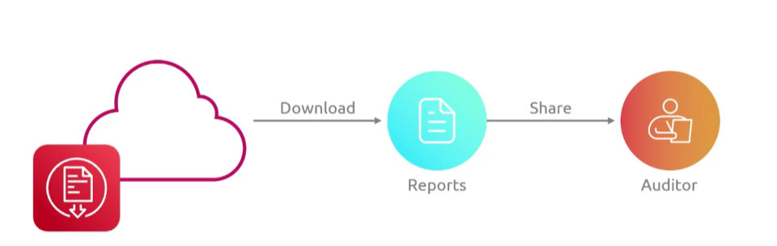

## Artifact
- [Overview](#overview)
- [Components](#components)

### Overview

* AWS `Artifact` is a free, self-service portal providing on-demand access to aws security and compilance reports as well as legal agreements
    - it servers as a central resource for audit evidence and contract management
    - you can submit these reports to auditors for any compilance needs you must meet

### Components

* `AWS Artifact Reports`: download official third-party compilance documents like SOC1/2/3 reports, ISO certifications, PCI, DSS, and FedRAMP
* `AWS Artifact Agreements`: review, accept, and manage legally binding terms such as HIPPA BAA and DPA