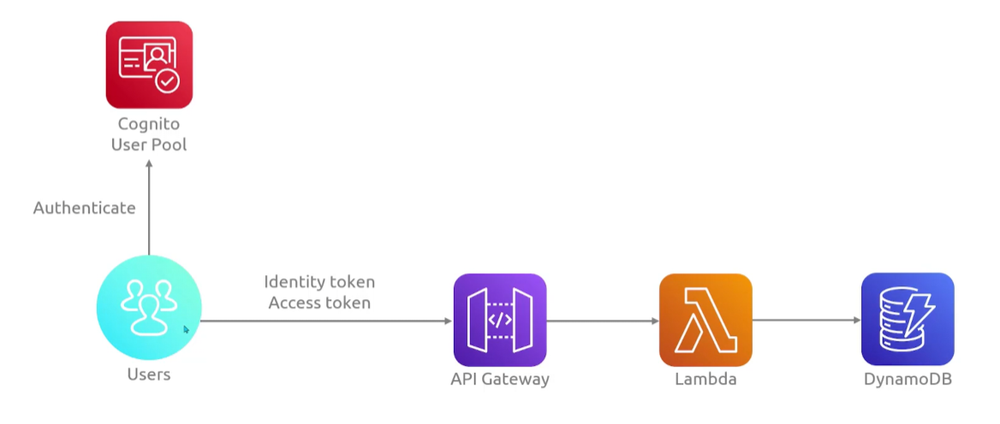
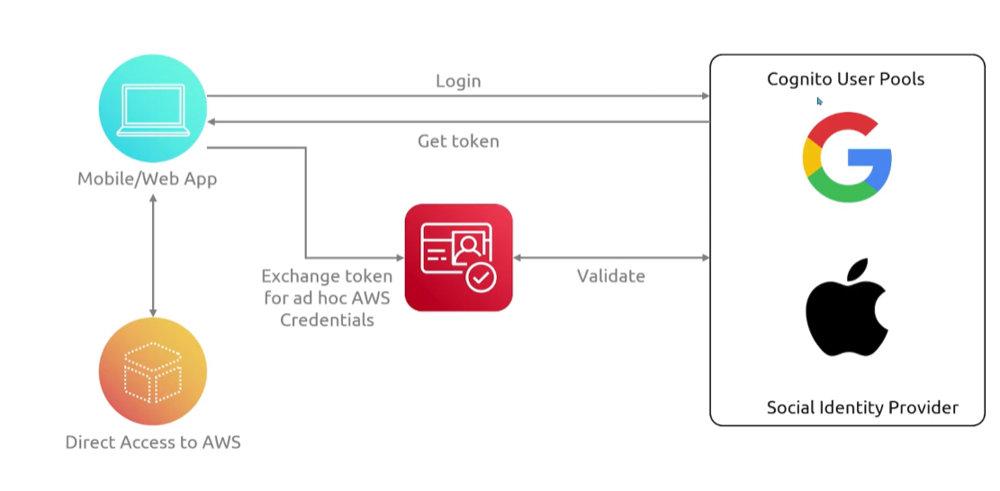

## Cognito
- [Overview](#overview)
- [Components](#components)

### Overview

* AWS `Cognito` is an identity management service that provides secure user authentication, authorization, and directory services for web and mobile applications
    - it handles sign-up, sign-in, mfa, and federation with social or enterprise idp
    - it scales to millions of users and hundreds of transactions per second
        * pay as you go model
    
### Components

* `User Pools`: built in user directoy that manages sign-up and sign-in services
    - issuing oauth 2.0 and openid connect tokens upon successful auth
    - meant for basic auth, get token from pool and pass it to app for auth
    * 
* `Identity Pools`: a tool that exchanges user tokens from user pools or external idp for temp, limited-privilege aws credentials to access backend resources like `s3`
    - 
* `App Clients`: configurations that connect specific client applications to your user pool