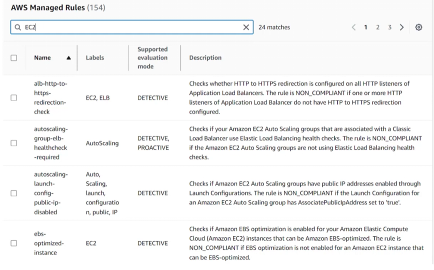

## Config
- [Overview](#overview)
- [Components](#components)

### Overview

* AWS `Config` is a fully managed service that lets you assess, audit, and evaulate the configurations of your aws resources
    - it tracks resource inventory, records configuration changes, and evaluates how well your setup match your internal security and compliance rules
        * great for auditing purposes because it tracks and monitors any changes made to the configuration of your resources

### Components

* `Configuration Recorder`: continously captures and saves point-in-time views of your cloud infra
* `Resource Relationships`: maps how different cloud elements connect and depend on each other
    - e.g `ec2` instance linked to an `ebs volume`
* `Config Rules`: pre-built or custom rules that auto check if your resource configurations comply with best practices and security policies
    - how `aws control tower` implements `detective guardrails`
    - 
* `Conformance Packs`: group of rules and remediation actions packaged together to help manage compilance at scale
* `Multi-Account Aggregation`: combines compliance data across multiple aws accounts and regions into a single dashboard