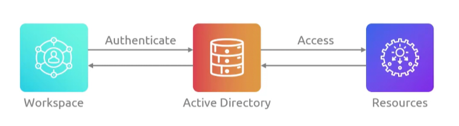

## Directory Service
- [Overview](#overview)

### Overview

* AWS `Directory Service` lets you run and connect microsoft active directory or cloud native directories in aws
    - the 3 main directory types are 
        1. `AWS Managed AD`: real microsoft ad built on windows server, supporting turst, multi-region replication, and domain joining for `ec2` or `rds`
            - available in standard or enterprise
            - it can create a trust relationship with whatever AD you may have on prem
        2. `AD Connector`: a fast directory gateway proxy that forwards sign-in requests to your existing on-prem AD without caching data in the cloud
        3. `Simple AD`: low cost, samba-based directory compatible with basic AD tasks for smaller workloads, though it does not support trust relationships or MFA
    - it is high available, deploys domain controllers across 2 AZs by default
    - it connects seamlessly with `ec2`, `rds for sql server`, `fsx`, and `iam identity center for sso`