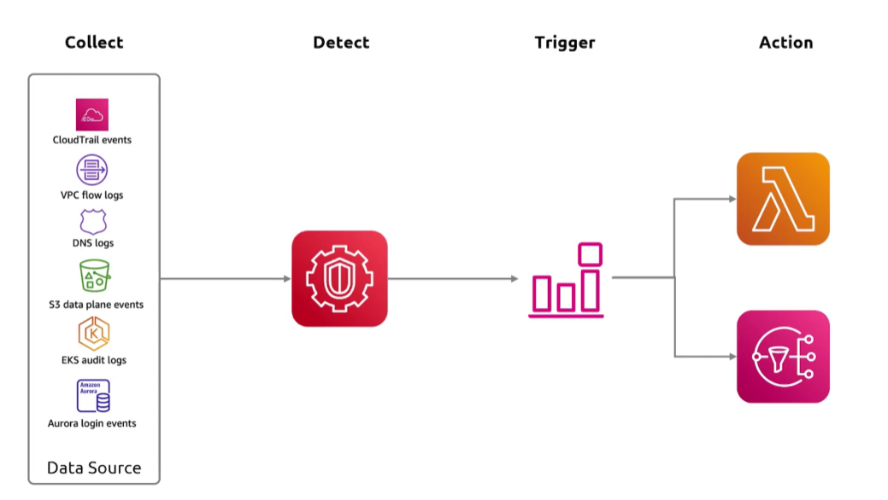
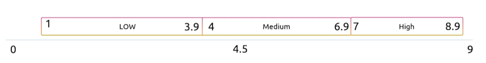

## GuardDuty
- [Overview](#overview)
- [Threat Catagories](#threat-catagories)

### Overview

* AWS `GuardDuty` is a fully managed threat detection service that continously monitors aws accounts, workloads, and data using `ml`, anomaly detection, and threat intelligence
    - uses aws cloudtrail for tracking management and api data events
    - uses vpc flow logs to capture network traffic ip data
    - uses dns logs to evaulate queries resolved by `route53`
    - uses lightweight agents (`eBPF`) for `ec2`, `ecs`, and `eks` container analysis
    - scans `ebs volumes` and `s3 buckets` when suspicious uploads occur
    - monitors login threats for `rds` and inspects ai workloads like `bedrock` and `sagemaker`
    - automatically correlates security signals into actionable sequence assessments
    - you can pass it trusted and threat ip lists
        * trusted to ignore or threat to auto generate a finding on
    - keyword is malicous activity
* When `GuardDuty` finds something, its going to give it a severity score
    - 

### Threat Catagories

* `Recon`: suspcious behavior like port scanning, unusual api activity, or unblcoked probing signaling an attacker gathering target info
* `Instance Compromise`: signals that an `ec2` or workload instance is compromised
    - cryto mining, backdoor command, data exfiltration
* `Account Compromise`: indicators that creds or iam identities are hijacked, such as logins from unusual geolocations or disabled cloudtrail logging
* `S3`: malicious file detection 