## IAM Identity Center
- [Overview](#overview)
- [Components](#components)
- [Demo](#demo)

### Overview

* AWS `IAM Identity Center` is a central service for managing workforce access and sso across multiple aws accounts and applications
    - it connects external identity providers like Microsoft Entra ID, Okta, or Google Workspaces to issue secure, temporary credentials
    - it gives users a single login page to see all assigned accounts and cloud tools
    - it uses reusable permission templates instead of manual account-by-account user setups
    - integrates with corporate directories via SAML 2.0 or AD
    - it is free to enable and you only pay for underlying resource usage
    - aws `control tower` automates the setup and configuration of `identity center` when you deploy a landing zone
        * it configures it to use its own directory and user permissions

### Components

* `Identity Source`: the directory of users and groups
    - you can use the built in identity center directory, connect to AD via AWS Directory Service, or link and external idp like okta
* `Permissoin Sets`: collection of iam policies that define what tasks users or groups can perform
* `AWS Access Portal`: a customized web page where people login in to see and launch all assigned aws accounts, cloud applicatoins, and external saas apps

### Demo

1. Enable Identity Center
    - 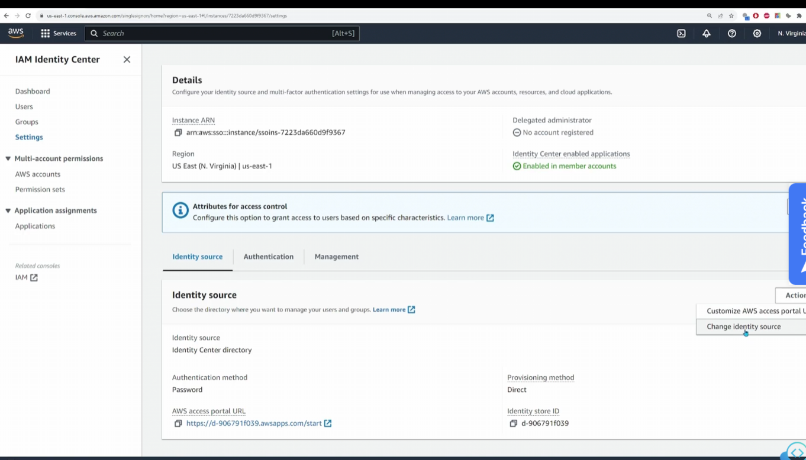
    * you can change yoour identity source to choose a new idp
        - 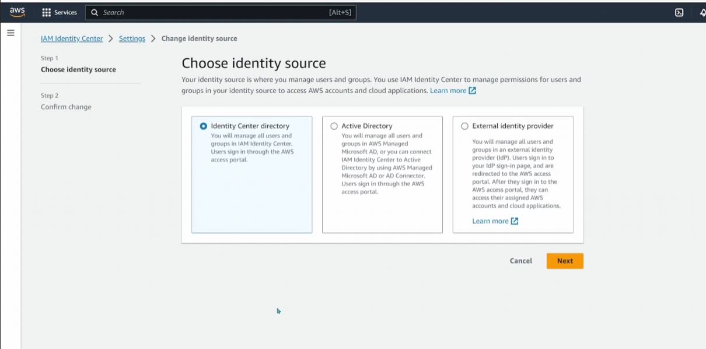

2. You can manage users and groups
    - 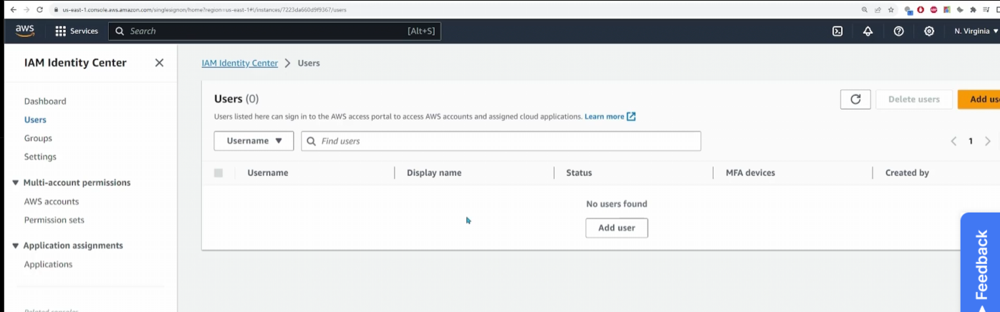
    - 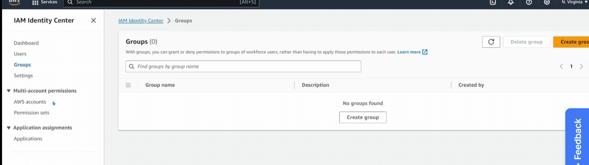
    * NOTE: for external idps, these will be managed on their platforms

3. You can view aws accouts associated with your organization
    - 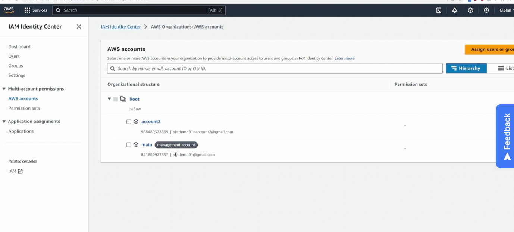

4. Define permission sets for users to inherit
    - 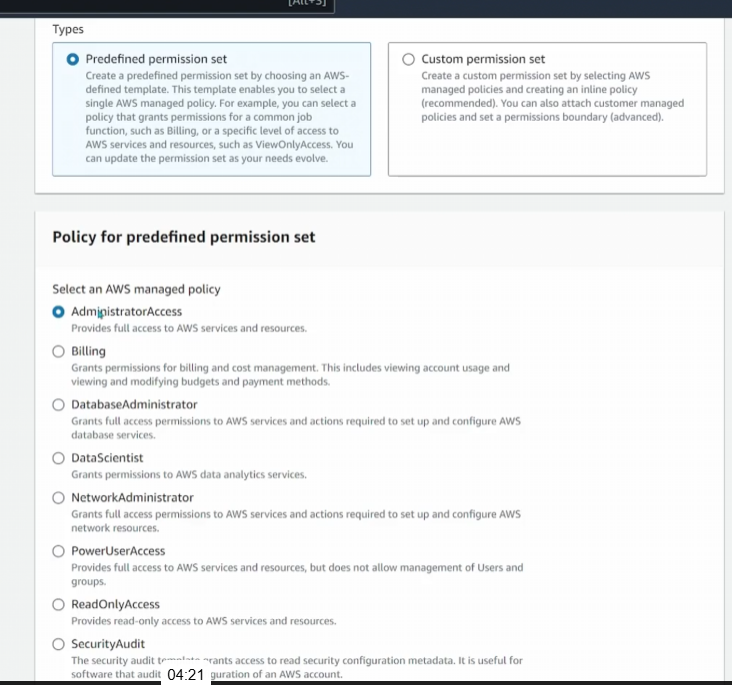
    * you can create a custom permission set
        - 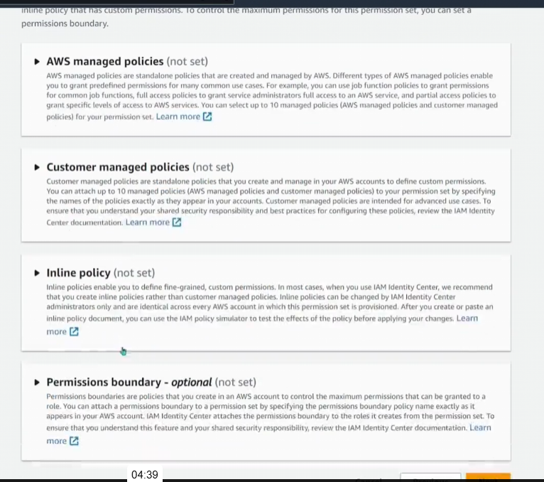
        - 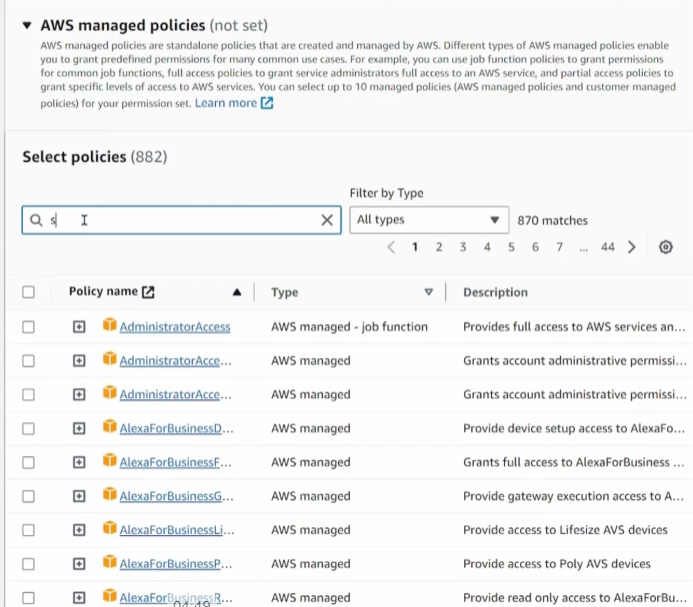
    * define permission set configurations
        - 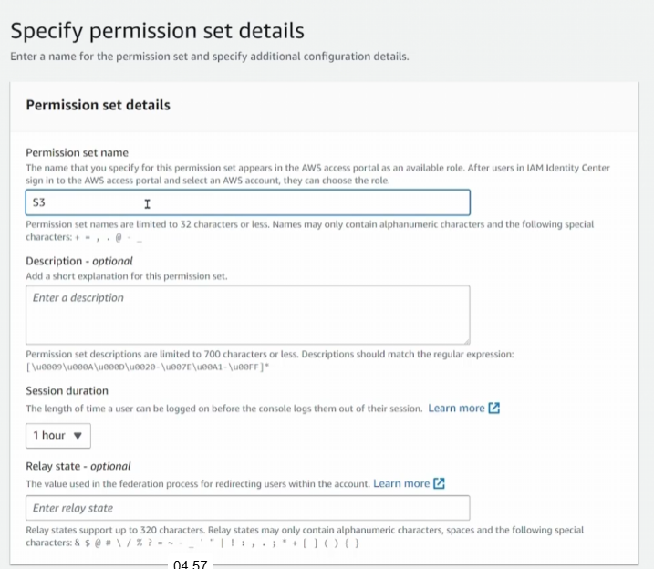

5. Assign a user to an account
    * select account and assign
        - 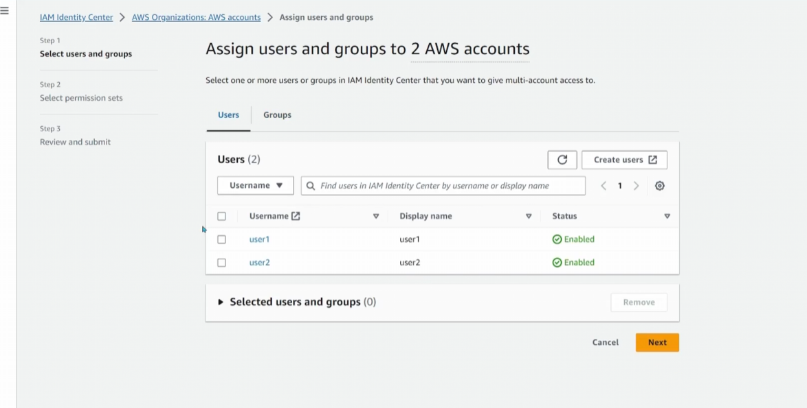
        - 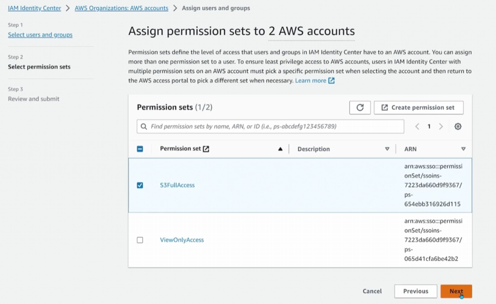
        * these policies will be configured on both accounts
