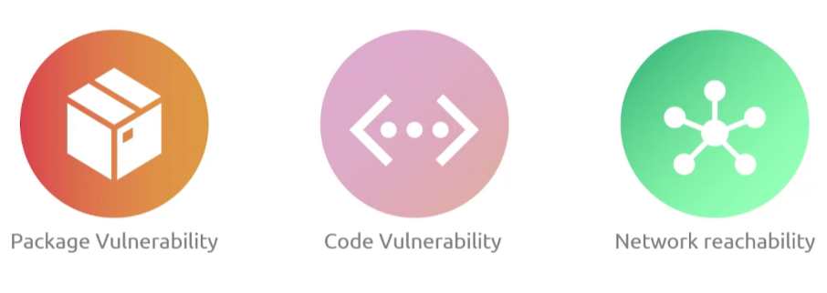
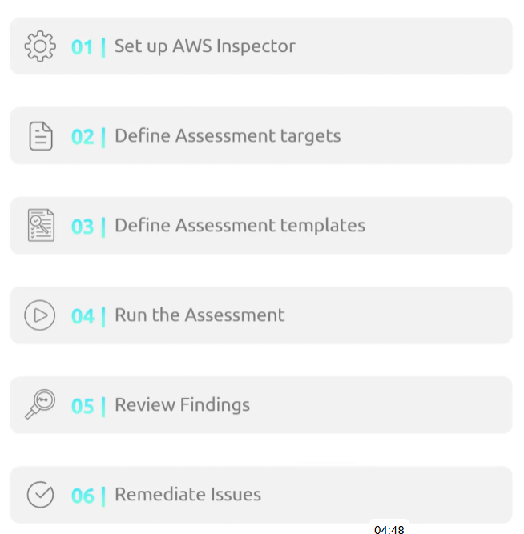

## Inspector
- [Overview](#overview)

### Overview

* AWS `Inspector` is an automated vulnerability management service that scans `ec2`, `ecr container images`, and `lambda functions` for software flaws and network exposure
    - it auto finds and monitors supported workloads across your accounts
        * detects changes that may effect workload such as patches or updates 
    - uses agent based scanning via `ssm` and agentless scanning via `ebs snapshots` for `ec2`
    - prioritizes findings using cve data, network reachability, and exploitability
        * provides scoring based on what it finds
        * if it finds something it will produce a `finding report`
        - 
    - it has a centralized dashboard where you can define customizable views
    - you can define what is scanned using an `assessment target`
        * which is a group of aws resources you want to scan
        * can group by naming the target or selecting either all instanes in your account or region or by using resource tags
    - 
    