## Macie
- [Overview](#overview)
- [Demo](#demo)

### Overview

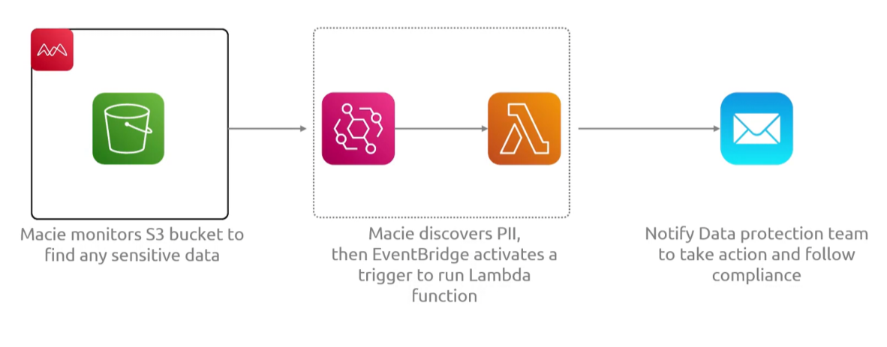
* AWS `Macie` is a fully managed data security and privacy service that uses `ml` and pattern matching to discover, classify, and protect sensitive data stored in `s3`
    - it auto detects PII and monitors `s3 bucket` security postures
    - it catalogs general purpose `s3` and flags public accessibility, unencrypted objects, or risky bucket policies
    - scans `s3` object data continuously to spot PII
    - generates prioritized security alerts that integrate with `security hub` and `eventbridge` for automated remediation
    - it scales with data growth

### Demo

1. Enable Macie
    - 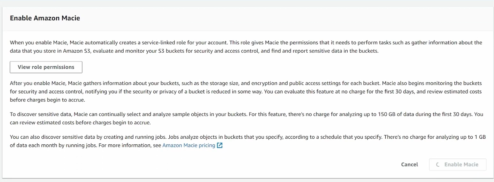
    - 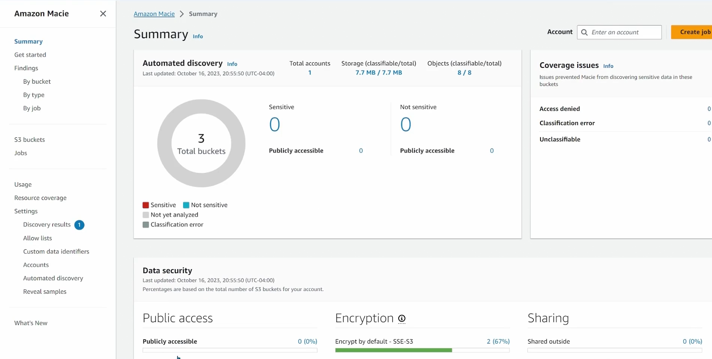

2. Create job to scan buckets
    - 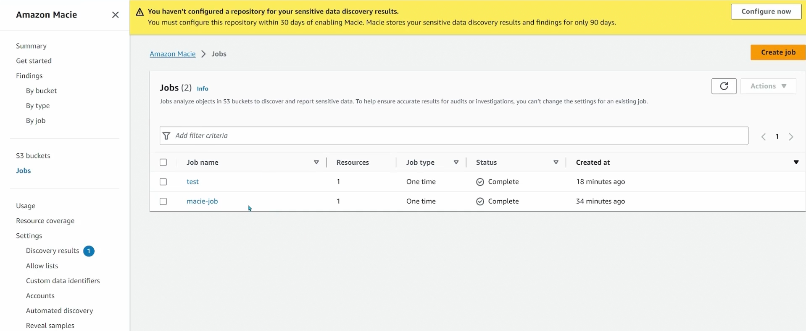
    - 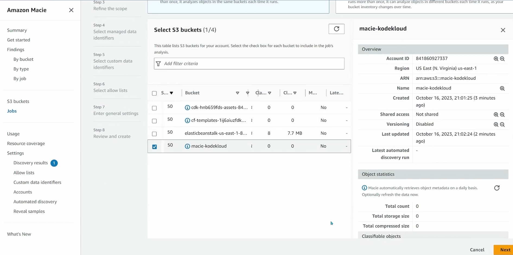
    - 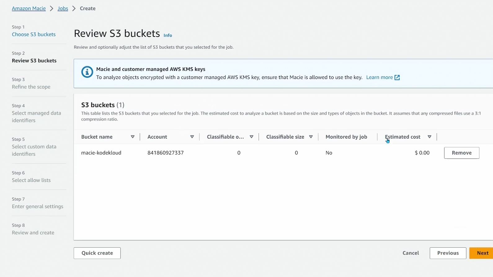
    * schedule frequency
        - 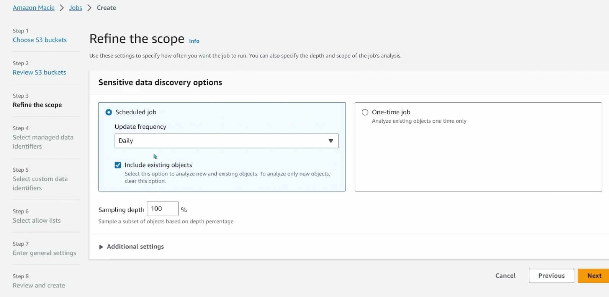
    * define built in rules for scan, or you can choose specific ones
        - 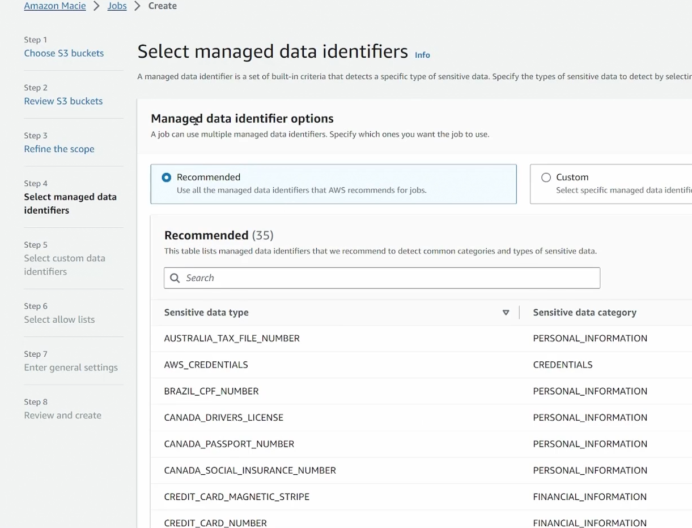 
    * define custom rules
        - 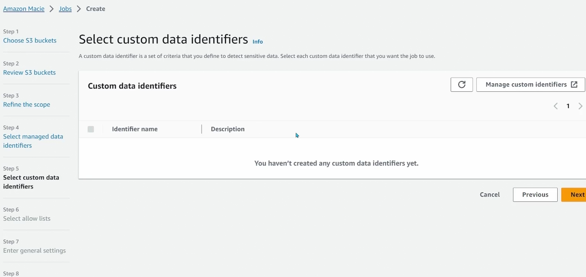
    * define allow list
        - 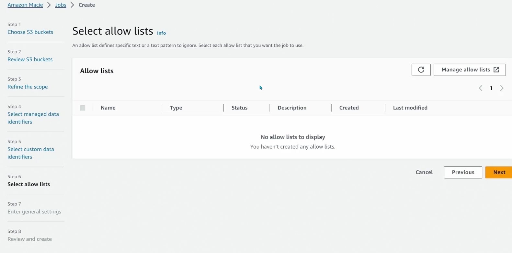
    * general settings
        - 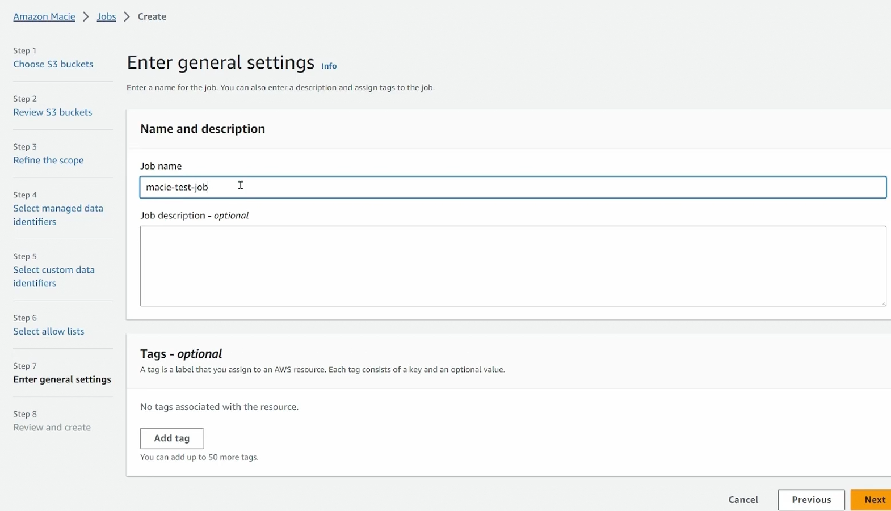

3. Submit Run and wait for it to run 
    * show findings on the job
        - 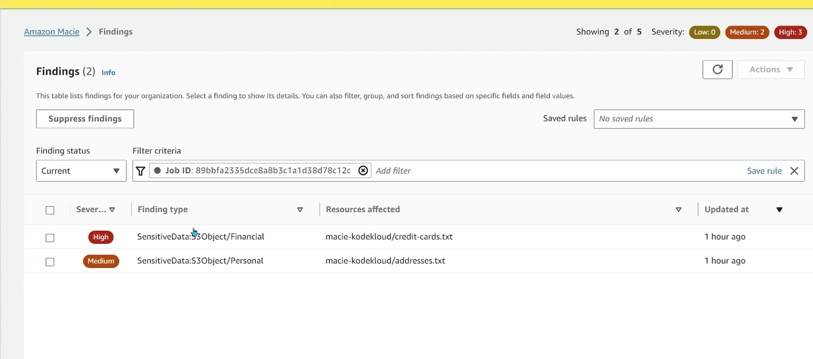
        - 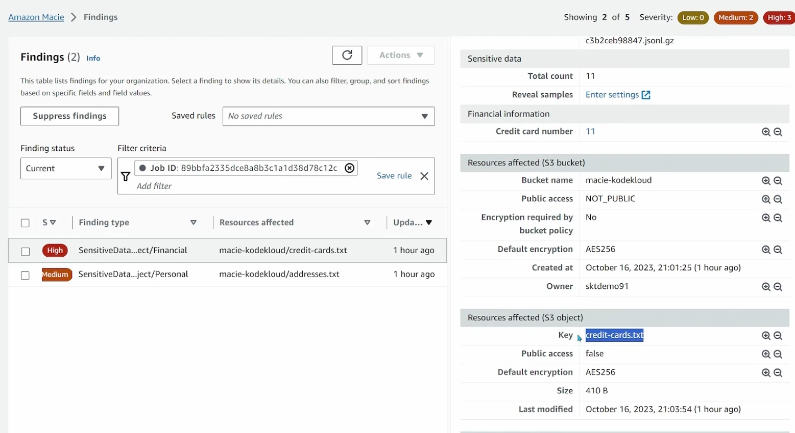
