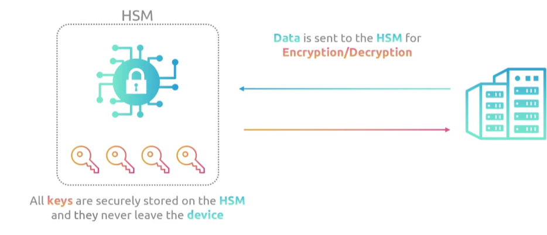
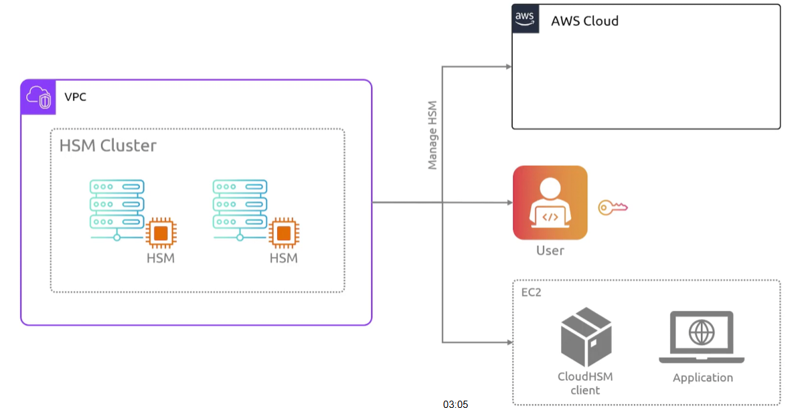

## CloudHSM
- [Overview](#overview)

### Overview

* AWS `Cloud Hardware Security Module (CloudHSM)` is a hardware security module that lets you generate, store, and manage your own encryption keys on single-tenant, FIPS 140-2 Level 3 validated hardware inside of your `vpc`
    - because its single tenant and isolated in hardware, only you can see and manage the keys
    - auto sync clusters across multiple `AZs` with built in loadbalancing
    - billed per hour per HSM instance with no upfront hardware costs
    - this is a way to centralize and secure your keys in one place which is how it differs from `kms`
    - you can interact with the `hsm` using an `cloudhsm client` 
        * 