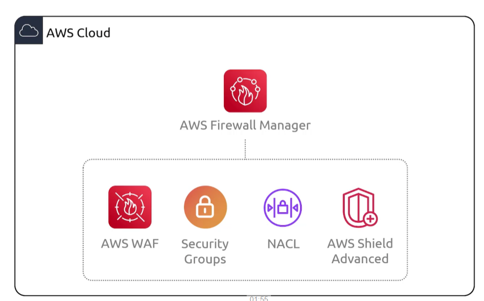

## Firewall Manager
- [Overview](#overview)

### Overview

* AWS `Firewall Manager` is a security management service that lets you centrally configure and maintian firewall rules across multiple aws accounts and resources in `aws organizations`
    - it supports tools like `waf`, `shield advanced`, `vpc sg`, `network firewall`, and `route53 dns firewall`
    - manages rules from a single admin account
    - applies security policies automatically to existing or new resources
    - detects non compliant resources, overly permissive sg, and unprotected assets