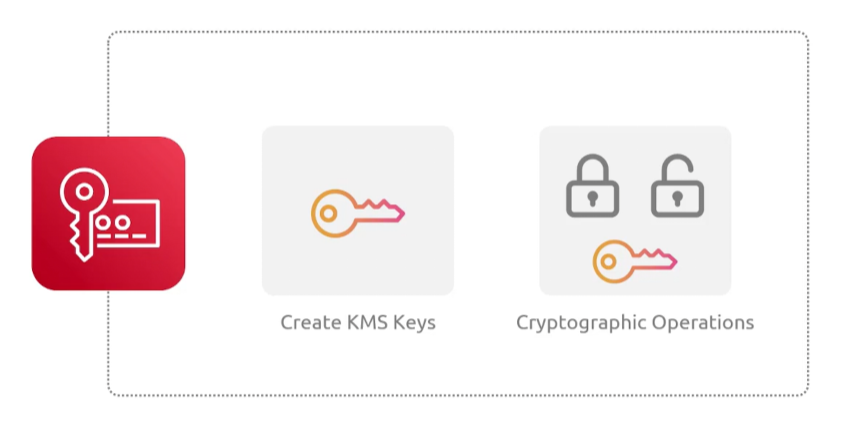
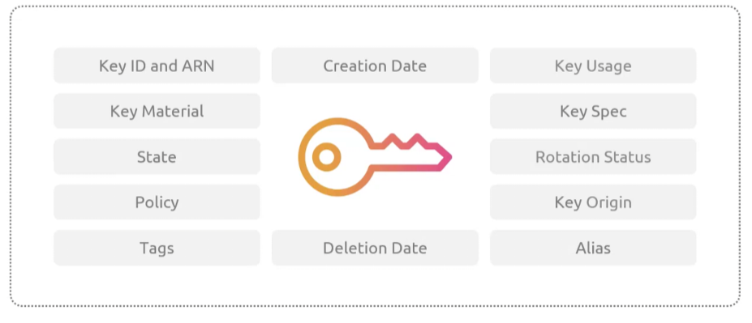
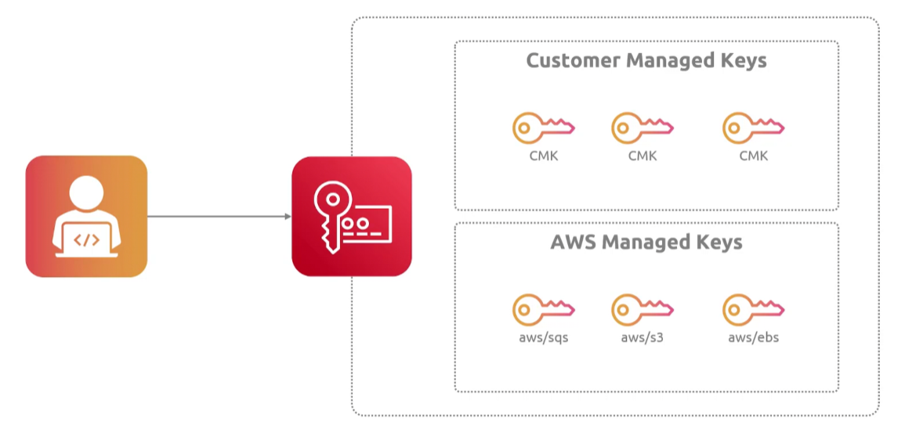
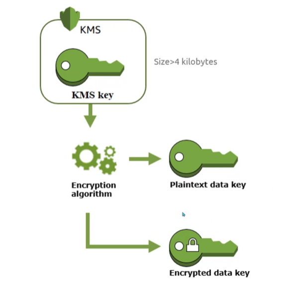
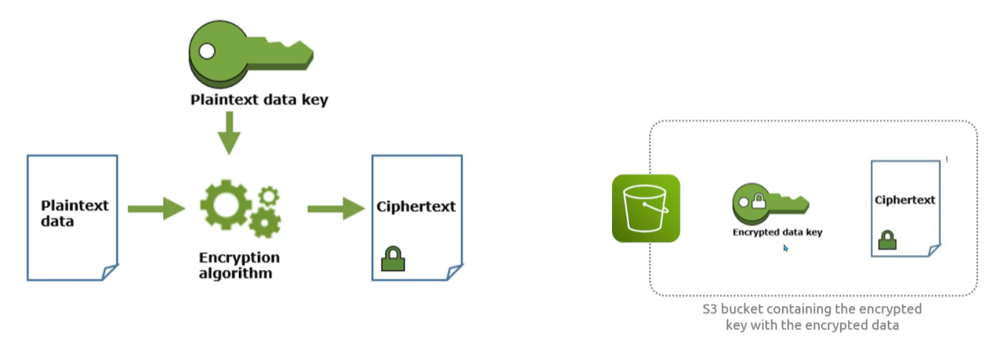
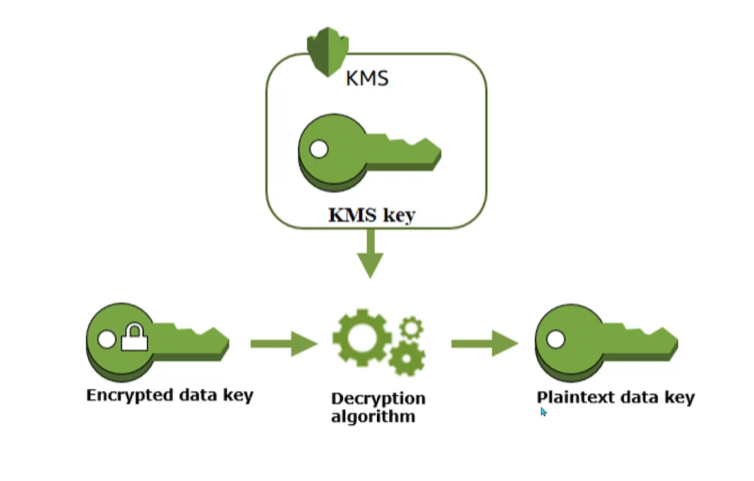
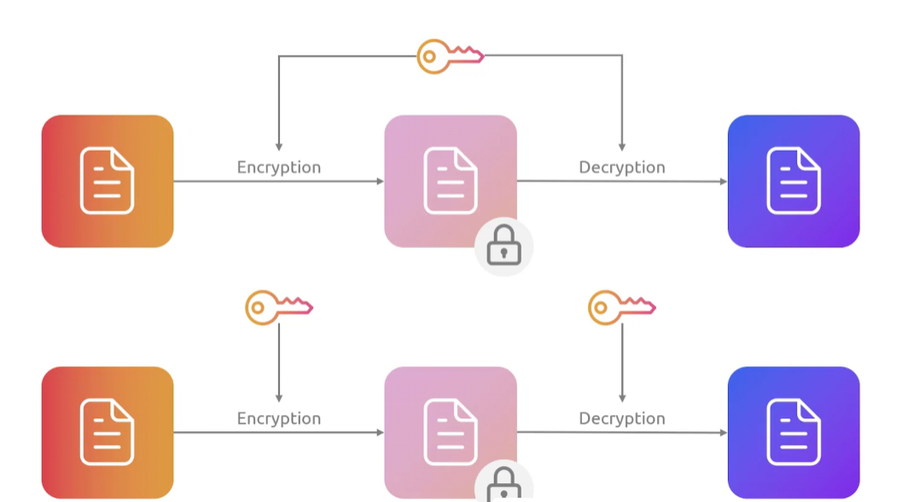

## Key Management System
- [Overview](#overview)
- [Keys](#keys)
    - [Types](#types)
    - [Encryption](#encryption)

### Overview

* AWS `Key Management System(kms)` is a managed service that lets you crete and control cyptographic keys to protect your data
    - it integrates deeply with most aws services to encrypt data at rest, encrypt or decrypt files, or digital signatures
    - you can you key policies and iam permissiont to restrict who can use or administer keys
    - every key usage is tracked in `cloudtrail` for security compliance
    - cost $1/key with a free tier covering 20k requests per month

### Keys

* AWS `kms keys` have metadata that contains non-secret configuration information and properties 
    - keyid: id of the kms key
    - arn: arn of the key
    - awsaccountid: aws account that owns the key
    - creationdate: exact timestamp key was created
    - keystate: operational state of the key (`enabled`, `disabled`, `pendingdeletion`)
    - keyusage: key cryptographic capabilities (`encrypt_decrypt`, `sign_verify`, `generate_verify_mac`)
    - keyspec: key cryptographic config (`symmetric_default`, `rsa_4096`, `ecc_nist_p256`)
    - keymanager: who manages the key (aws or customer)
    - origin: source of the key (`aws_kms`, `external`, or `aws_cloudhsm`)
    - multiregion: bool indicating whether key is regional or multi-region
    - description: description of key
    - alias: friendly display name of key, prefixed with `alias/`
        * can be used to easily identify keys in console, smoothly rotate them, reference them cleanly in code without using complex key-id
        * region locked, must be unique in that region

#### Types

* `Customer Managed Keys (CMK)`: keys that you create, control, set policies for, and rotate
* `AWS Managed Keys`: default keys created and managed for you by specific aws services
    - cannot be shared between accounts, policies cannot be modified
    - no cost associated with these
* `AWS Owned Keys`: collection of keys owned and managed by aws for internal service use
* `KMS Data Keys`: used to encrypt and decrypt large amounts of data
    - generated by `kms` key via api
        * 
            - generates 2 data keys (one encrypted and one plaintext)
            - use plaintext to encrypt data and we store the data with the encrypted key (i.e. `s3`)
            - 
            - to decrypt data, we use `kms master key` to decrypt `encryted data key` and use that key to decrypt the files
                * 
    - uses symmetric encryption
- NOTE: you can import key material
- NOTE: kms keys can only encrypt up to 4KB of data, you'll need data key for more

#### Encryption

* `Symmetric`: one key used for both encryption and decryption
* `Asymmetric`: 1 private key used for decryption and 1 public key used for encryption
    - great for when you want to share key with others for encryption but don't want to expose decryption key
