## Network Firewall
- [Overview](#overview)
- [Components](#components)
- [Demo](#demo)

### Overview


* AWS `Network Firewall` is a managed statfull network security and intrusion detection service that protects your `vpc`
    - it runs deep packet inspection, custom rule configuration, and suricata-compatible rule support
    - it automatically scales to filter traffic across network perimeters
    - it deploys `firewall endpoints` inside designated subnets in your vpc
    - it directs incoming and outgoing traffic through the `firewall endpoints` via updated `vpc routes`

### Components

* `Firewall Endpoints`: placed inside dedicated subnets across `AZs` to act as the traffic entry and exit inspection points
    - route tables are configured to route network traffic through your endpoints so packets are properly intercepted
        * 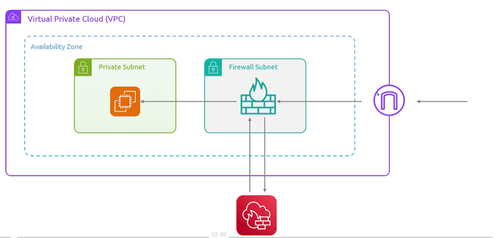
        * route from `igw` to `firewall endpoint` so `network firewall` can inspect and if it passes it sends back to `firewall endpoint` which sends it to our `private subnet`
        * we can also centralize it through a `tgw` so we can protect multiple `vpcs`
        * NOTE: you must associate the `tgw`, `vpgw`, or `igw` as an edge associated to the `route table` rather than a standard route
            - it intercepts inbound traffic entering a `vpc` at the edge
            - `edge association` is ingress routing while a standard `route` is egress routing
    - cannot protect application in the same `subnet` as itself, so `firewall endpoints` must have a dedicated `subnet`
    - 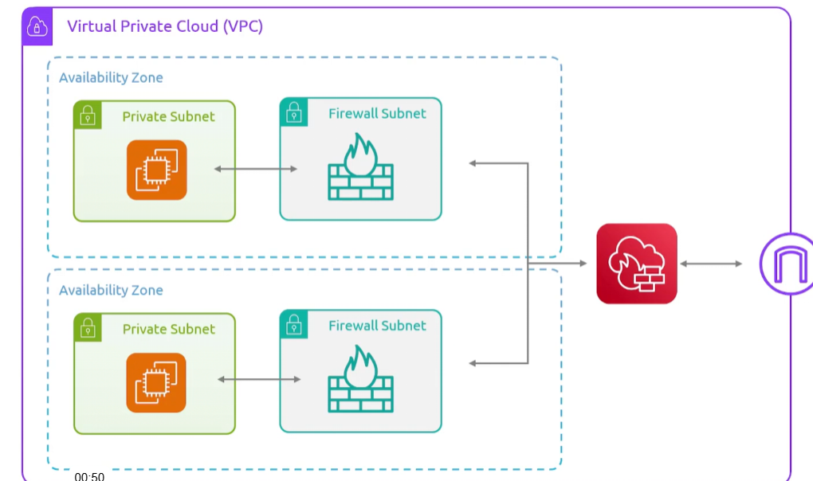
* `VPC Endpoint Association`: implements the firewall protections across additional or seconday enpoints and vpc
* `Firewall`: connects your inspection rules to the primary `vpc` you want to protect
    - defining logging behavior and `AZ` endpoints
* `Firewall Policy`: reusable set of stateless and stateful rule groups plus policy-level settings that dictate filtering behavior
* `Rule Group`: collection of inspection criteria and packet handling actions (`drop`, `pass`, or `alert`)
    - stateless: evaluates packets withou regard to packet context or traffic flow (supports `pass`, `drop`)
    - stateful: evaluates full context of traffic flow (supports `drop`, `pass`, `alert`)

### Demo


```
                          ┌─────────────┐
                          │   END USER  │
                          │ (internet)  │
                          └──────┬──────┘
                                 │
                    ═════════════╪═════════════  INBOUND
                                 ▼
                          ┌─────────────┐
                          │     IGW     │
                          └──────┬──────┘
                                 │  edge-association route table:
                                 │  app-subnet CIDR ─► firewall VPCE
                                 ▼
                       ┌───────────────────┐
                       │  FIREWALL SUBNET  │
                       │   ┌───────────┐   │
                       │   │   VPCE    │◄──┼──── Network Firewall
                       │   │ (inspect) │   │      inspects here
                       │   └─────┬─────┘   │
                       └─────────┼─────────┘
                                 │  local route ─► app subnet
                                 ▼
                       ┌───────────────────┐
                       │ APPLICATION SUBNET│
                       │   ┌───────────┐   │
                       │   │  SERVER   │   │
                       │   └─────┬─────┘   │
                       └─────────┼─────────┘
                                 │
                    ═════════════╪═════════════  RETURN
                                 │  app-subnet route table:
                                 │  0.0.0.0/0 ─► firewall VPCE
                                 ▼
                       ┌───────────────────┐
                       │  FIREWALL SUBNET  │
                       │   ┌───────────┐   │
                       │   │   VPCE    │   │  inspects again
                       │   │ (inspect) │   │  (same endpoint)
                       │   └─────┬─────┘   │
                       └─────────┼─────────┘
                                 │  firewall-subnet route table:
                                 │  0.0.0.0/0 ─► IGW
                                 ▼
                          ┌─────────────┐
                          │     IGW     │
                          └──────┬──────┘
                                 ▼
                          ┌─────────────┐
                          │  INTERNET   │
                          └─────────────┘
```

1. Create a `vpc`
    - make sure there is a `dedicated subnet` for the `firewall vpc endpoint` (which will be a gateway loadbalancer endpoint)
    - make sure there is a `workload subnet` for your applications

2. Create `rt`
    * 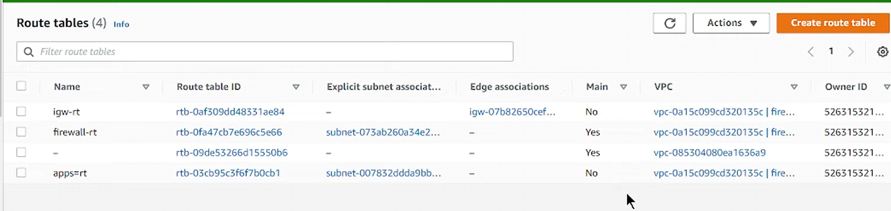
    - create a `igw edge associated rt` 
        * associated an `igw` with this `rt` as an `edge association`
        - 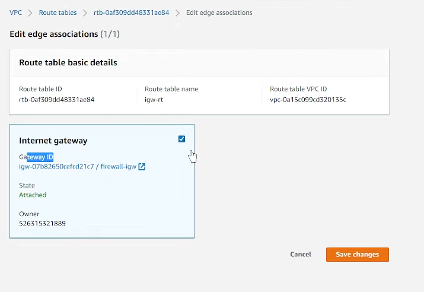
    - create a `rt` for the `network firewall subnet`
        * associated an `igw` with this `rt` as a standard `route`
        - this is so egress traffic leaving the `application subnet` has to go through `firewall endpoint` to reach the internet
    - create a `rt` for the `application subnets`

3. Create `Network Firewall` with Rules
    * define `subnets` for `firewall` to be created in
        - 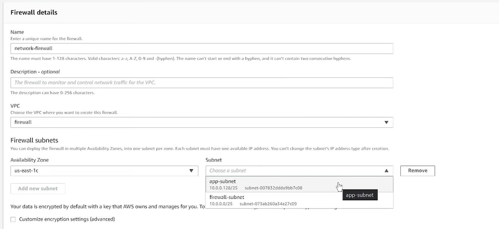
        - 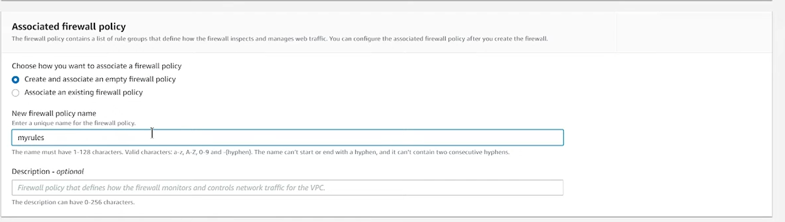
    * add `firewall rules`
        - 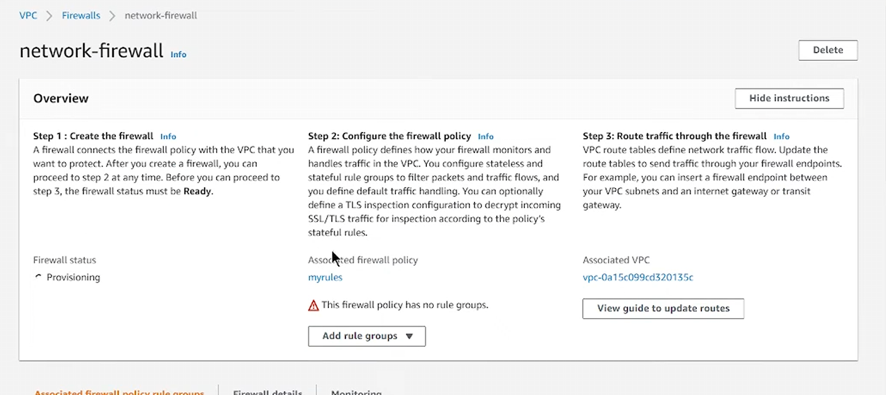
        - 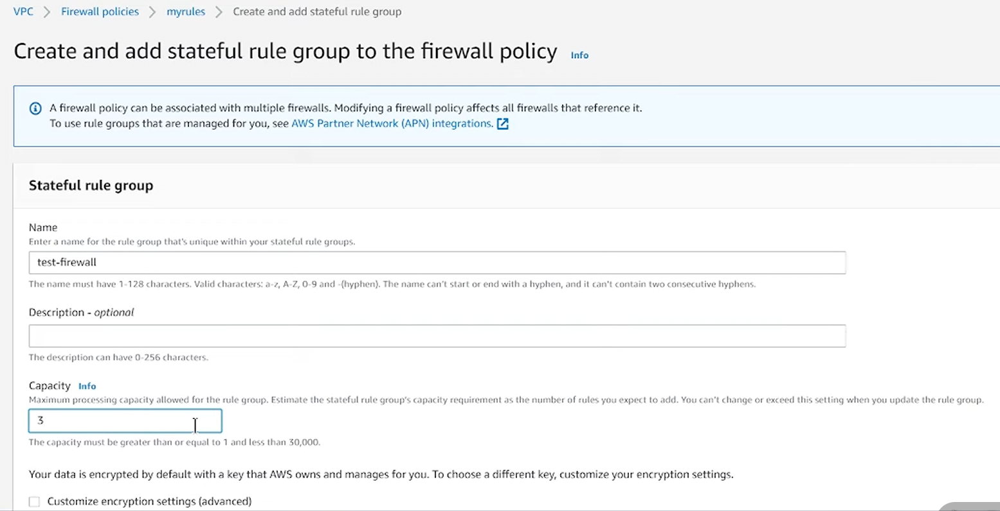

4. You'll see that a `vpce` has been created
    - 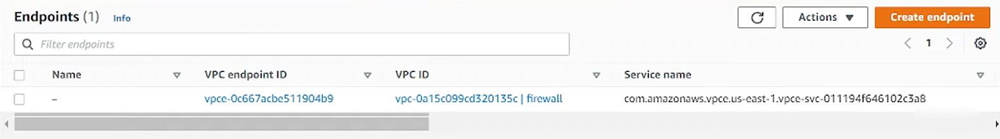
    - 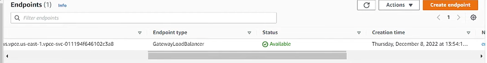

5. Mod `rt` for `application subnets` to egress through `firewall vpce`
    - 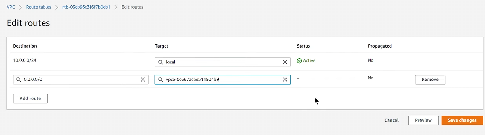

6. Mod `rt` for `igw edge association` to egress to `firewall vpce` any traffic hitting `application subnet cidr block`
    - 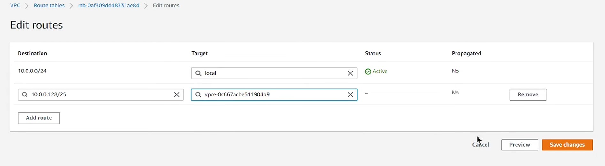
    * now all traffic trying to hit the `application subnet` has to route through the `firewall endpoint` for inspection
