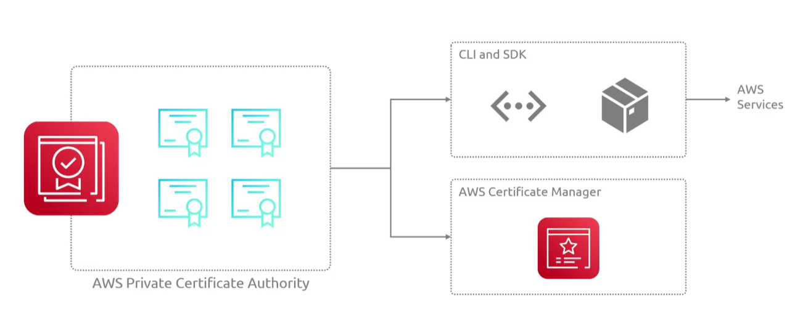

## Private Certificate Authority
- [Overview](#overview)

### Overview

* AWS `Private Certificate Authority` is a managed service that helps you create custom root and subordinate certificate hierarchies to issue and revoke private digital certificates for internal servers, users, and connected devices
 - generates certificates that are only valid for internal users
 - corporations may use these to generate certificates for internal services
 - it is scalable for growing infrastructure 
 - it can be integrated with `acm` for automatic renewals for generated certs
    * 