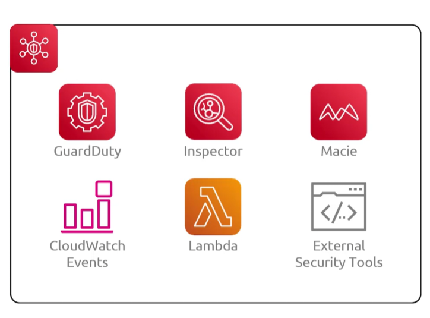
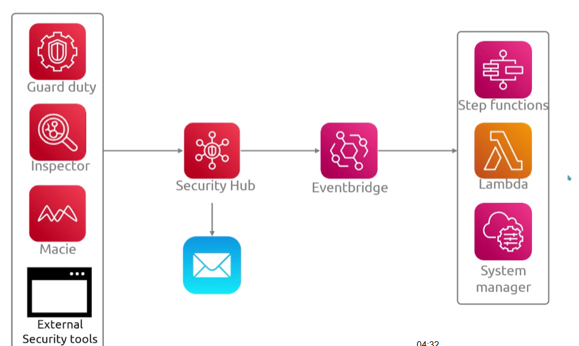
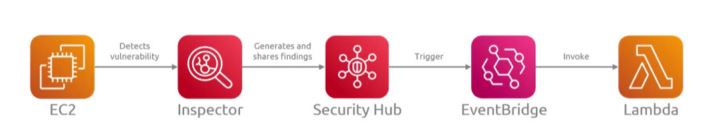

## Security Hub
- [Overview](#overview)

### Overview

* AWS `Security Hub` is a unified cloud secruity posture management and operations service that centralizes, correlates, and prioritizes seruity findings
    - it integrates services like `guardduty`, `inspectory`, and `macie` into a single dashboard
        * it aggregates and normalizes security alerts using the `AWS Security Finding Format (ASFF)`
    - it checks your env against compliance frameworks like CIS benchmarks and NIST guidelines
    - maps out exposure paths and prioritizes active risks across multiple accounts and regions
    - triggers automate remediation or sends findings to ticketing tools like jira or servicenow
        * 
    - you can monitor everything in aws from a security perspective
    - it automatically scales based on your infrastructure