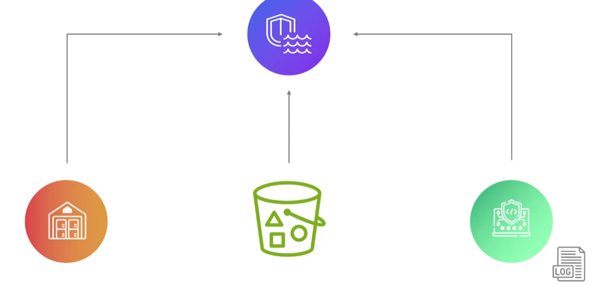
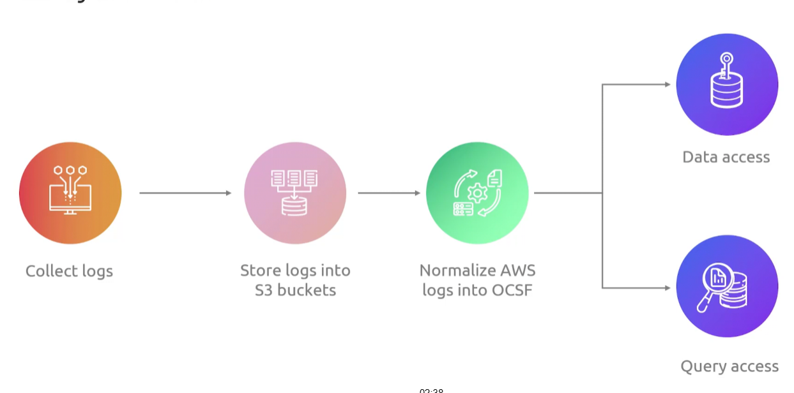

## Security Lake
- [Overview](#overview)

### Overview

- 
* AWS `Security Lake` is a fully managed service that auto centralizes, normalizes, and stores security logs and event data from cloud (multiple cloud accounts), on-premises, and third party sources
    - it converts incoming logs into a standard format using open cybersecurity schema frameworks (OCSF) so different tools can easily read the data
        * 
    - it stores data in apache parquet format inside of `s3`