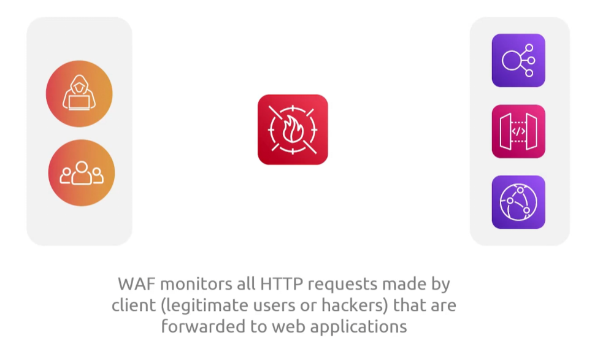
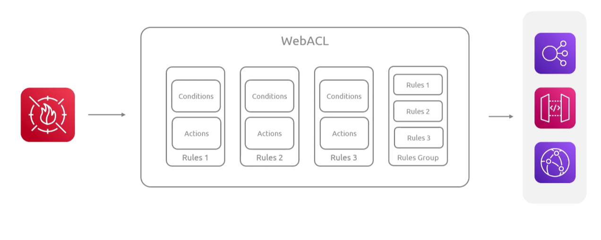
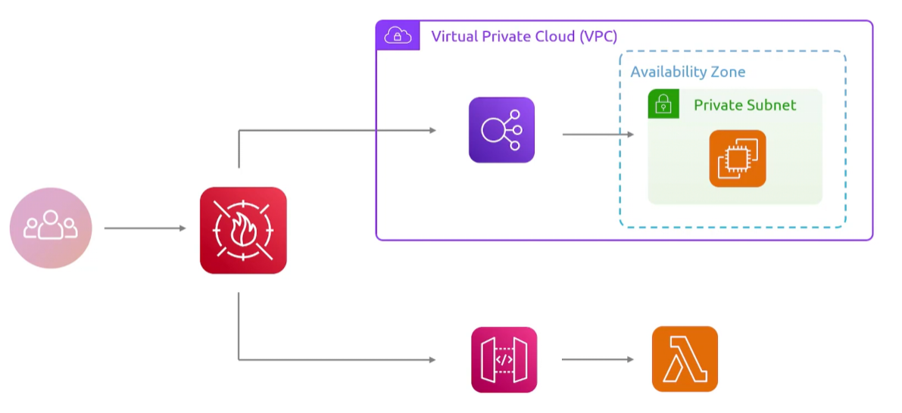

## Web Application Firewall
- [Overview](#overview)

### Overview

* AWS `Web Application Firewall` is a web application firewall that protects web apps and apis by controlling `http(s)` requests
    - it filters traffic using web acls, managed or custom rules, and integrated directly with `cloudfront`, `alb`, and `api gateway`
    - 
    - 
        * using webacls we can block off of a variety of different rules
            - ddos attacks
            - specific known and dangerous ip addresses
            - sql injections
        * it will `allow`, `block`, or `count` based on how you configure `waf` to respond to that traffic 