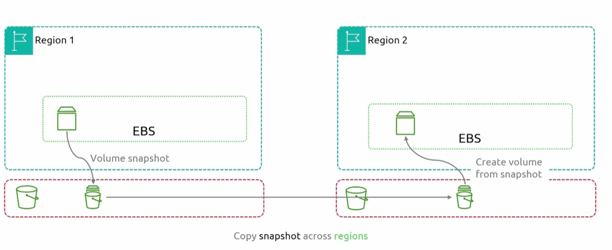
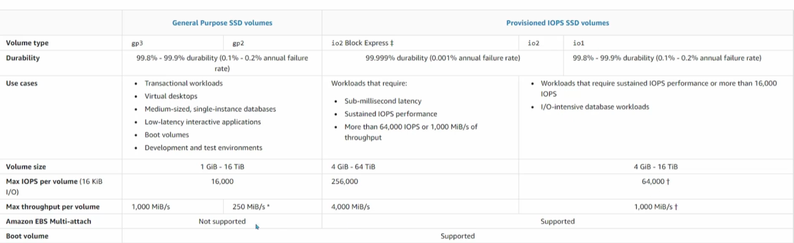
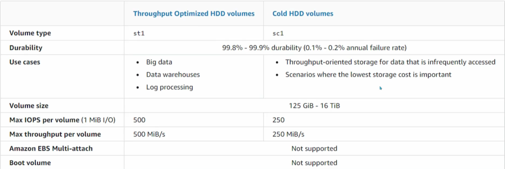
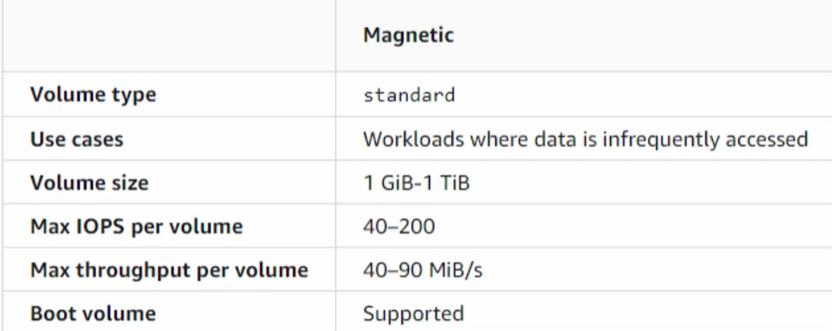

## Elastic Block Storage
- [Overview](#overview)
- [Snapshots](#snapshots)
- [Volume Types](#volume-types)
    - [SSD](#solid-state-drives)
    - [HDD](#hard-disk-drives)
    - [Magnetic](#magnetic-volumes)
- [Pricing](#pricing)

### Overview

* The way that `block storage` works is that it breaks up data into blocks and stores this blocks as separate pieces each with its own identifier. These blocks can then be storage across a variety of different physical devices
    - A collection of blocks can be present to your `os` as a `volume`
    - This `volume` is presented to you `os` and a `filesystem(fs)` can then be created on top of it
    - We can also present these blocks of storage as a `hard drive`, which allows us to install an `os` on the block itself.
        * A `bootable hard drive` is a storage drive that contains an `os` and all necessary files required to start up your computer
* In this sense, `block storages` are mountable and bootable

* Amazon's `block storage` service is known as `elastic block storage (ebs)`
    - AWS `ebs` provides `block storage` for `ec2 instances`. These instances will see these `block storage` devices and create a `fs` on top of it
    - What makes `ebs` so unique, is that they are abstract from `ec2 instances`
        * You can attach/dettach from instances
        * You can attach dettached `ebs` to other instances
        * This allows you to move data from one instance to another
    - Certain `ebs` volume types allow multi attach, where it can be attached to multiple instances
        * Your app must be intelligent enough to now allow multiple writes to that `volume` data at the same time
    - AWS `ebs` is `AZ` resilient, it can handle an instance going down but if an entire `AZ` goes down then that data will be lost
        * This also means that in order to attach an `ebs` to an instance, they must exist in the same `AZ`

### Snapshots

* Now how do we get past the issue of not being able to mount `ebs` across `AZs`
* AWS allows you to use a feature known as `snapshots`
    - You take a `snapshot` of an `ebs` and create an `image` in `s3`
        * `S3` is available across all `AZs`
    - From this `snapshot` we can create a brand new `volume` in whatever `AZ` yo'd like
    

* This method works across `AZs`, but how do we copy data across `regions`. 
    * Similarly to how we do it across `AZs`, we can take a `snapshot` and store it in `s3`, and move the data from the `s3` in the source region and copy it to an `s3` in the destination region
        - From there, we can create a `volume` from that data in `s3`
        - 

### Volume Types

* There are a variety of different `volume types` available for use in `ebs`

#### Solid State Drives

* 
1. `General Purpose SSD (gp2/gp3)`: 
    - These are volumes backed by `solid state drives`
    - They balance price and performance 
    - Good for virtual desktops, medium sized single instance databases, latency senstivie applications, test and dev environments
    - Recommended for most workloads
    - Does not support multi attach
    * Two types of `gen purpose ssd`
        1. `gp3`: latest generation and lost cost `ssd` volumes offered by `ebs`. Most performant `volume` for its price.   
            - Offer 20% lower price per GiB than its `gp2` counterpart. Can range from 1GiB to 64TiB
            - You can migrate from `gp2` to `gp3` by using `ebs` volume operators to change the type without interrupting the instance
            - Performance scale independently of volume size (you can increase IOPS or throughput without adding extra GiB)
        2. `gp2`: no longer the default
            - Performance scales with volume size (for every 1GiB, you get 3 IOPS)
2. `Provisioned IOPS SSD`:
    - These volumes are backed by `solid state drives`
    - It is classified as the highest performance `ebs` volume
    - Designed for critical, iops intensive, throughput intensive workloads that require low latency
    - Supports `ebs` multi attach
    * Two types of `provisioned iops`
        1. `io2`: if you need sub ms latency, sustained iops, more than 64,000 IOPS or 1,000 MiB/s throughput
            - can range from `4GiB` to `16GiB`
            - max iops of 64,0000
            - max throughput of 1000MiB/s
        2. `io2 block express`: if you need sustained iops or more than 16,000 IOPS (gp limit)
            - has a larger max volume size than `io2` and `io1`
            - can range from `4GiB` to `64GiB`
            - max iops of 256,000 per volume
            - max throughput of 4000MiB/s
        3. `io1`: if you need sustained iops or more than 16,000 IOPS (gp limit)
            - less durable than io2
            - can range from `4GiB` to `16GiB`
            - max iops of 64,000
            - max throughput of 1000MiB/s

#### Hard Disk Drives

* 
1. `Throughput Optimized HDD`
    - These volumes are backed by `hard disk drives`, as a result they are slower than traditional `ssd` volume types
    - Lowest cost `hdd` for less frequently accessed workloads
    - Does not support multi attach
    * 1 Type:
        1. `st1`
            - for big data
            - data warehouses
            - log processing
2. `Cold HDD `
    - These volumes are backed by `hard disk drives`, as a result they are slower than traditional `ssd` volume types
    - Low cost `hdd` for frequently accessed throughput intensive workloads
    - Does not support multi attach
    * 1 Type:
        1. `sc1`
            - scenarios where lowest cost is important

#### Magnetic Volumes

* 
1. `Magnetic`:
    - Are a previous gen of volumes backed by magnetic drives
    * 1 Type:
        1. `standard`
            - workloads where data is infrequently accessed
            - workloads with small datasets
            - workloads where perfomance isn't a primary concern

### Pricing

* You pay per `GB` per month for each volume
* You pay for faster `IOPS`