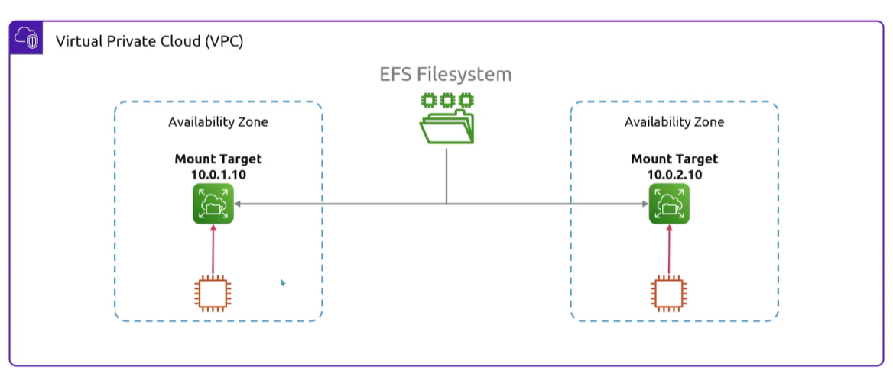
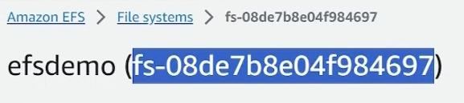
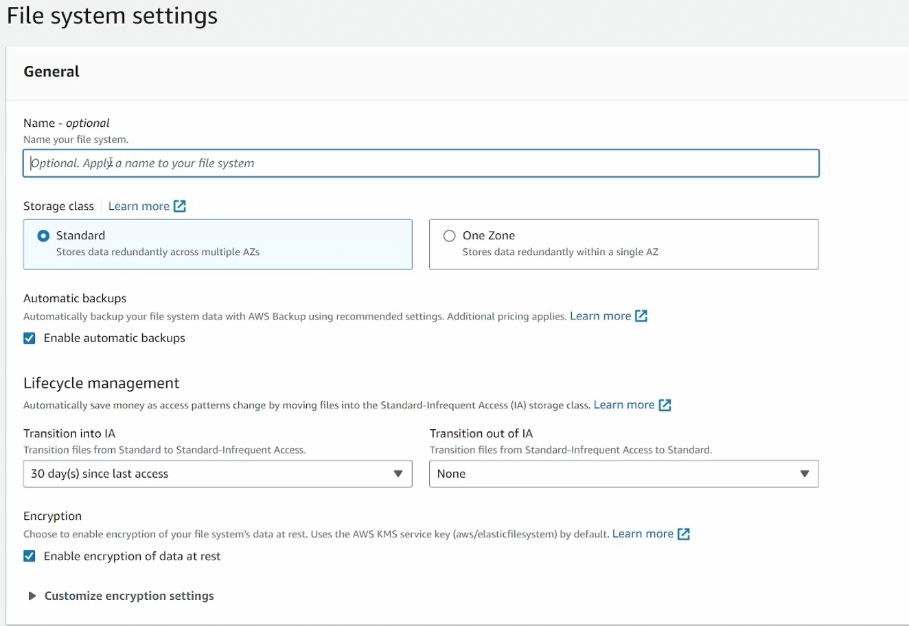
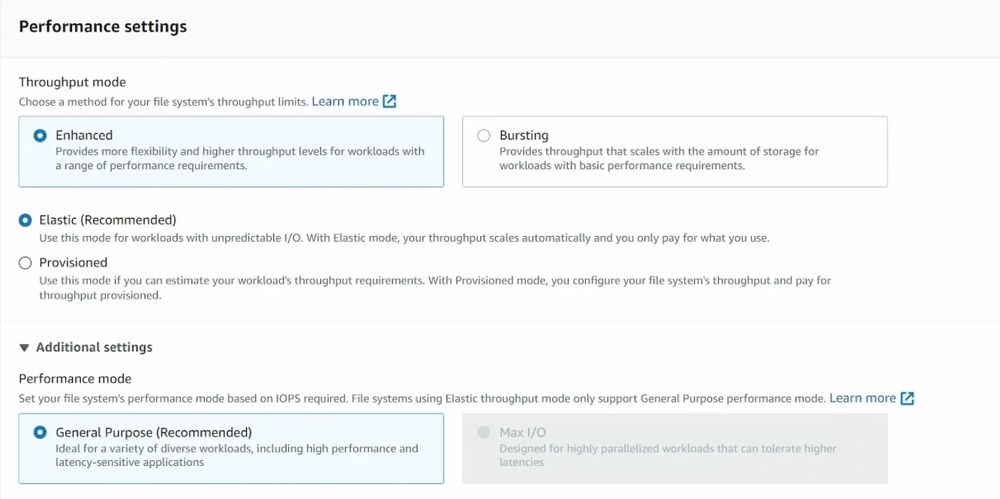
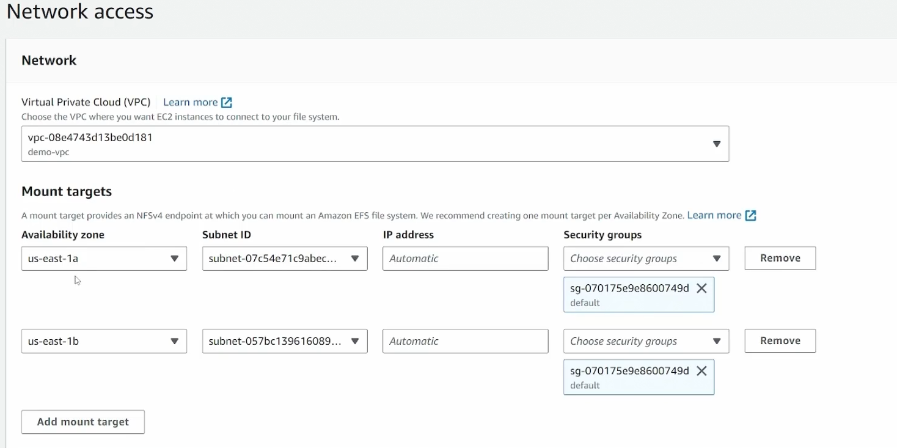
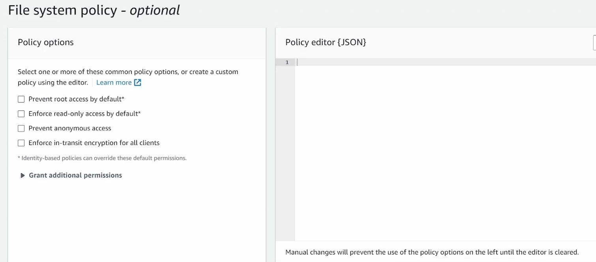

## Elastic File System
- [Overview](#overview)
- [Storage Classes](#storage-classes)
- [Performance Modes](#performance-modes)
- [EFS in EC2](#efs-in-ec2)
    - [Access Points](#efs-access-points)
- [Encryption](#encryption)
- [Hands On](#hands-on)

### Overview

* Amazon `Elastic File System (efs)` is the first of 2 file system storage solutions provided by aws, the second being `FSx`. 
* AWS `efs` supports the `Network File System v4 protocol (NFSv4)`
    - It only supports Linux based systems and it can be mounted to multiple `ec2` at the same time, so data can be shared
    - You deploy it into a `vpc`, so its `vpc` specific
    - It is made available inside of a `vpc` via a `mount target`
        * You specify `subnets` where you want to deploy a `mount target` into. Once deployed they get an ip address
        * `ec2` can then connect to the `efs` through that `mount target`
            - For HA, you'd typically make your `efs` available through multiple `mount targets` across `AZs`

        * 

### Storage Classes

* `efs` offers multiple `storage classes`
    1. `Standard Storage Classes`: multi-az resilience and highest levels of durability and availability
        - `efs standard`
        - `efs standard-infrequent access (IA)`
            * data accessed less frequently, stored here for cheaper alternative
    2. `One Zone Storage Classes`: single-az, saved costs
        - `efs one zone`
        - `efs one zone-infrequent access (IA)`
            * data accessed less frequently, stored here for cheaper alternative

### Performance Modes

* `efs` offers multiple `performance modes`
    1. `General Purpose Perfomance Mode`: for latency-sensitive applications
        - web servers, content management systems, home directoies, general use
    2. `Elastic Throughput Mode`: autoscales throughput performance up or down to meet the needs of workload
    3. `Max i/O Performance Mode`: higher levels of aggregate throughput and operations
        - Tend to have higher latency
    4. `Provisioned Throughput Mode`: level of throughput the `fs` can drive is independent of the `fs` size and burst credit balance
    5. `Bursting Throughput Mode`: scales with the amount of storage your `fs` has and supports burting of higher levels for up to 12hr/day

### EFS in EC2

* Setting up `efs` in `ec2`

```bash
# install efs utils
sudo dnf -y install amazon-efs-utils

# mount efs
sudo mount.efs efs:id /<directory> # efs:id is the ID of the efs fs and can be found in the console
```
* Example ID:
   -  

* NOTE: `efs` can be mounted but not booted (cannot install os)
* NOTE: mounted `fs` also don't persist through reboot, so you'd need to add it to `/etc/fstab`

#### EFS Access Points

* `EFS Access Points` are app specific entry points into an `efs fs`. They let you control how different apps or users access the same `fs` without intefereing with each other
* `Access points` controle 3 things:
    1. `Root Directory`: each app gets its own root path
        - Each app sees only its subdirectory, not the full `fs`. (i.e., root path is `/jenkins`, which will be the path mounted by the app)
    2. `POSIX user`: forces a specific UID/GID
        - Regardless what user the app runs, `efs` will treat all requests as the defined UID/GID, preventing privilege escalation at the `fs` level
    3. `Directory Permissions`: you can set ownership at creation, UID/GID of all objects created and permissions for those 
    
* Mounting also changes when using an `access point`
    
    ```bash
    sudo mount -t efs -o tls,accesspoint=<accesspoint-id> <efs-id>:/ /efsvolume
    ```

* NOTE: policies can also be created in `efs` to ensure `access point` is used on a `efs` volume
* NOTE: roles can be configured so apps can only access `efs` at a specific `access point`
* NOTE: more information on access points can be found [here](https://oneuptime.com/blog/post/2026-02-12-efs-access-points-application-specific-access/view)

### Encryption

* Its recommended to enable encryption in `efs` and there are 2 types
    1. `Encryption at Rest`: means data is encrypted when stored in `efs` using `AES-256` and integrates with `kms` for key management
        - You can only encrypt an `efs` while creating it, can't encrypted unencrypted `efs`
        - You can use aws managed keys or using `kms` (recommended, since you can rotate, audit trail, and give cross account access by sharing key (though you'll need to permit the other account in the `efs` policies))
    2. `Encryption in Transit`: means data is encrypted as it travels between your compute resource and your `efs mount target
        - You need to mount using `efs-utils` tls option. This mount helper sets up a local proxy that handles the tls connectiom using either `efs-proxy` or `stunnel` in older versions of the helper. This can be done manually without the helper too
            
            ```bash
            sudo mount -t efs -o tls <fs-id>:/ <mount-path>
            ```
        
        - You can enforce `encryption in transit` but adding a `fs` policy to your `efs`

            ```json
            {
              "Statement": [{
                "Effect": "Allow",
                "Principal": {
                  "AWS": "arn:aws:iam::123456789:role/my-ec2-role"
                },
                "Condition": {
                  "Bool": {
                    "aws:SecureTransport": "false" // <- enforce encryption in transit
                  }
                },
                "Action": [
                  "elasticfilesystem:ClientMount",
                  "elasticfilesystem:ClientWrite"
                ]
              }]
            }
            ```
* NOTES: more information on this can be found [here](https://oneuptime.com/blog/post/2026-02-12-efs-encryption-at-rest-in-transit/view)

### Hands On

1. Navigate to `efs` console and click create `fs` and `customize`
    - 
        * you can move data in and out of IA based on last access
    - 
        * performance settings
    - 
        * network settings
        * ideally, you'd attach `sg` that allow traffic from `sg` containing `ec2`
    - 
        * you can enforce `fs` policies, bsaically like bucket policies
            1. `elasticfilesystem:ClientMount`: who can mount the `fs`
            2. `elasticfilesystem:ClientWrite`: who can write to the `fs`
            3. `elasticfilesystem:ClientRootAccess`: who can access as root
                
                ```json
                // restrict who can mount and write to specific ec2 role
                // enforces encryption in transit
                {
                  "Statement": [{
                    "Effect": "Allow",
                    "Principal": {
                      "AWS": "arn:aws:iam::123456789:role/my-ec2-role"
                    },
                    "Condition": {
                      "Bool": {
                        "aws:SecureTransport": "false"
                      }
                    },
                    "Action": [
                      "elasticfilesystem:ClientMount",
                      "elasticfilesystem:ClientWrite"
                    ]
                  }]
                }
                ```