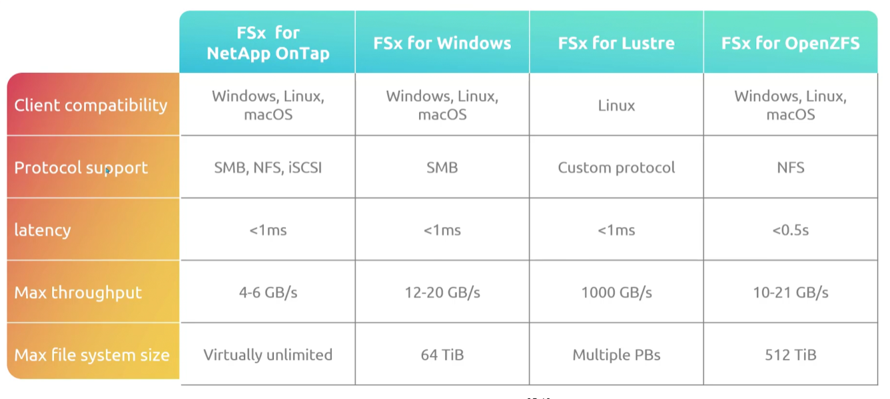

## FSx
- [Overview](#overview)
- [Flavors fo FSx](#flavors-of-fsx)

### Overview

* AWS `FSx` you create a `fs` and compute resources can remotely connect to them
* The main difference between `FSx` and `efs`, is that while `efs` can only be used with linux based machines; `FSx` can be used with a variety of `os`
* With `FSx` you no longer need to worry about:
    - provisioning file servers and storage volumes
    - replicating data
    - patching file servers
    - addressing hardware issues
    - performing manual backups
    * All of the above listed, will be handled by AWS for you
* Some of the benefits include:
    - Storage
    - Managed by AWS
    - Scalability
    - Shared Access (multiple people and devices can write to it at the same time)
    - Backups
* NOTE: specialized for high performance file systems
### Flavors of FSx

1. `Amazon FSx for Windows File Server (wfs)`: fully compatible for windows file servers
    - supports `service message block (smb)` protocol
        * application-layer protocol used for sharing files, printers, and serial ports across a local network
    - can be integrated with microsoft AD
    - support data deduplication
    - can set quotas
    - supports `single-az` and `multi-az` deployments

2. `Amazon FSx for Lustre`: created for high performance parallel file processing
    - used for scientific computing, ml, and data analytics
    - provides low-latency, high throughput access to data
    - built on the lustre `fs`
    - integrates seamlessly with other aws services like `s3`, `datasync`, and `batch`
    - can scal capacity and throughput
    - supports `single-az` deployments

3. `Amazon FSx for NetAPP ONTAP`: `fs` built on top of `NetAPP ONTAP`
    - offers high performance storage that available for linux, windows, and macOs through `nfs`, `smb`, and `iscsi` protocols
    - it can scale your `fs` up or down in response to workload demands
    - it can perform snapshots, clones, replications, etc
    - supports `single-az` and `multi-az` deployments

4. `Amazon FSx for OpenZFS`: runs on top of the `ZFS fs`
    - supports access from linux, windows, macOS vis the `nfs` protocol
    - uses power openzfs capabilities including data compression, snapshots, and data cloning
    - offers built-in data protection and security features
    - supports `single-az` and `multi-az` deployments