## S3
- [Overview](#overview)
- [Bucket](#bucket)
    - [Objects](#objects)
- [Storage Classes](#storage-classes)
- [Versioning](#versioning)
    - [MFA Delete](#mfa-delete)
- [ACL and Resource Policies](#acl-and-resource-policies)
- [Static Web Hosting](#static-web-hosting)
- [Presigned Urls](#presigned-url)
    - [Sharing Objects](#sharing-objects)
    - [Uploading Objects](#upload-objects)

### Overview

* Amazon `Simple Storage Service (s3)` is an `object based storage` solution that provides:
    - scalability
        * `s3` an handle an unlimited number of objects
        * max size of a single file is 5TB
        * an aws account supports up to 100 `buckets` by default, but this number an be increased to `1000` by requesting a service limit increase
    - data availability
        * When you upload a file to s3, though serverless in nature, that file gets upload to multiple servers across multiple `AZs` within a region so that your data is never lost
        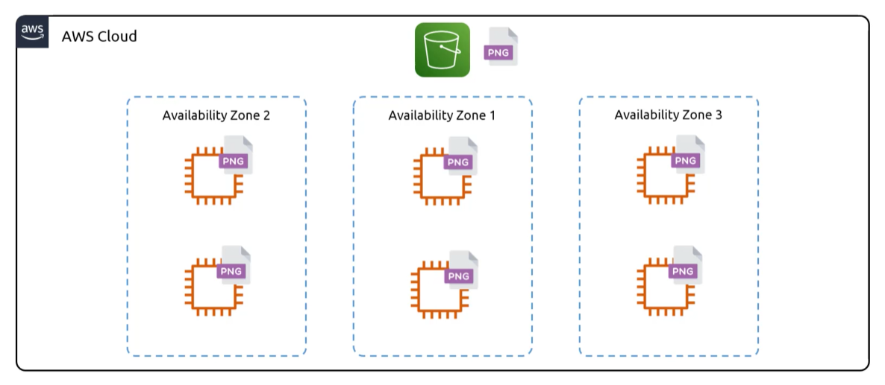
    - security
    - performance
* Think of it like dropbox, a great place to store your files and since it's an aws service it intergrates nicely with aws services like `ec2`, `lambda`, and `iam(acl)`
* Its different from `ebs` (block based storage, can be mounted to instances) and `efs` (file based storage, mounting ), theres no `fs` or directories
    - You cannot boot or mount from `s3`
        * NOTE: new aws feature actually allows you to mount as a `fs`

### Bucket

* Files and Folders in `s3` are group together in what is known as a `bucket`, think of it as one large folder
* `Buckets` have a flat file structure, there are no nested directories
    - however, in the console, aws will present files that are prepended with the same prefix in a folder like structure for you. The name of the `object key` will determine how aws displays the "folder structure"
        * 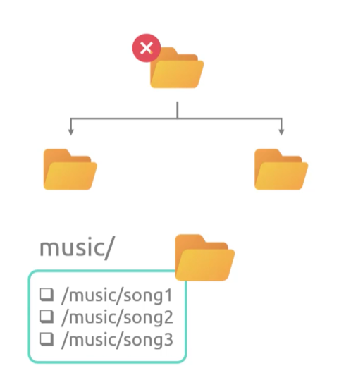
    - You cannot boot

* NOTE: `bucket names` must be unique globally across all aws accounts
    - This because that bucket name gets embedded to a url that is associated with your bucket
    - Objects created in your bucket also get associated with that url
        * (e.g `https://<bucket-name>.s3.amazonaws.com/<object-1>`)

#### Objects

* Within `buckets` you have `objects`
    - `Objects` are files that are uploaded to `s3`
* `Objects` have properties associated with them, the main being:
    1. `key`: the file name`
    2. `value`: the file data

### Storage Classes

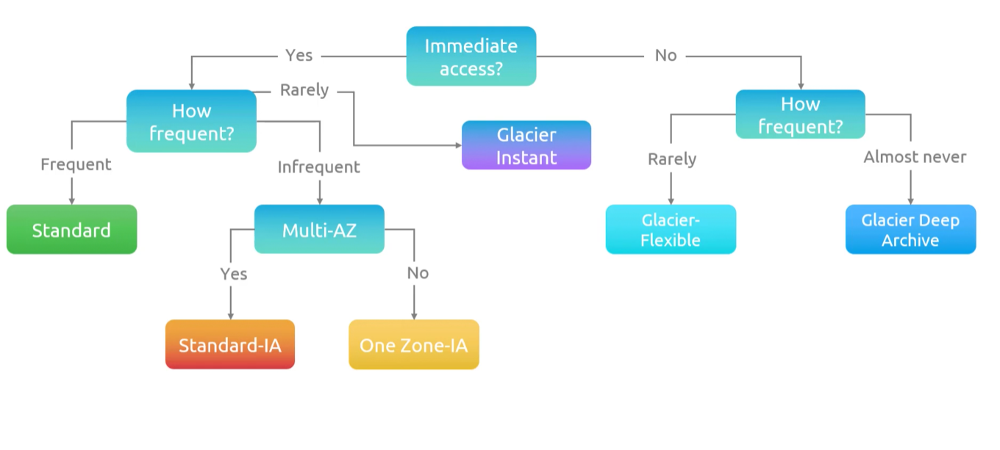

* AWS `s3` provides a range of `storage classes` that provide a varying level of data access, resiliency, and cost.
* `Storage Classes` are set per object in a `bucket` in the properties section.
    - You can specific the class during upload or change the class of an existing object
    * 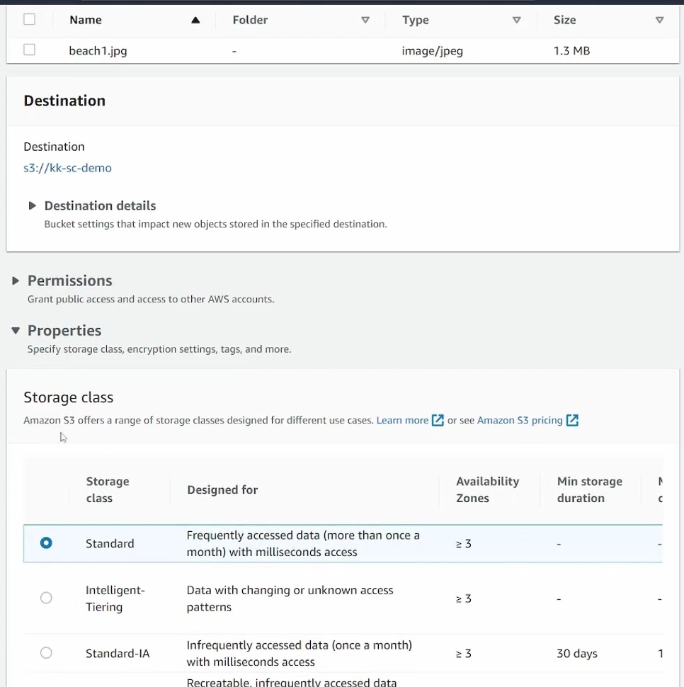

* 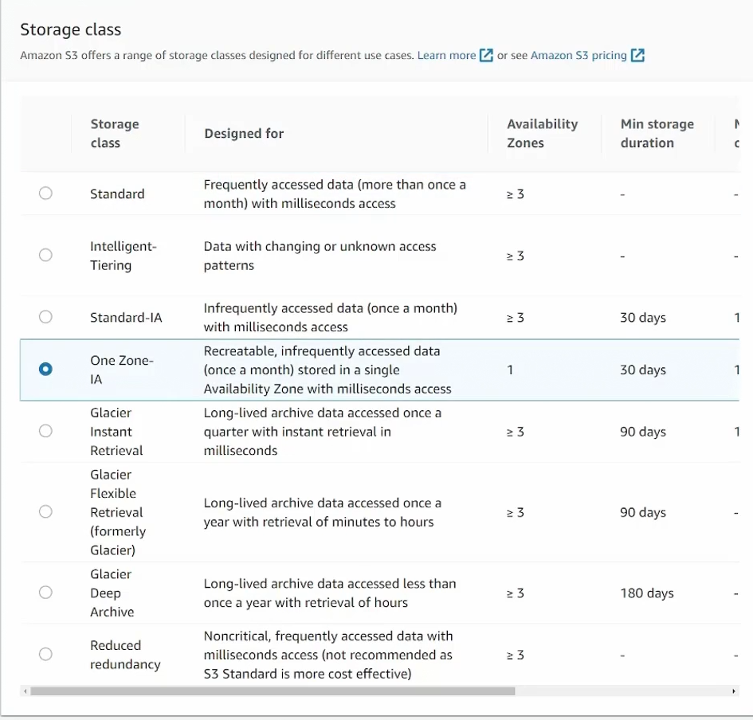

1. `S3 Standard (default)`
    - When you upload an `object` it gets replicated to at least 3 `AZs`
    - You get 11 9's worth of durability (`99.99999999999%`)
    - low latency, file available with `ms` of request
    - files can be made publically available on the internet
    * Costs:
        - billed per GB/Month stored on `s3`
        - get charged per GB on egress from `s3`
        - no retrieval fee, minimal size, or minimal duration

2. `S3 Standard-IA (Infrequent Access)`
    - Meant for data that doesn't need to be accessed as frequently
    - When you upload an `object` it gets replicated to at least 3 `AZs`
    - You get 11 9's worth of durability (`99.99999999999%`)
    - low latency, file available with `ms` of request
    - files can be made publically available on the internet
    * Costs:
        - billed per GB/Month stored on `s3`, though it will be cheaper than `s3 standard`
        - get charged per GB on egress from `s3`
        - there is a retrieval fee
        - there is a minimum duration charge of 30 days
        - there is a minimum size charge of 128 KB per object

3. `S3 One Zone-IA (Infrequent Access)`
    - Meant for data that doesn't need to be accessed as frequently
    - When you upload an `object` it gets stored in 1 `AZ`
        * data is still replicated within an `AZ` just not across `AZs`
    - You get 11 9's worth of durability (`99.99999999999%`)
    - low latency, file available with `ms` of request
    - files can be made publically available on the internet
    * Costs:
        - billed per GB/Month stored on `s3`, though it will be cheaper than `s3 standard` & `s3 standard ia`
        - get charged per GB on egress from `s3`
        - there is a retrieval fee
        - there is a minimum duration charge of 30 days
        - there is a minimum size charge of 128 KB per object

4. `S3 Glacier-Instant`
    - Meant for storing data that's rarely accessed, think of it as an archive for data
    - When you upload an `object` it gets replicated to at least 3 `AZs`
    - You get 11 9's worth of durability (`99.99999999999%`)
    - low latency, file available with `ms` of request
    - files can be made publically available on the internet
    * Costs:
        - billed per GB/Month stored on `s3`, though it will be cheaper than `s3 standard` & `s3 standard ia`
        - get charged per GB on egress from `s3`
        - there is a retrieval fee
        - there is a minimum duration charge of 90 days
        - there is a minimum size charge of 128 KB per object

5. `S3 Glacier-Flexible`
    - Objects are not immediately available at request
        * because of this files CANNOT be made publically available on the internet
    * Costs:
        - billed per GB/Month stored on `s3`, though it will be cheaper than `s3 standard`, `s3 standard ia`, `s3 one zone-ia`, `s3 glacier-instant`
        - get charged per GB on egress from `s3`
        - there is a retrieval fee (will vary by how quickly you want the data)
            1. `bulk (5-12hrs)`
            2. `Expedite (1-5min)`
            3. `Standard (3-5hr)`
            - When data is retrieved, objects are stored in `s3 standard ia` temporarily
        - there is a minimum duration charge of 90 days
        - there is a minimum size charge of 40 KB per object

6. `S3 Glacier Deep Archive`
    - Objects are not immediately available at request
        * because of this files CANNOT be made publically available on the internet
    * Costs:
        - billed per GB/Month stored on `s3`, though it will be cheaper than `s3 standard`, `s3 standard ia`, `s3 one zone-ia`, `s3 glacier-instant`, and `s3 glacier-flexible`.
            * this will be the cheapest `storage class` option
        - get charged per GB on egress from `s3`
        - there is a retrieval fee (will vary by how quickly you want the data)
            1. `Standard (12hrs)`
            2. `Bulk (48hrs)`
            - When data is retrieved, objects are stored in `s3 standard ia` temporarily
        - there is a minimum duration charge of 180 days
        - there is a minimum size charge of 40 KB per object

7. `S3 Intelligent-Tiering`
    - Automatically reduces storage costs by intelligently moving data to the most cost-effective access tier
    * Costs:
        - Separate from the cost of the `storage class` an object gets assigned to, all objects will also incur a monitoring/automation cost per 1000 `objects`

### Versioning

* `S3 versioning` is a feature that allows you to preserve, retrieve, and restore every version of every object stored in a `bucket`
    - `Versioning` is enabled at the `bucket` level, not on individual `objects`
        * Once enabled, you can NEVER disable it. You can only suspend it
        * 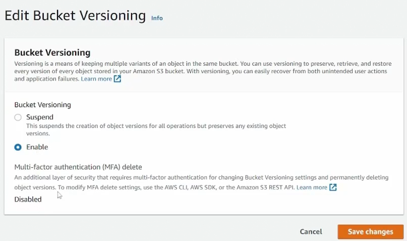
    - `Buckets` can be in 1 of 3 states:
        1. `Unversioned(default)`
        2. `Versioning Enabled`
        3. `Versioning Suspended`
            - When versioning is suspended, it doesn't delete version history, new `objects` added will just be assigned id null and any new changes to that `object` will also be assigned null (effectively overwritting each other)
            - 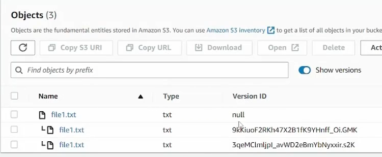

* When you upload an `object` when versioning is enabled, `s3` is going to give it a version id
    - When you upload a new `object` with the same key, instead of overwriting it (like `s3` usually does), it will upload and assign it a newer version id
    - The newest version of a file will always be known as latest, if you try to access a resource and u don't specify the version you want, it will always pull latest
    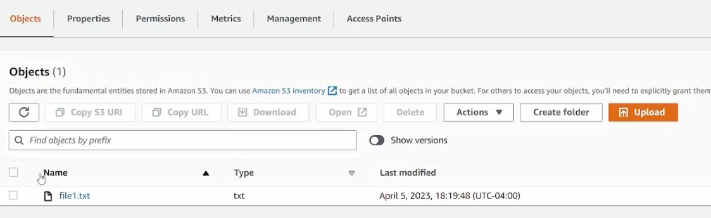
        * `show version` switch is present when versioning is enabled 
        * 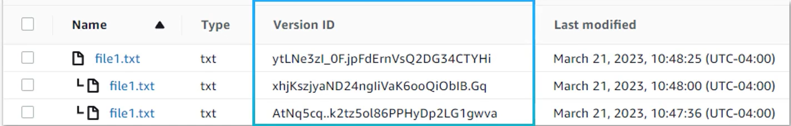
    - When you delete a versioned `object`, `s3` doesn't ask you if you want to `permanently delete` like it does for none versioned `buckets`. It just adds a `delete marker`, the previous versions are still there, `s3` just hides it in the console
        * 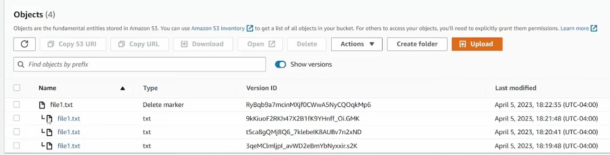
        - If this was an accidentaly delete and you want that `object` back, you need only delete the `delete marker`
            * 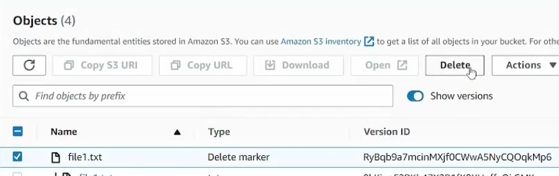
        - Now if you delete and specify the version id during that deletion, then that version is permanently removed
    - If versioning is disablde then the version id will be set to null
    * Costs:
        - you will be charged for all versions of an `object` in your `bucket`

#### MFA Delete

* When this feature is enabled, MFA is required to change the versioning state of a `bucket`
    - `MFA` will also be required to delete versions
* NOTE: this feature can only be enabled through the cli

### ACL and Resource Policies

#### Resource Policies

* `s3` policies determine who's allowed to have access to our `bucket` and how can we change who can access it
* By default when an `s3 bucket` is created only the user who created the `bucket` will have access to it, that person and whoever may have some `iam` permission that allows access to all `s3` buckets

* `Bucket Policies` determine who has access to an `s3` resource
    - `Bucket Policies` are writted in `json`, example below
        * 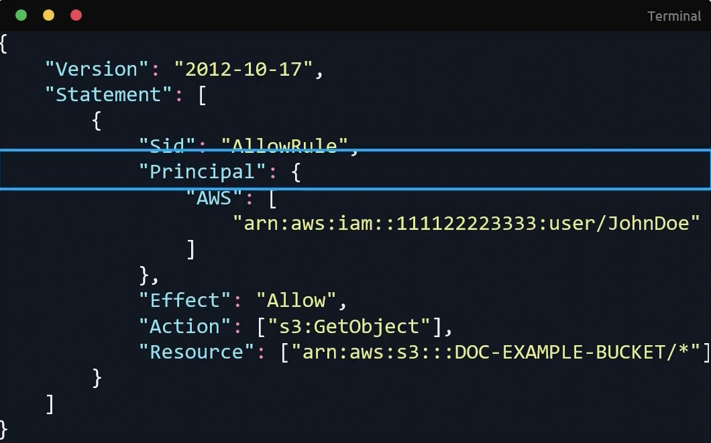
    - You can even control access to`objects` with specific prefixes
    - You can restrict access to sourceIP from specific `cidr blocks`
        * 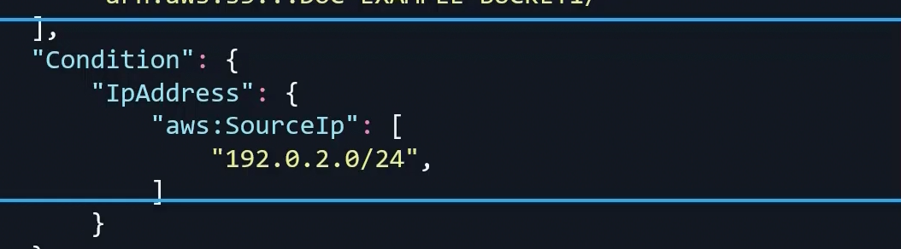
    * `Resource Policies` differ from `iam policies` because they define rules that can apply to anonymous and public users
    * When creating policies with permissions that apply to both `bucket` and `object`, you'll need to add both `bucket` and `object` in the resource field

        ```json
        {
            "Version": "2012-10-17",
            "Statement": [
                {
                    "Sid": "AllowSpecificPrincipalGetObject",
                    "Effect": "Allow",
                    "Principal": {
                        "AWS": "arn:aws:iam::111122223333:role/YourTargetRole"
                    },
                    "Action": [ 
                        "s3:GetObject",
                        "s3:GetBucket"
                    ]
                    "Resource": [ 
                        "arn:aws:s3:::your-bucket-name/*", // applies to GetObject permission
                        "arn:aws:s3:::your-bucket-name" // applies to GetBucket Permission
                    ]
                }
            ]
        }
        ```

#### ACLs

* `s3 acls` are a legacy access control mech that predates `iam` and its very inflexible and has a limited set of rules
    - 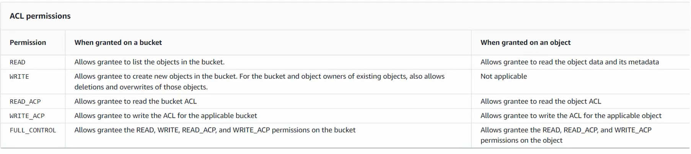
        * not recommended to be used

### Static Web Hosting

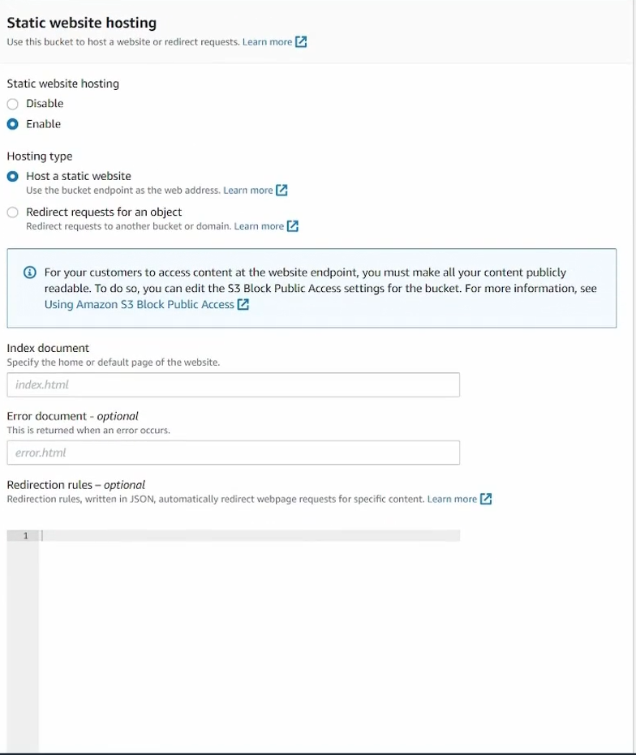

* `Static Hosting` in `s3` allow you to convert an `s3 bucket` into a static webserver
    - The classic features of a webserver can all be hosted in an `s3 bucket`
    - If you'd like a custom domain name for your static site, the `bucket name` must match the name of the `dns`
        * Though you could probably bypass this by using `cloudfront` 
    * Cost:
        - same as a `standard bucket`, but you will be charged a fee per request
* NOTE: the url produced when you create a static site will be inaccessible to the public until you flip the switch to enable public access and update the `bucket policy` to allow read access
    - 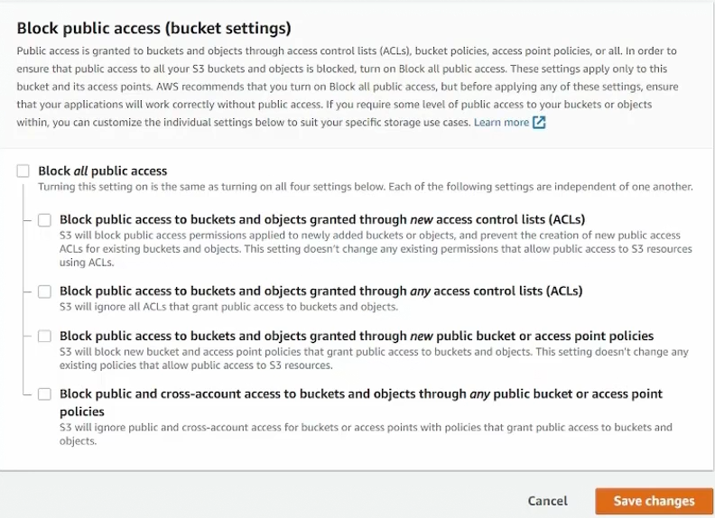
    - Allow public access in `bucket policy`

        ```json
        {
            "Version": "2012-10-17",
            "Statement": [
                {
                    "Sid": "AllowPublic",
                    "Effect": "Allow",
                    "Principal": "*",
                    "Action": [ 
                        "s3:GetObject"
                    ]
                    "Resource": [ 
                        "arn:aws:s3:::your-bucket-name/*", // applies to GetObject permission
                    ]
                }
            ]
        }
        ```

### Presigned Url

* `Presigned Urls` allow you to share files with user that is not explicitly allowed to access that object
    - Other solutions would be to create that user an aws account or make the `bucket` public, which are extreme solutions to what could possible be a one off event
* This `presigned url` tricks `s3` into thinking anyone using the url is you
    - Possible use case:
        * locking content behind a paywall, once enduser pays for it, paywall generates a `presigned url` and forwards it to enduser
        * these urls also allow uploads to `s3 buckets` as well
* NOTE: when creating a `presigned url`, an expiration date must be provided
    - `presigned urls` generated by `iam` user have a max duration of 7 days
        * However `presigned urls` can have an unlimited duration 
* NOTE: an `iam` user does not need to have acess to a `bucket` to generate a `presigned url`
    - a `presigned url` does not give you access to a `bucket`, it just allows you to send a request to the `bucket` as the user that generated the url
    - meaning if you don't have access and u generate a `presigned url`, anyone using that url will also not have access

#### Sharing Objects

* Click object and `share with a presigned url`
    - 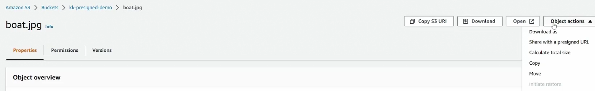
    - 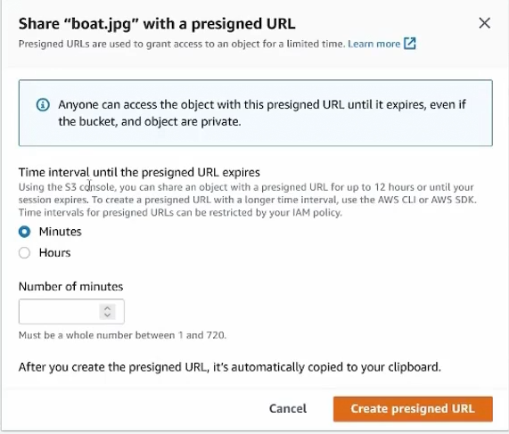

#### Upload Objects

* In order to generate a `PutObject presigned url` you need to use sdk or aws toolkit
    - More info [here](https://docs.aws.amazon.com/AmazonS3/latest/userguide/PresignedUrlUploadObject.html)

### Access Points

* `Access points` solves a unique issue
    - Say you have an `s3 bucket` with multiple different teams accessing it, that all have different permissions. The `bucket policy` becomes massive and difficult to manage
* It's similar to `efs access points`, each team will have its own unique "tunnel" into the `s3` which a corres ponding `arn`
    - The beauty about this `arn` is that users can access the `bucket` through the `access points arn`
        * Each `access point` can also have its own `bucket policy`
            - Though these `policies` must be copied to the `bucket policy`
* `Access Points` can also be exposed to specific `vpcs` through `privatelink`
    - 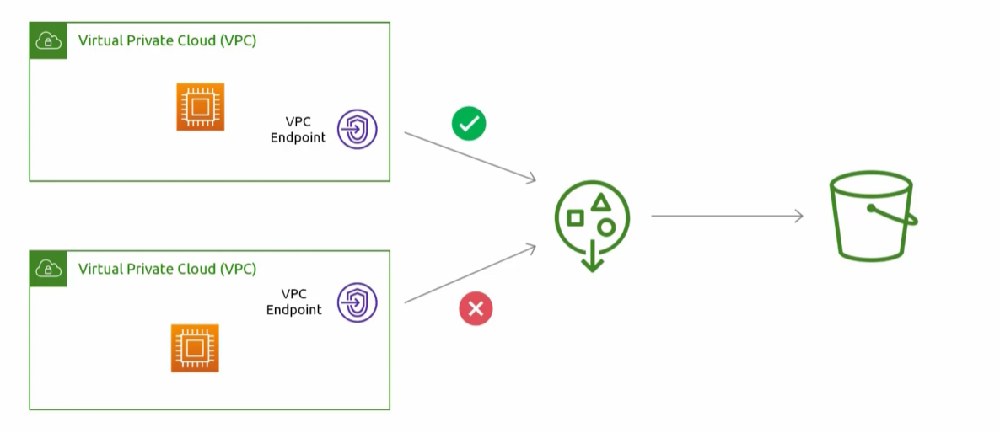

#### Hand On

* [Documentation](https://docs.aws.amazon.com/AmazonS3/latest/userguide/access-points-policies.html)

1. Create an `Access Points`
    - 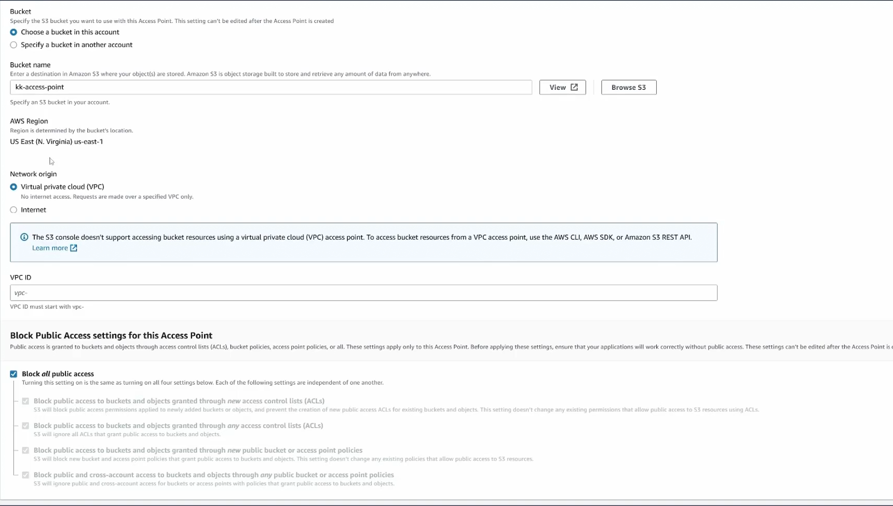
        * you can restrict to a `vpc`

2. Add a `policy` to the access point

    ```json
    {
        "Version":"2012-10-17",
        "Statement": [
        {
            "Effect": "Allow",
            "Principal": {
                "AWS": "arn:aws:iam::123456789012:user/Jane"
            },
            "Action": ["s3:GetObject", "s3:PutObject"],
            "Resource": "arn:aws:s3:us-west-2:123456789012:accesspoint/my-access-point/object/Jane/*"
        }]
    }
    ```

3. Delegate access control to `access points`
    - Its possible to cross account delegate too

    ```json
    {
        "Version":"2012-10-17",
        "Statement" : [
        {
            "Effect": "Allow",
            "Principal" : { "AWS": "*" },
            "Action" : "*",
            "Resource" : [ "arn:aws:s3:::amzn-s3-demo-bucket", "arn:aws:s3:::amzn-s3-demo-bucket/*"],
            "Condition": {
                "StringEquals" : { "s3:DataAccessPointAccount" : "111122223333" }`
            }
        }]
    }
    ```

4. Get `access point arn` and list objects
    - 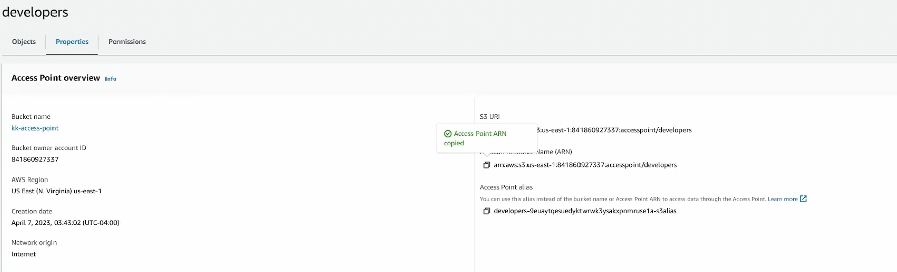
    - `aws s3 ls s3://<arn-access-point>`