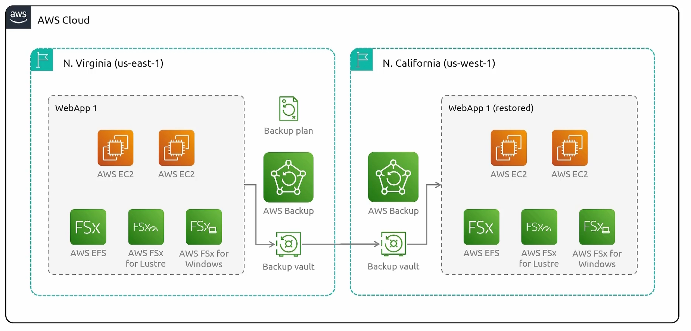

## AWS Backup
- [Overview](#overview)

### Overview

* AWS `Backups` is a service that makes its easy to centralize and automate backups of data across your aws environment
    - You get a single console for managing aws services
    - It automates the backup scheduling and retention policies
    - Allows backing up to different regions and even different aws accounts
* Components:
    1. `Backup Vault`: a "folder" that keeps all of your backups
        - can have multiple vaults across regions and accounts to organize backups
    2. `Backup Plan`: defines the configuration for your backups
        - defines backup schedules, retention policies, as well as which vault will be used to store the backups
    3. `Recovery Point`: point in time in which data can be restored