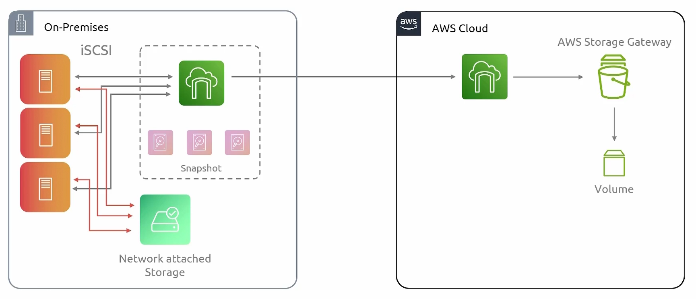
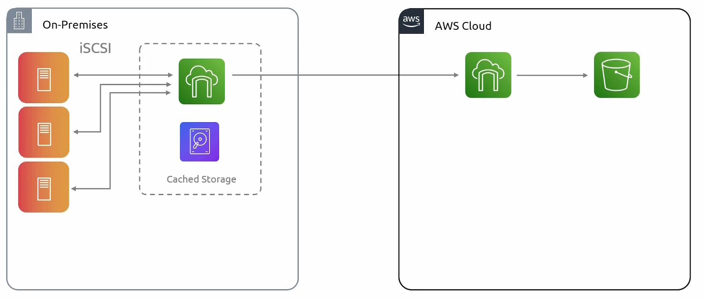
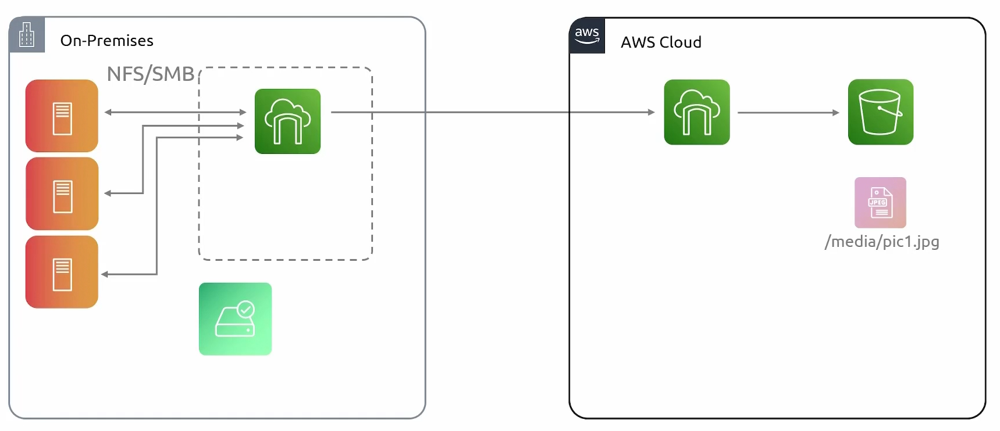
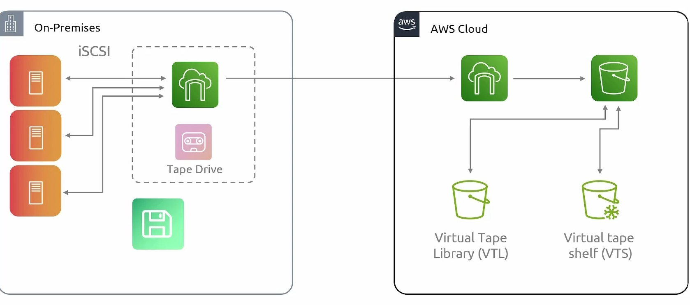

## Storage Gateway
- [Overview](#overview)

### Overview

* AWS `Storage Gateway` acts as a bridge between your on premise environment and your cloud based storage
    - Does this by running as either a vm or a physical device on prem
* Some of the use cases include:
    - using it as an extension to on prem storage needs
    - using it to assist with migration into the cloud, since all your data can be placed there
    - using it to host backups
    - using it for disaster recovery since your data can be easily backed up to the cloud
* The `storage gateway` comes in 3 different flavors and which once you pick is dependent on what type of storage tech you're running on prem
    1. `Volume`: block storage (iSCSI)
        - within the volume mode you have 2 modes
            1. `stored mode`: helps with storing backups
                - gateway is deployed on prem and in the same way on prem resouces connect to network attached storage that exposes block storages to the machines, the machines also connect to the gateway
                - data is stored locally on prem, using physical drives, meaning this does not increase your data center's storage capacity
                    * once data is writted on disk, the data is then copied over to aws via the gateway endpoint, which is then copied to aws as `ebs snapsnots`
                    * with these snapshots, we can create `ebs volumes` which can then be attached to `ec2 instances`
                    * 
            2. `cached mode`: data center storage extension
                - unlike `stored mode`, all data is stored in aws `s3`   
                    * because its hooked up to `s3` our storage space is virutally infinite
                - the only thing stored locally is a `cache` of frequently accessed data
                
    2. `File`: file system storage (NFS)
        - Servers on prem connect to gateway, like they it would connect to a file system server, using `nfs/smb` like protocols
        - Similar to `volume cache mode`, the data is stored in aws `s3`
            * 
    3. `Tape`: this is a traditionaly enterprise level storage extension where data/backups are held in tapes
        - in this case the gateway is going to emulate a tape drive, but will remove the maintenance that would happen with storing these tapes physically
        - data is copied to a `s3` an stored in a `virtual tap library (vtl)`
        - for less frequently accessed data, this can be stored in `s3` as a `vitual tape shelf (vts)`
        